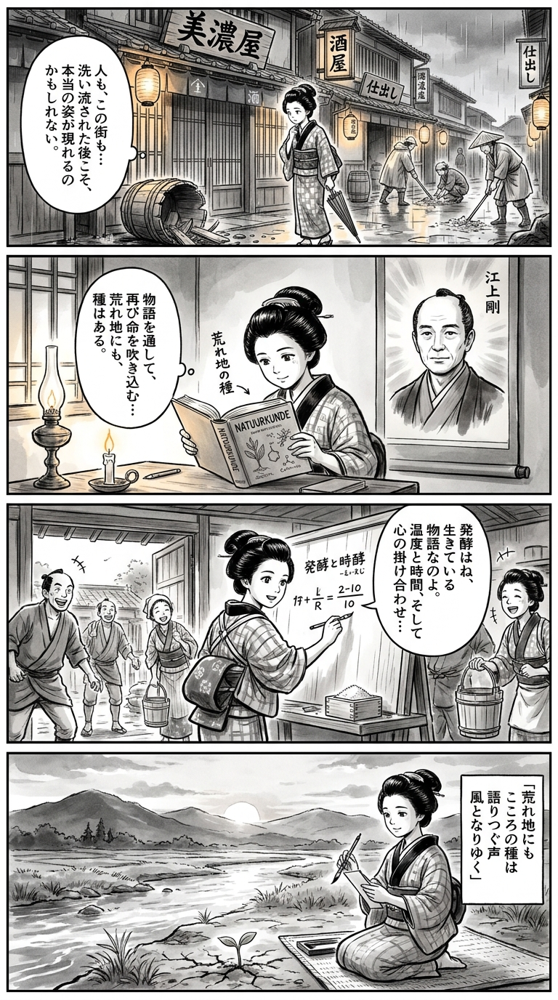

> **Language**: [日本語](../ja/荒れ地の種_review.html) | [English](../en/荒れ地の種_review.html) | [繁體中文](../zh-tw/荒れ地の種_review.html)
>
> [← Top / トップページ](../../)

## 📖 書籍情報
- **タイトル**: 荒れ地の種  
- **著者**: 江上 剛  
- **ASIN**: B0DGJ6212V  
- **URL**: [https://www.amazon.co.jp/dp/B0DGJ6212V](https://www.amazon.co.jp/dp/B0DGJ6212V)

---

<picture>
  <source srcset="../../images/reviews/荒れ地の種_4panel.webp" type="image/webp">
  
</picture>
## 🎯 この本の核心
『荒れ地の種』は、東日本大震災と原発事故によって全てを失った酒蔵「矢吹酒造所」の再生を描く物語である。主人公・光は、家族や蔵、そして酒造りの命ともいえる酵母を失いながらも、仲間と共に「福の壽」を復活させようとする。その過程で描かれるのは、喪失から立ち上がる人間の尊厳と、土地と共に生きるという文化の根源的な問いである。  

物語の核には「風土と人の絆」がある。酒造りは単なる産業ではなく、地域の自然、歴史、そして人々の心が結晶した営みとして描かれる。風評被害を超えるためには「安全」ではなく「物語」が必要だという視点が、現代社会における信頼の再構築を示唆している。

---

## 💡 キーインサイト
- **「ストーリー」が風評を超える力を持つ**  
　福島の復興には、数字やデータではなく心を動かす物語が必要だと説かれる。人々が共感するストーリーこそが、地域やブランドの信頼を再生する鍵となる。  

- **酒造りは人造りである**  
　技術だけでなく、杜氏や職人の心の在り方が酒の品質を決める。誠実さ、忍耐、そして他者への思いやりが、ものづくりの本質として描かれる。  

- **喪失を抱えたまま生きる強さ**  
　光は失った家族への痛みを忘れずに抱え続けるが、それでも前へ進む。再生とは記憶を消すことではなく、痛みを抱えながらも希望を紡ぐ行為である。  

- **共助の精神が地域を支える**  
　「米がなければ米を貸す」という言葉に象徴されるように、助け合いの文化が福島の再建を支える。競争よりも共生を選ぶ姿勢が、地域の強さを生む。  

- **若者の情熱が未来を拓く**  
　浩紀や真由美といった若者たちが、新しい発想で酒造りに挑む姿は、荒れ地にまかれる希望の種である。世代を超えた継承が、文化の持続を可能にする。

---

## 🔍 現代的文脈との関連
現代社会では、災害や経済格差、社会的孤立などによって「再生」や「共助」の価値が再び問われている。『荒れ地の種』が描く助け合いの精神や風土との共生は、地域づくりやコミュニティ再生の実践的モデルとして読み取ることができる。  

また、風評被害や情報の信頼性が揺らぐ時代において、「ストーリーによる共感の再構築」は重要なテーマである。データではなく人の心を動かす物語が、社会の分断を癒やす手段となりうる。本作は、そうした現代的課題に対する文学的応答としても意義深い。

---

## 🚀 実践への提案
1. **地域や企業の物語を発信する**
   数字ではなく、人々の思いや背景を伝えることで、共感と信頼を築くことができる。地域ブランドや企業文化の再生に有効である。

2. **共助のネットワークを育む**
   「米がなければ米を貸す」という精神を現代に応用し、業界や地域を越えた支援体制を整える。災害時や経済危機に強い社会をつくる基盤となる。

3. **若者の挑戦を支援する**
   新しい発想や行動力を持つ若者に実践の場を提供することで、地域や組織に新しい風を吹き込むことができる。

4. **風土と文化を守る経済活動を行う**
   土地の自然や伝統を尊重し、それを活かしたものづくりを行う。地域の独自性を経済価値と結びつけることが、持続的発展を支える。

5. **赦しと共感を選ぶ**
   対立や分断を超えて、他者を理解し共に歩む姿勢を持つ。復興や再生は、怒りではなく共感から始まる。

---

## ⭐ 総合評価
『荒れ地の種』は、喪失と再生を描いた人間ドラマでありながら、地域経済や文化の再構築という社会的テーマをも内包している。江上剛は、金融と地域の現場を知る作家として、現実に根ざした希望の物語を紡いでいる。  

この作品は、震災を経験した人々だけでなく、変化の時代に立ちすくむすべての読者に向けた「再生の書」である。荒れ地にまかれる小さな種が、やがて豊かな実りをもたらすように、読者の心にも静かな希望を芽吹かせるだろう。

---

&copy; shioki | [CC BY-NC-SA 4.0](https://creativecommons.org/licenses/by-nc-sa/4.0/)
