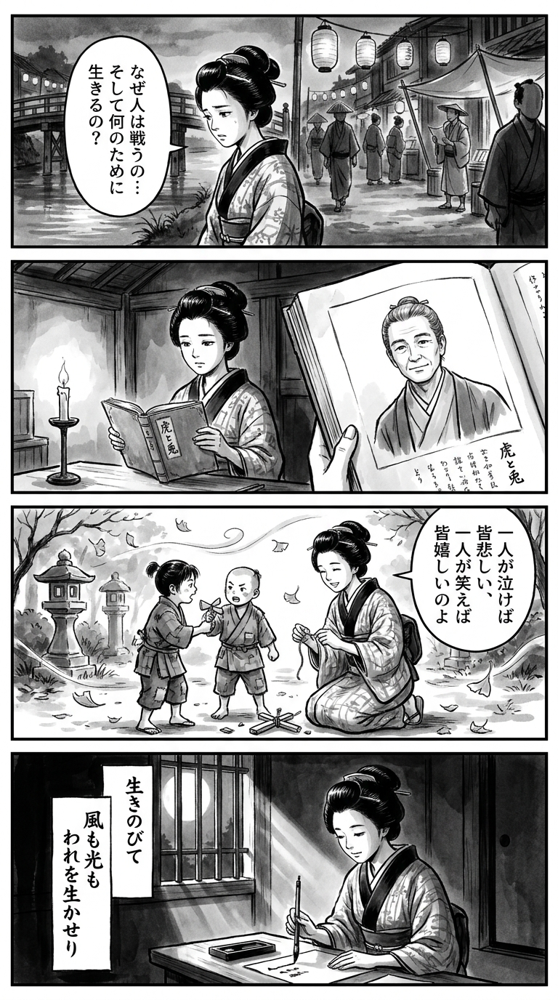

> **Language**: [日本語](../ja/虎と兎_review.html) | [English](../en/虎と兎_review.html) | [繁體中文](../zh-tw/虎と兎_review.html)
>
> [← Top / トップページ](../../)

## 📖 書籍情報
- **タイトル**: 虎と兎  
- **著者**: 吉川　永青  
- **ASIN**: B0CW1HLDP8  
- **URL**: [https://www.amazon.co.jp/dp/B0CW1HLDP8](https://www.amazon.co.jp/dp/B0CW1HLDP8)

---

<picture>
  <source srcset="../../images/reviews/虎と兎_4panel.webp" type="image/webp">
  
</picture>
## 🎯 この本の核心
『虎と兎』は、敗北と喪失を経た人間が「生きる意味」を再発見する壮大な叙事詩である。会津戦争の敗残兵・虎太郎が異国の地でアメリカ先住民と出会い、他者と共にある幸福の哲学を学ぶ過程が描かれる。  

物語の中心には、「なぜ生きるのか」「命をどう使うのか」という根源的な問いがある。敗者の視点から歴史を見つめ、暴力と支配の構造を批判しながらも、他者と共に生きる希望を見出す姿が印象的である。  

異文化との出会いを通じて、個人の幸福を超えた普遍的な人間の尊厳を描き出す本書は、歴史小説の枠を超えた精神的な探求の書である。

---

## 💡 キーインサイト
- **「生き残ること」の意味を再定義する**  
  戦争の敗者として生き延びた虎太郎は、生存を恥ではなく「天に生かされた使命」として受け止める。生き続けること自体が行動の責任であるという思想は、現代におけるレジリエンスの原型を示している。  

- **幸福は他者との関係の中にある**  
  ブラック・ケトル酋長の教えが象徴するように、幸福は個人の内部では完結しない。周囲の人々が泣いているなら自分も不幸だという共感的倫理が、物語の精神的支柱となっている。  

- **異文化との出会いが自己を照らす**  
  異国の地での経験を通じ、虎太郎は自国の価値観を相対化し、真の「戦士」としての心を学ぶ。異文化理解が自己理解の深化へとつながる構造は、グローバル時代の読者にも響く。  

- **暴力の正当化への批判**  
  官軍や白人入植者の暴虐を通して、「正義」を名乗る権力の欺瞞が暴かれる。暴力を文明や神の名のもとに正当化する構造を問い直すことで、歴史の中の倫理的盲点を照射する。  

- **「他者のために生きる」成長の物語**  
  虎太郎が「自分のため」から「誰かのため」に生きるようになる過程は、自己超越の物語である。人間の成熟とは、他者の幸福を自らの幸福とする覚悟にあると本書は語る。

---

## 🔍 現代的文脈との関連
現代日本では、戦争記憶の風化が進む一方で、文学や映像作品を通じて「記憶を継承する」試みが続いている。本書の「敗者の尊厳」や「暴力の連鎖を断つ」という主題は、その流れと共鳴する。  

また、移民や多文化共生が課題となる現代社会において、異文化との共鳴を描く本作は、他者理解の重要性を再認識させる。虎太郎と先住民の交流は、文化的境界を超えた連帯のモデルとして読むことができる。  

さらに、コロナ禍以降に強調される「誰かのために生きる」という価値観とも響き合う。『虎と兎』は、過去の物語でありながら、現代の倫理的課題に直結する普遍的メッセージを放っている。

---

## 🚀 実践への提案
1. **他者の幸福を自分の尺度に取り入れる**
   周囲の人々の幸せを自分の幸福の一部として考えることで、利己的な判断から解放される。共感的な幸福観が、より持続的な満足をもたらす。

2. **「生き残った意味」を問い続ける**
   困難を乗り越えた後こそ、「なぜ自分は生き延びたのか」を考える時間を持つこと。生存を目的ではなく出発点とする姿勢が、人生を深める。

3. **異文化に触れる機会を意識的に持つ**
   異なる価値観に触れることは、自身の固定観念を揺さぶり、視野を広げる契機となる。読書や旅行、異分野交流などがその第一歩となる。

4. **「守るための戦い」を選ぶ**
   対立を避けるだけでなく、守るべきもののために立ち上がる勇気を持つ。自らの行動が誰かを支えるものであるかを常に問い直すことが重要だ。

5. **日常の中で「命の使い道」を見出す**
   特別な使命でなくとも、日々の中で誰かのために何ができるかを考えることが、命を活かす実践となる。小さな行動が人生の意味を形づくる。

---

## ⭐ 総合評価
『虎と兎』は、歴史の敗者たちの声を通じて、人間の尊厳と幸福の本質を問う作品である。戦争や異文化の衝突という重い題材を扱いながらも、そこに希望と再生の物語を見出す筆致が見事である。  

読者は、虎太郎の旅を通じて「生きるとは何か」「幸福とは何か」を自らに問い返すことになるだろう。歴史小説としての迫力と、哲学的寓話としての深みを併せ持つ本書は、現代に生きるすべての人に静かな覚醒を促す一冊である。

---

&copy; shioki | [CC BY-NC-SA 4.0](https://creativecommons.org/licenses/by-nc-sa/4.0/)
