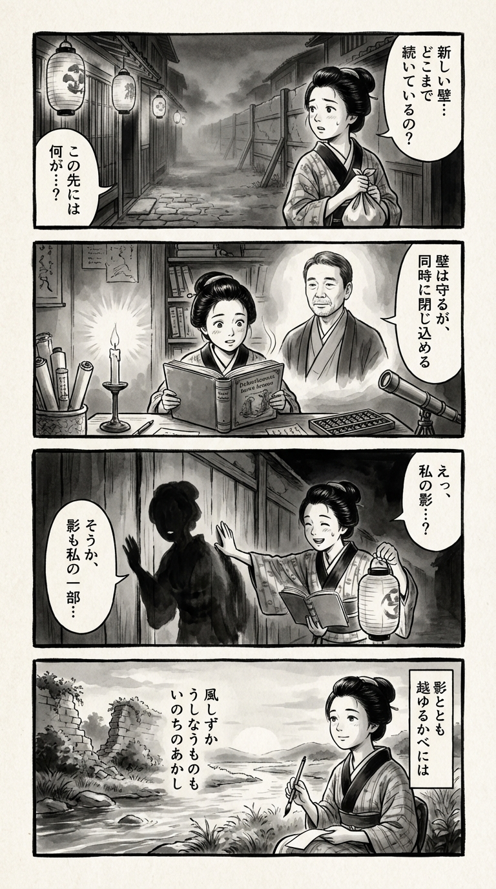

> **Language**: [日本語](../ja/街とその不確かな壁_review.html) | [English](../en/街とその不確かな壁_review.html) | [繁體中文](../zh-tw/街とその不確かな壁_review.html)
>
> [← Top / トップページ](../../)

## 📖 書籍情報
- **タイトル**: 街とその不確かな壁  
- **著者**: 村上春樹  
- **ASIN**: B0BTGK1HHS  
- **URL**: [https://www.amazon.co.jp/dp/B0BTGK1HHS](https://www.amazon.co.jp/dp/B0BTGK1HHS)

---

<picture>
  <source srcset="../../images/reviews/街とその不確かな壁_4panel.webp" type="image/webp">
  
</picture>
## 🎯 この本の核心
『街とその不確かな壁』は、現実と幻想の境界が溶け合う世界を舞台に、人間の内面に潜む「孤独」「喪失」「再生」を描いた長編である。物語は、主人公が「壁に囲まれた街」と「外の世界」を往還する構造を持ち、現実と想像、記憶と夢が交錯する中で、自己の輪郭を探し続ける。

村上春樹はこの作品で、「影」「街」「時間」「継承」といった象徴を通じ、自己と他者、愛と死、記憶と忘却といった人間存在の根源的なテーマを再び問い直す。読者は、曖昧で不確かな世界の中でこそ見出される「生の確かさ」に触れることになる。

---

## 💡 キーインサイト
- **影は自己の不可分な一部である**  
　影は人間の暗い側面や抑圧された感情の象徴であり、それを受け入れることが自己統合の鍵となる。影を排除するのではなく共に生きるという発想が、成熟した自己理解へと導く。

- **愛は喪失を通して刻印される**  
　愛は永遠ではないが、失われた後も人の中に熱として残り続ける。喪失の痛みを抱えながらも、それを生の証として受け入れる姿勢が描かれている。

- **時間は主観的に歪み、再生の契機となる**  
　時間は直線的ではなく、記憶や感情によって伸縮する。過去に囚われながらも、再び時間を動かす力を得ることが、主人公の成長を象徴する。

- **継承は意味の連鎖である**  
　経験や記憶、感情は他者へと受け渡され、物語の中で円環的に再生する。これは個人の物語が他者との関係性の中で生き続けることを示している。

- **壁は安全と制約の両義を持つ**  
　街を囲む壁は、外界からの保護であると同時に、自由の制限でもある。壁を越える行為は、自己の限界を超える象徴的な通過儀礼として機能する。

---

## 🔍 現代的文脈との関連
本書に描かれる「壁」は、現代社会における多文化共生や排除の問題と響き合う。国家やコミュニティが築く見えない境界線は、安心をもたらす一方で、他者を排除する装置にもなりうる。村上はその曖昧な構造を、個人の内面世界に重ね合わせることで、社会的・心理的な「境界」の本質を問う。

また、知的自由や言論の多様性が揺らぐ現代において、「街の図書館」というモチーフは、記憶と知の継承の場として重要な意味を持つ。壁の内外をめぐる物語は、現代の閉塞感を映し出す鏡であり、同時に他者との新たな関係を模索する希望の寓話でもある。

---

## 🚀 実践への提案
1. **自分の影と向き合う時間を持つ**
   否定したい感情や過去を見つめ直すことで、自己理解が深まる。影を受け入れることは、心の再統合への第一歩である。

2. **時間の流れを意識的に感じ取る**
   焦燥や停滞を感じるときこそ、ゆっくりと進む時間の中に意味を見出すことが重要だ。過去と現在をつなぐ感覚を取り戻すことで、再生の契機が生まれる。

3. **他者との「継承」を意識する**
   経験や思考を他者に伝える行為は、自己を超えて生きることにつながる。語る・教える・書くことを通じて、自分の物語を次世代へと渡す。

4. **現実と非現実の境界を創造的に探る**
   夢や記憶を素材とした創作や思索は、自己の内面を理解する強力な手段となる。自分の「街」を描くように、心の地図を可視化してみるとよい。

5. **喪失を「刻印」として受け入れる**
   失ったものを消そうとするのではなく、それが自分を形づくった証として抱くこと。痛みを意味づけ直すことで、人生の新たな章が始まる。

---

## ⭐ 総合評価
『街とその不確かな壁』は、村上春樹の長編の中でも特に内省的で、哲学的な深みを持つ作品である。現実と幻想の狭間で揺れる主人公の旅は、読者自身の心の風景を映し出す鏡のように作用する。

本書は、孤独を抱えるすべての人に向けた静かな対話であり、「不確かさ」を生きる勇気を与える物語である。現代社会の分断や閉塞を超え、他者と自己の境界を見つめ直す契機を与えてくれる一冊である。

---

&copy; shioki | [CC BY-NC-SA 4.0](https://creativecommons.org/licenses/by-nc-sa/4.0/)
