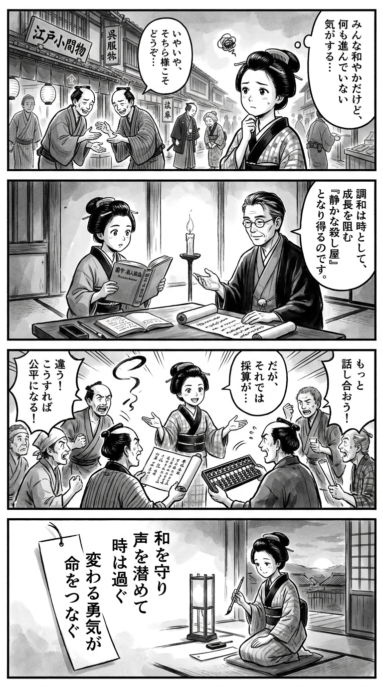

> **Language**: [日本語](../ja/衰退の法則―日本企業を蝕むサイレントキラーの正体_review.html) | [English](../en/衰退の法則―日本企業を蝕むサイレントキラーの正体_review.html) | [繁體中文](../zh-tw/衰退の法則―日本企業を蝕むサイレントキラーの正体_review.html)
>
> [← Top / トップページ](../../)

## 📖 書籍情報
- **タイトル**: 衰退の法則―日本企業を蝕むサイレントキラーの正体  
- **著者**: 小城 武彦  
- **ASIN**: B072FNQ75T  
- **URL**: [https://www.amazon.co.jp/dp/B072FNQ75T](https://www.amazon.co.jp/dp/B072FNQ75T)

---

<picture>
  <source srcset="../../images/reviews/衰退の法則―日本企業を蝕むサイレントキラーの正体_4panel.webp" type="image/webp">
  
</picture>
## 🎯 この本の核心
本書は、日本企業の「衰退」を単なる経営上の失敗ではなく、文化的・心理的な構造問題として捉え直す試みである。著者・小城武彦は、企業が環境変化に適応できず、売上や利益を長期的に低下させる「衰退」のメカニズムを明らかにし、それがいかにして「破綻」へと至るのかを論理的に描き出す。  

特に注目すべきは、社員一人ひとりが合理的に行動しているにもかかわらず、組織全体としては非合理な結果を生むという逆説的構造である。著者はこの現象を「サイレントキラー」と呼び、対立回避や秩序重視といった文化的癖が、変化の時代において致命的な遅れを生むと警鐘を鳴らす。  

文化心理学の視点を導入し、日本企業特有の「内向き」「協調的」な自己観が、外部環境への感度を鈍らせている点を分析することで、単なる経営論を超えた深い文化批評としても読むことができる一冊である。

---

## 💡 キーインサイト
- **衰退は突発的ではなく、長期的な適応不全の結果である**  
  経営破綻の多くは一度の失策ではなく、長年にわたる「環境への鈍感さ」と「変化への遅れ」の積み重ねによって生じる。これを理解することは、企業の再生戦略を考えるうえで不可欠である。  

- **合理的な個人行動が組織全体の非合理を生む**  
  社員が自分の立場を守るために合理的に行動するほど、組織は硬直化し、外部への適応力を失う。この逆説的な構造こそが、著者のいう「衰退惹起サイクル」である。  

- **「対立回避」と「秩序重視」が意思決定を麻痺させる**  
  日本企業では、異論を避け、調整を優先する文化が根強い。これが意思決定のスピードと質を奪い、変化への対応を遅らせる。  

- **経営陣の社内政治化が戦略思考を奪う**  
  出世条件が「忖度」や「派閥」への忠誠に偏ると、経営層は秩序維持を目的化し、外部環境への感度を失う。結果として、企業は静かに衰退していく。  

- **文化心理学が示す「内集団志向」が外向き感度を鈍らせる**  
  東アジア的な「協調的自己観」により、社内の調和を優先する傾向が強まり、顧客や市場といった外部への関心が低下する。この文化的構造が「サイレントキラー」として作用する。

---

## 🔍 現代的文脈との関連
本書の問題意識は、現代日本企業が直面する「長期停滞」と深く結びついている。人口減少や人手不足、DXの遅れといった構造的課題が進む中で、企業は変化への適応力を問われている。著者が指摘する「対立回避」「秩序重視」「内向き志向」は、まさにこうした時代における最大のリスク要因である。  

また、近年注目される「人的資本経営」や「ガバナンス改革」といった潮流も、本書の主張と響き合う。組織文化の見直しなしに制度改革を進めても、実質的な変化は起こらない。小城はその根底にある文化的構造を可視化し、変革の出発点を提示している。

---

## 🚀 実践への提案
1. **「対立回避」よりも「建設的対話」を奨励する**
   異論を封じる文化は衰退の温床となる。議論を恐れず、異なる視点を歓迎する会議運営や評価制度を導入することが重要である。

2. **ミドル層に「調整」ではなく「実行」の権限を与える**
   ミドルが上層部の意向を忖度するだけでなく、現場の判断で戦略を推進できるようにすることで、組織の俊敏性が高まる。

3. **人事評価を「忖度」から「成果」へ転換する**
   成果に基づく透明な評価制度を整備し、組織内の政治的行動を抑制する。これにより、社員のエネルギーが本来の業務に向かう。

4. **経営陣に「外向きの感度」と「経営リテラシー」を再教育する**
   データ分析や市場理解を重視した意思決定訓練を行い、秩序維持型リーダーシップから脱却する。

5. **文化心理学的視点で組織文化を診断する**
   社内の価値観や行動様式を定期的に可視化し、文化的バイアスが意思決定に与える影響を検証する。

---

## ⭐ 総合評価
『衰退の法則』は、経営書の枠を超えた「文化構造論」として読むべき一冊である。企業の衰退を単なる経営判断の失敗ではなく、組織文化と心理構造の問題として捉える視座は鋭く、現代の日本企業にとって極めて示唆的である。  

特に、合理的な個人行動が非合理な組織結果を生むという逆説の指摘は、読者に深い思索を促す。経営者、マネジャー、そして組織文化に関心を持つすべての人にとって、自社の「サイレントキラー」を見つめ直すための必読書である。

---

&copy; shioki | [CC BY-NC-SA 4.0](https://creativecommons.org/licenses/by-nc-sa/4.0/)
