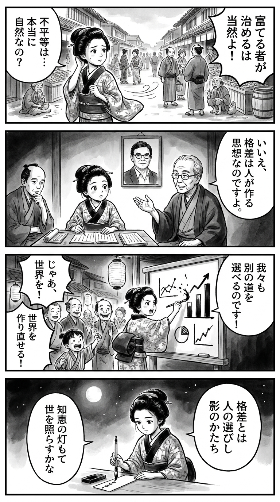

> **Language**: [日本語](../ja/資本とイデオロギー_review.html) | [English](../en/資本とイデオロギー_review.html) | [繁體中文](../zh-tw/資本とイデオロギー_review.html)
>
> [← Top / トップページ](../../)

## 📖 書籍情報
- **タイトル**: 資本とイデオロギー  
- **著者**: トマ・ピケティ, 山形浩生, and 森本正史  
- **ASIN**: B0CDBNG7TG  
- **URL**: [https://www.amazon.co.jp/dp/B0CDBNG7TG](https://www.amazon.co.jp/dp/B0CDBNG7TG)

---

<picture>
  <source srcset="../../images/reviews/資本とイデオロギー_4panel.webp" type="image/webp">
  
</picture>
## 🎯 この本の核心
『資本とイデオロギー』は、格差を「経済的必然」ではなく「政治的・思想的構築物」として読み解く壮大な試みである。ピケティは、社会がどのようにして不平等を正当化し、制度化してきたかを、前近代から現代のグローバル資本主義まで縦断的に分析する。  

彼は、所有と権力の結びつきを「政治レジーム」と「所有権レジーム」の相互作用として描き、格差の根源を制度とイデオロギーの歴史的連関に求める。さらに、知識と民主主義の関係を重視し、経済学を専門家の独占から解放することで、市民が自らの社会を再構築できる可能性を提示する。  

本書の核心は、格差を「変えられるもの」として捉え直す点にある。歴史的多様性を示すことで、現代の格差体制もまた政治的選択によって再編可能であるという希望を読者に与える。

---

## 💡 キーインサイト
- **格差の「自然化」は支配の装置である**  
  格差を「自然なもの」とみなす言説は、支配層による正当化の手段である。ピケティは、歴史的に格差の形が可変的であることを示し、社会がそれを「選択」してきた事実を明らかにする。  

- **社会は自らの「事実」を構築する**  
  経済データや税制の分類は中立的なものではなく、社会が自らをどう定義するかという政治的・文化的選択の産物である。したがって、格差の「事実」そのものが社会的構築物であるという視点が重要になる。  

- **思想と出来事の相互作用が歴史を動かす**  
  ピケティは唯物史観的な決定論を退け、思想の自律性を強調する。社会変革は、偶発的な出来事と理念的構想の交差点で生まれると説く。  

- **知識の民主化が格差是正の鍵**  
  経済や財政を専門家の領域に閉じ込めず、市民が理解し議論することが民主主義の基盤である。知識の共有は、格差を再生産する構造を打破する第一歩となる。  

- **平等主義の後退は思想の怠慢による**  
  20世紀の平等化を支えた累進課税や社会政策が後退した背景には、所有と再分配をめぐる思想的革新の欠如がある。ピケティは、新しい平等主義の構想を再び政治の中心に据える必要を説く。

---

## 🔍 現代的文脈との関連
現代社会では、格差拡大と民主主義への不信が深まる中で、ピケティの問題意識はかつてなく切実である。テクノロジー企業や巨大資本が国家権力と結びつき、富と情報の集中が進む状況は、まさに本書が警鐘を鳴らす「新しい所有レジーム」の形成を示している。  

また、AIや自動化による生産構造の変化、自然資本を金融化する動きなどは、「資本」が社会のあらゆる領域を再編している現実を映し出す。ピケティの視点を通じて見ると、これらの動きは単なる経済現象ではなく、格差を正当化する新しいイデオロギーの形成過程と捉えられる。  

この意味で『資本とイデオロギー』は、現代の「ポスト・グローバル資本主義」を理解するための思想的基盤を提供する書である。

---

## 🚀 実践への提案
1. **経済知識の民主化を進める**
   経済や財政の仕組みを理解し、市民が公共的議論に参加することが不可欠である。専門家依存から脱却し、社会の制度設計を共に考える文化を育むべきだ。

2. **格差を「自然」とみなす言説を批判する**
   格差を不可避とする言葉や政策の背後にあるイデオロギーを見抜くことが重要である。歴史的・制度的背景を検証し、社会がどのように格差を選び取ってきたかを理解することが変革の第一歩となる。

3. **グローバル化の制度設計を再考する**
   グローバル化は一様ではなく、政治的選択によって形を変えうる。国際的な税制や労働基準の再構築を通じて、分配の歪みを是正する仕組みを模索すべきである。

4. **累進課税と財産再分配を再評価する**
   20世紀の平等化を支えた制度を再検討し、現代の巨大資本集中に対応する新たな枠組みを構築する必要がある。財産の集中を抑制することは、民主主義の再生にもつながる。

5. **新しい平等主義連合を構想する**
   経済的再分配だけでなく、所有と権力の構造そのものを問い直す政治的連帯が求められる。社会的想像力を回復し、共通の未来を描くことが現代の課題である。

---

## ⭐ 総合評価
『資本とイデオロギー』は、経済学・政治哲学・歴史学を横断して「格差の正当化構造」を解体する知的冒険である。ピケティは、数字や理論の背後にある「物語」を読み解き、社会が自らの不平等をいかに作り出してきたかを暴き出す。  

本書は、経済政策の専門家だけでなく、社会のあり方を根本から考えたい読者に強く訴える。読む者に、歴史を再構築する想像力と、未来を選び取る政治的責任を突きつける一冊である。

---

&copy; shioki | [CC BY-NC-SA 4.0](https://creativecommons.org/licenses/by-nc-sa/4.0/)
