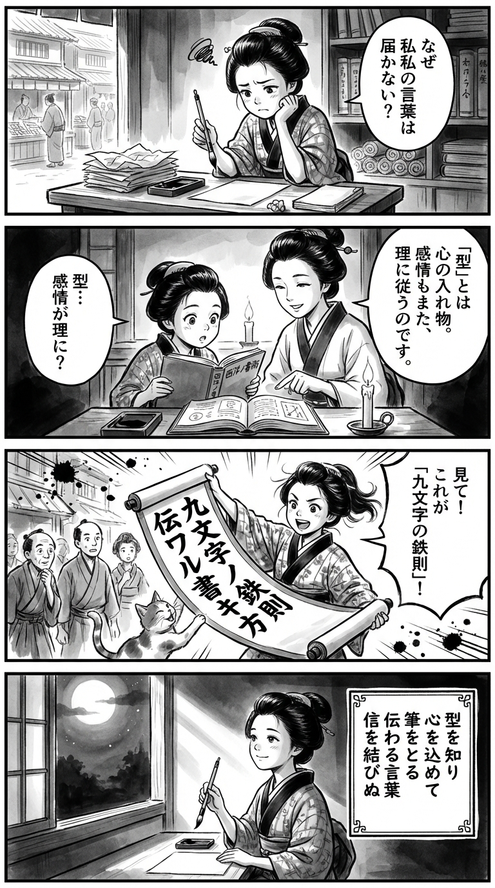

> **Language**: [日本語](../ja/超ライティング大全――「バズる記事」にはこの1冊さえあればいい_review.html) | [English](../en/超ライティング大全――「バズる記事」にはこの1冊さえあればいい_review.html) | [繁體中文](../zh-tw/超ライティング大全――「バズる記事」にはこの1冊さえあればいい_review.html)
>
> [← Top / トップページ](../../)

## 📖 書籍情報
- **タイトル**: 超ライティング大全――「バズる記事」にはこの1冊さえあればいい  
- **著者**: 東 香名子  
- **ASIN**: B09711C994  
- **URL**: [https://www.amazon.co.jp/dp/B09711C994](https://www.amazon.co.jp/dp/B09711C994)

---

<picture>
  <source srcset="../../images/reviews/超ライティング大全――「バズる記事」にはこの1冊さえあればいい_4panel.webp" type="image/webp">
  
</picture>
## 🎯 この本の核心
本書の核心は、「バズる記事」を偶然の産物ではなく、再現可能な技術として体系化している点にある。著者・東香名子は、構成・タイトル・推敲・読者理解といったライティングの全工程を「型」として提示し、誰でも実践できる方法論に落とし込んでいる。  

単なるテクニック集ではなく、読者との共感や信頼構築を重視する姿勢が貫かれている点も特徴的である。文章を「届ける」だけでなく、「伝わる」ものにするための心理的配慮やマナーまでを含め、ライターとしての成長を促す指南書となっている。

---

## 💡 キーインサイト
- **「型」を使えば誰でも成果を出せる**  
　文章の良し悪しは才能ではなく構造理解にあると説く。テンプレートを活用することで、安定して読者の心を動かす文章が書けるという発想は、再現性の高いスキル構築を可能にする。  

- **タイトル設計の9文字ルール**  
　冒頭9文字以内に「食いつきワード」を置くという具体的な指針は、情報過多の時代において読者の注意を引くための実践的戦略である。クリック率を左右する要因を可視化した点が秀逸だ。  

- **読者の悩みと解決策をセットで提示する**  
　単なる情報提供ではなく、読者の課題を中心に据えた構成が共感を呼ぶ。問題提起と解決の両輪を意識することで、信頼性と拡散力を両立できる。  

- **「ぜいにく言葉」を削ぎ落とす洗練**  
　不要な修飾や曖昧表現を省くことで、文章の骨格が明確になる。シンプルな表現は、読者の理解を助け、発信者の信頼を高める。  

- **ポジティブな締めで印象を残す**  
　ネガティブな投稿を避け、前向きな結論で終えることが、読者との長期的な関係を築く鍵となる。発信者の姿勢が文章の印象を決定づけるのだ。

---

## 🔍 現代的文脈との関連
SNSやブログが誰でも発信できる時代において、「伝わる文章」を書く力は個人の影響力を左右する重要なスキルとなっている。本書が提示する「型」や「タイトル設計」は、アルゴリズム主導の情報環境においても有効な普遍的原理である。  

また、AIによる自動生成コンテンツが増える中で、「共感」や「誠実さ」といった人間的要素をどう文章に宿すかが問われている。本書はその問いに対し、構造と感情の両立という実践的な答えを提示している点で、現代のライターやマーケターにとって示唆的である。

---

## 🚀 実践への提案
1. **ネタ帳を日常的に更新する**
   思いついたアイデアを即座に記録することで、継続的な発信の基盤を作る。観察と記録の習慣が、創造性を支える。

2. **タイトルを複数案出して検証する**
   9文字以内にキーワードを配置するなど、構造的にタイトルを設計する。複数案を比較することで、読者の反応を予測できる。

3. **文章を寝かせて推敲する**
   一度書いた文章は2～3時間置いてから見直す。時間を置くことで冷静な判断ができ、不要な表現を削ぎ落とせる。

4. **読者の悩み＋解決策を意識して構成する**
   読者の課題を起点に文章を設計することで、共感と信頼を生む。単なる情報発信ではなく、読者の行動変化を促す文章になる。

5. **「小学5年生でもわかる」表現を目指す**
   専門的な内容でも平易な言葉で伝えることで、読者層を広げる。理解しやすい文章は、結果として拡散されやすくなる。

---

## ⭐ 総合評価
『超ライティング大全』は、感性頼みのライティングから脱却し、再現性のある文章術を体系的に学べる実用書である。単なる「バズ」を狙うのではなく、読者との信頼を築くための誠実な発信を提唱している点に、著者の一貫した倫理観が感じられる。  

ウェブライター、ブロガー、SNS発信者など、あらゆる「言葉で人を動かす」職業人にとって必読の一冊である。文章を通じて人とつながる力を磨きたい読者に、確かな指針と勇気を与えてくれるだろう。

---

&copy; shioki | [CC BY-NC-SA 4.0](https://creativecommons.org/licenses/by-nc-sa/4.0/)
