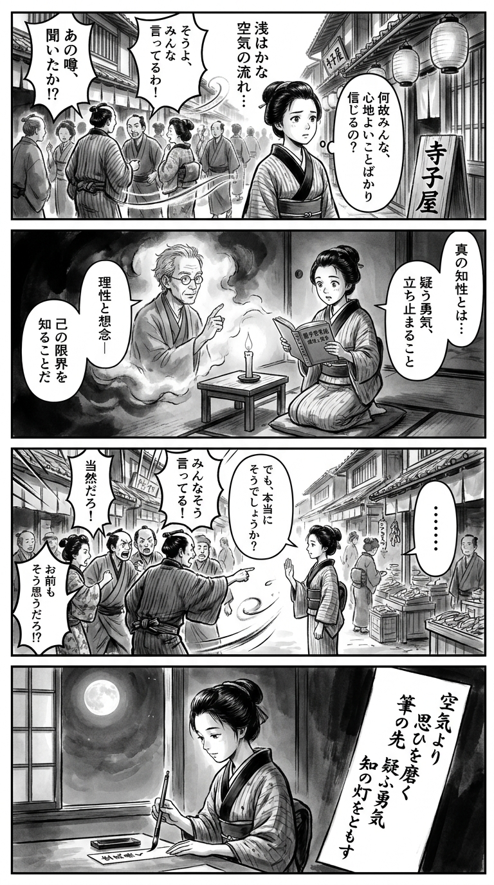

> **Language**: [日本語](../ja/超・反知性主義入門_review.html) | [English](../en/超・反知性主義入門_review.html) | [繁體中文](../zh-tw/超・反知性主義入門_review.html)
>
> [← Top / トップページ](../../)

## 📖 書籍情報
- **タイトル**: 超・反知性主義入門  
- **著者**: 小田嶋 隆  
- **ASIN**: B015DWP8T2  
- **URL**: [https://www.amazon.co.jp/dp/B015DWP8T2](https://www.amazon.co.jp/dp/B015DWP8T2)

---

<picture>
  <source srcset="../../images/reviews/超・反知性主義入門_4panel.webp" type="image/webp">
  
</picture>
## 🎯 この本の核心
『超・反知性主義入門』は、現代日本に蔓延する「思考停止」と「同調圧力」を徹底的に批判する書である。小田嶋隆は、社会が「空気」や「場の雰囲気」によって動き、理性よりも感情が優位に立つ構造を鋭く描き出す。  

本書の中心にあるのは、「知性とは何か」という根源的な問いである。著者は、知性を単なる知識や情報処理能力ではなく、「疑う力」「立ち止まる勇気」「自分の限界を知る謙虚さ」として定義する。社会の「微温」な安定の裏に潜む危うさを見抜き、思考の自由を取り戻すための思想的挑戦が展開されている。

---

## 💡 キーインサイト
- **「本音」信仰の罠**  
  「露悪的な人間ほど信用できる」という倒錯を指摘し、正直さを免罪符にする風潮を批判する。誠実さとは、他者への配慮と倫理を伴うものであり、単なる感情の吐露ではないと説く。  

- **「空気」で動く社会の構造**  
  日本社会は「効率」ではなく「空気」で動くという洞察は、合理性を欠いた集団的意思決定の危険を示す。場の雰囲気が理性を圧殺する構造を可視化する点に本書の鋭さがある。  

- **他人の恥辱を娯楽化する文化**  
  他者の失敗やスキャンダルを消費する社会を「群衆のスポーツ」と呼び、知的退行の象徴として描く。メディアやSNSがこの傾向を加速させていることを、冷徹に分析する。  

- **「役に立つ」知の浅薄さ**  
  実用目的だけの読書や知識追求を批判し、知的営みの本質を「考えること」そのものに見出す。知性の価値を再定義する試みとして、現代的意義が深い。  

- **「愛国者のふり」を強要する危険**  
  ナショナリズムの圧力が個人の自由を奪う構造を警告する。真の愛国とは、批判的精神をもって社会を見つめる態度であると示唆している。

---

## 🔍 現代的文脈との関連
本書の問題意識は、現代の情報環境と密接に結びついている。SNSの普及により、短い断定や感情的な発言が拡散しやすく、専門知や熟議が軽視される傾向が強まっている。これはまさに小田嶋が警告する「空気で動く社会」のデジタル版である。  

また、AIやビッグデータによる意思決定が進むなか、「誰が何を根拠に決めているのか」が見えにくくなっている。効率や最適化が優先される社会では、説明責任や倫理的判断が後景に退く。小田嶋の言う「知性の限界を自覚する謙虚さ」は、こうした時代における最も重要な知的態度といえる。  

さらに、排外主義や自国中心主義の高まりも、反知性主義の一形態として本書の視野に入る。感情的同調が理性的議論を圧倒する現象は、国内外の政治的分断とも響き合っている。

---

## 🚀 実践への提案
1. **「空気」に流されないために立ち止まる**
   意見形成の前に一呼吸置き、「なぜそう思うのか」を自問する習慣を持つことで、同調圧力から距離を取ることができる。

2. **「本音」や「正直さ」を免罪符にしない**
   感情的発言を正当化せず、他者への影響を意識する。誠実さとは、率直さと配慮の両立にある。

3. **「効率」よりも「意味」を問う**
   仕事や生活の中で、成果よりも行為の倫理的・文化的意義を考える姿勢を持つ。思考の深さは効率の外にある。

4. **「役に立たない」読書をする**
   実用性を超えて、思索や感受性を養う読書を意識的に行う。知性は「使う」ものではなく「育てる」ものである。

5. **「自分の力ではどうにもならない」ことを認める**
   無力感ではなく、謙虚な知の出発点として受け入れる。限界の自覚が、対話と協働の基盤をつくる。

---

## ⭐ 総合評価
『超・反知性主義入門』は、現代社会の知的退行を見据えた痛烈な文明批評である。小田嶋隆の筆致は辛辣でありながら、どこかユーモラスで、読者に「考えることの愉しさ」を思い出させる。  

本書は、SNSの喧騒や政治的分断に疲弊した現代人にこそ読まれるべき一冊である。知性とは何か、社会とどう向き合うべきかを根底から問い直す契機を与えてくれる。読後、読者は「思考すること」そのものの価値を、改めて実感するだろう。

---

&copy; shioki | [CC BY-NC-SA 4.0](https://creativecommons.org/licenses/by-nc-sa/4.0/)
