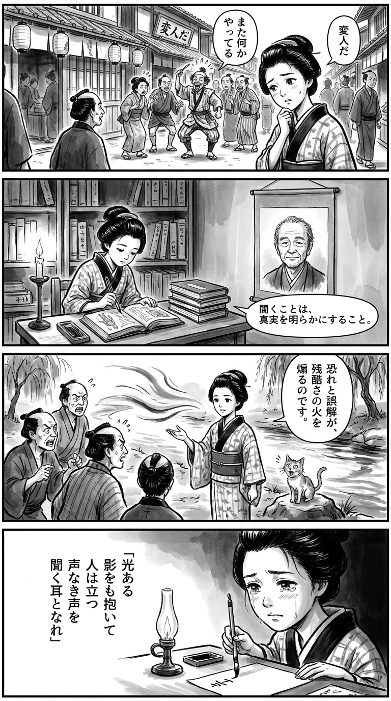

> **Language**: [日本語](../ja/超人間コク宝_review.html) | [English](../en/超人間コク宝_review.html) | [繁體中文](../zh-tw/超人間コク宝_review.html)
>
> [← Top / トップページ](../../)

## 📖 書籍情報
- **タイトル**: 超人間コク宝  
- **著者**: 吉田豪  
- **ASIN**: B08M5GF9VT  
- **URL**: [https://www.amazon.co.jp/dp/B08M5GF9VT](https://www.amazon.co.jp/dp/B08M5GF9VT)

---

<picture>
  <source srcset="../../images/reviews/超人間コク宝_4panel.webp" type="image/webp">
  
</picture>
## 🎯 この本の核心
『超人間コク宝』は、芸能二世としての複雑な生い立ちを持つ語り手を通して、現代日本の芸能・サブカル・ネット社会を縦断的に描き出すドキュメントである。華やかさの裏に潜む孤独や暴力、そして「叩かれる社会」で生きる人々のリアルが、吉田豪の冷静な聞き手としての姿勢によって浮かび上がる。  

本書は単なる人物評伝ではなく、ポリティカル・コレクトネスや社会的正義の問題を通して、「自由」と「責任」のバランスを問う思想的な試みでもある。サブカルの無邪気さが生んだ現実、SNS時代の監視社会化、そして当事者でなくとも声を上げる倫理——これらが交錯する中で、読者は「現代における人間らしさ」とは何かを突きつけられる。

---

## 💡 キーインサイト
- **「特権」と「孤独」は共存する**  
　華やかな家庭に生まれても、そこに幸福が保証されるわけではない。社会的特権の裏に潜む孤独を描くことで、成功や名声のイメージを相対化している。  

- **暴力と愛情の曖昧な境界**  
　家庭内の暴力が「しつけ」や「愛情表現」として受け入れられていた時代背景を通し、暴力を通じてしか伝えられなかった感情の複雑さを浮かび上がらせる。  

- **SNS時代の「監視社会化」**  
　日常の些細な発言や写真までもが批判の対象となる現代。個人の自由な発信が萎縮する構造を鋭く描き、ネット時代の息苦しさを可視化している。  

- **サブカルの自己批判的再検討**  
　かつてのサブカル的無責任さが社会の右傾化や差別の温床になったという視点は、文化的自己省察として重要である。表現の自由と倫理の関係を再考させる。  

- **「当事者でなくても立ち上がる」倫理**  
　差別や不正義に対して、当事者でなくとも声を上げる姿勢を強調する。これは現代社会における連帯の新しい形を提示している。

---

## 🔍 現代的文脈との関連
本書が描く「周縁の語り」や「叩かれる社会」は、現代日本の個人化・孤立化の進行と深く結びついている。都市化と分業化が進む中で、共同体のつながりが弱まり、個人が社会的評価の中で孤立する構造が強まっている。  

また、AIや市場経済の拡大によって「人間らしさ」や「誠実な対話」の価値が再び問われる時代において、吉田豪のインタビューは“人間を記録する”行為としての重みを増している。周縁的な生を記録し、社会の均質化に抗う本書は、現代文化の再生に向けた重要な証言でもある。

---

## 🚀 実践への提案
1. **SNSでの発信に「距離感」を持つ**
   過剰な自己開示は攻撃の的になる。発信と沈黙のバランスを意識し、プライベートを守ることが自己防衛となる。

2. **「当事者でなくても声を上げる」姿勢を持つ**
   不正義に対して沈黙せず、倫理的な立場から発言することが社会的連帯を支える。

3. **過去の文化を現代の倫理で再検討する**
   懐古に留まらず、過去の表現を今の文脈で読み直すことが、文化の成熟につながる。

4. **批判を受け流す「プロレス魂」を持つ**
   批判を恐れず、必要以上に引きずらない柔軟さを持つことで、創造的な発信を続けられる。

5. **名声より誠実さを重視する**
   社会的成功に左右されず、誠実な関係を築く姿勢が、長期的な信頼と自己肯定を支える。

---

## ⭐ 総合評価
『超人間コク宝』は、芸能・サブカル・ネット社会の交差点で「人間とは何か」を問う稀有な記録である。吉田豪の聞き手としての冷静さと、語り手の赤裸々な自己開示が交わることで、単なるゴシップを超えた社会的ドキュメントに昇華している。  

現代の閉塞した空気の中で、自分の言葉で生きるとはどういうことかを考えたい読者にとって、本書は強い刺激と洞察を与える一冊である。孤独と特権、暴力と愛、自由と責任——そのすべてが交錯する現代の“人間模様”を、真正面から描き出している。

---

&copy; shioki | [CC BY-NC-SA 4.0](https://creativecommons.org/licenses/by-nc-sa/4.0/)
