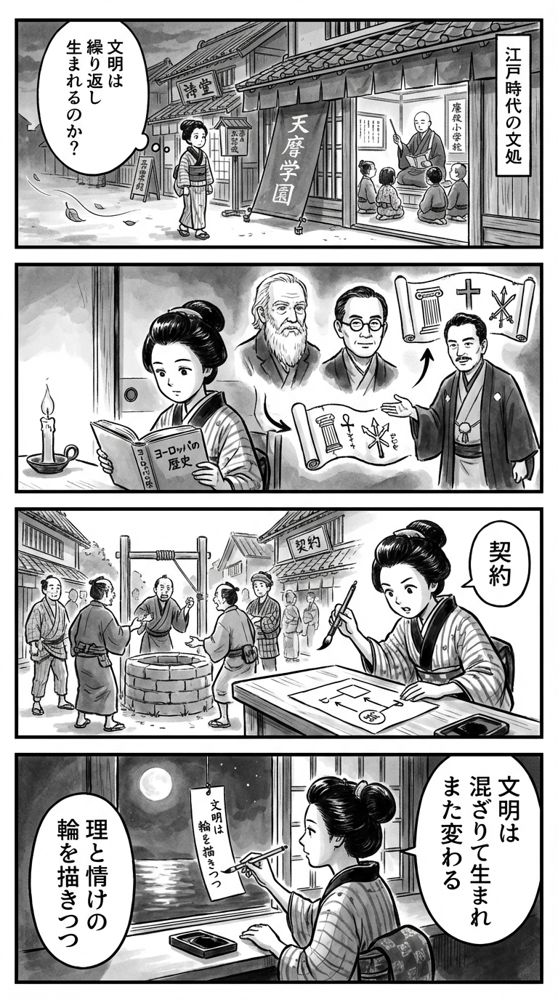

---
---
> **Language**: [日本語](../ja/超約ヨーロッパの歴史【mobi_リフロー版】_review.html) | [English](../en/超約ヨーロッパの歴史【mobi_リフロー版】_review.html) | [繁體中文](../zh-tw/超約ヨーロッパの歴史【mobi_リフロー版】_review.html)
>
> [← Top / トップページ](../../)

## 📖 書籍情報
- **タイトル**: 超約ヨーロッパの歴史【mobi_リフロー版】  
- **著者**: ジョン・ハースト, 倉嶋雅人, and 福井憲彦  
- **ASIN**: 4487811996  
- **URL**: [https://www.amazon.co.jp/dp/4487811996](https://www.amazon.co.jp/dp/4487811996)

---

<picture>
  <source srcset="../../images/reviews/超約ヨーロッパの歴史【mobi_リフロー版】_4panel.webp" type="image/webp">
  
</picture>
## 🎯 この本の核心
『超約ヨーロッパの歴史』は、ヨーロッパ文明を単なる年代順の物語としてではなく、「異質な要素の再構成による創造」として描く知的試みである。著者ジョン・ハーストは、ギリシャの理性、キリスト教の道徳、ゲルマンの戦士精神という三つの要素の「ありえない混合」が、ヨーロッパ文明の原動力であったと説く。  

この混合は時代ごとに再構成され、ルネサンス、宗教改革、啓蒙主義、ロマン主義といった思想運動を生み出してきた。理性と信仰、感情と自由のせめぎ合いを通じて、ヨーロッパは自己批判と再生を繰り返す文明として描かれる。  

本書の核心は、文明を「進歩の直線」ではなく「再構成の連続」として捉える視点にある。過去の遺産を再利用しながら新しい価値を生み出すという、文化的創造のダイナミズムを理解する鍵を提示している。

---

## 💡 キーインサイト
- **文明は「再構成」の連鎖で進化する**  
  ヨーロッパ史は、古代ギリシャの理性やキリスト教の信仰が、時代ごとに新しい形で再構成される過程として描かれる。これは、歴史を単なる興亡の物語ではなく、文化的再生の連続として読み解く視点を与える。  

- **教会は知の敵ではなく守護者だった**  
  中世の教会は古代の知識を封印したのではなく、筆写や教育を通じて継承した。知の継承と制度化がなければ、ルネサンスや科学革命は生まれなかったという逆説的な洞察が示される。  

- **啓蒙主義とロマン主義の対立は現代にも続く**  
  理性と感情、普遍と個性の対立は、現代社会の価値観の揺らぎにも通じる。啓蒙主義の合理主義とロマン主義の情熱が、ヨーロッパ思想の両輪として今なお機能している。  

- **政治的自由は「契約」として成立する**  
  ロックの社会契約論に象徴されるように、自由は自然に与えられるものではなく、理性に基づく合意によって成立する。これは現代民主主義の根幹をなす思想的遺産である。  

- **ヨーロッパ文明は自己批判を内包する**  
  自らの価値を世界に拡張しつつ、その過程で他文化との接触と反省を繰り返してきた。普遍化と自己反省の両立こそが、ヨーロッパ文明の持続的な生命力を支えている。

---

## 🔍 現代的文脈との関連
本書の主題である「分断と統合」「混合と再構成」は、現代ヨーロッパの政治的・文化的状況とも深く響き合う。EUの形成と拡大、そしてブレグジットや東欧情勢などの分断は、まさにヨーロッパ史が繰り返してきた統合と解体のサイクルの現代的再演である。  

また、理性と感情、信仰と自由の対立は、AI時代の倫理やポピュリズムの台頭といった現代課題にも通じる。ハーストの提示する「再構成の文明観」は、グローバル化とアイデンティティの再定義が進む今、文化的多様性を肯定的に理解するための指針となる。

---

## 🚀 実践への提案
1. **歴史を「再構成の連続」として学ぶ**
   過去を単なる出来事の集積ではなく、再利用と再創造のプロセスとして捉えることで、現代の制度や価値観の背景をより深く理解できる。

2. **理性と感情のバランスを意識する**
   啓蒙主義とロマン主義の両極を往復するように、論理的思考と感性的判断を両立させることが、成熟した社会的判断力を育む。

3. **知識の継承と開放を両立させる**
   教会やルターの例に学び、専門知を守りながら広く共有する姿勢が、現代の教育・情報社会において不可欠である。

4. **文化の混合を創造の源とみなす**
   異文化の融合を恐れず、新たな価値を生み出す契機として受け入れる。グローバル社会における創造性の基盤は、純粋性よりも混合性にある。

5. **自由を「契約」として再確認する**
   政府と市民の関係を、権利と責任の相互契約として見直すことが、民主主義の健全な維持につながる。

---

## ⭐ 総合評価
『超約ヨーロッパの歴史』は、ヨーロッパ文明を「再構成され続ける混合体」として描くことで、歴史を生きた知の体系として再定義する一冊である。専門的な知識がなくとも、文明のダイナミズムを直感的に理解できる構成が魅力的だ。  

特に、理性と信仰、感情と自由といった対立軸を通じて、現代社会の課題を照らす洞察は鋭い。ヨーロッパ史を学びたい人だけでなく、文化・思想・社会の成り立ちを根本から考えたい読者にとっても、深い知的刺激を与えてくれるだろう。

---

&copy; shioki | [CC BY-NC-SA 4.0](https://creativecommons.org/licenses/by-nc-sa/4.0/)
