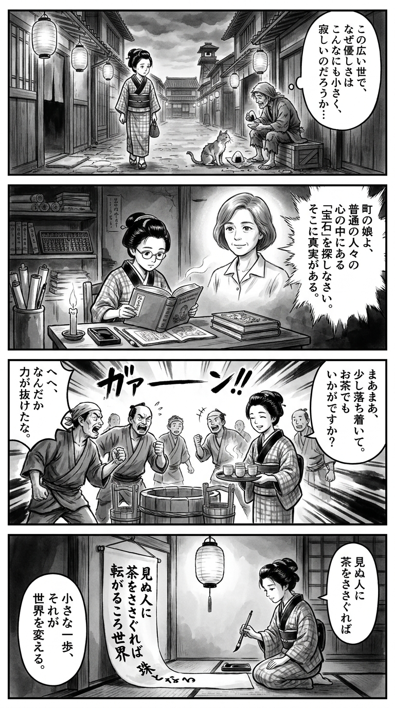

> **Language**: [日本語](../ja/転がる珠玉のように_review.html) | [English](../en/転がる珠玉のように_review.html) | [繁體中文](../zh-tw/転がる珠玉のように_review.html)
>
> [← Top / トップページ](../../)

## 📖 書籍情報
- **タイトル**: 転がる珠玉のように  
- **著者**: ブレイディみかこ  
- **ASIN**: B0D78MYHHC  
- **URL**: [https://www.amazon.co.jp/dp/B0D78MYHHC](https://www.amazon.co.jp/dp/B0D78MYHHC)

---

<picture>
  <source srcset="../../images/reviews/転がる珠玉のように_4panel.webp" type="image/webp">
  
</picture>
## 🎯 この本の核心
『転がる珠玉のように』は、パンデミックや社会的分断、家族の老いと死といった現実の只中で、それでも人間の優しさと連帯を信じようとするエッセイ集である。著者は英国の庶民的な日常を舞台に、平凡な人々の中に潜む「珠玉」のような輝きを丁寧に掬い上げる。  

ロックダウン下の孤独、移民社会の摩擦、そして別れの痛みを通して、著者は「それでも生きる」ことの肯定を描く。言葉の背景や文化の違いを掘り下げながら、他者理解の可能性を探る姿勢が全編を貫いている。

---

## 💡 キーインサイト
- **「いい人」こそが世界を支えている**  
　著者は「世界は珠玉でできている」と語り、目立たぬ人々の善意や誠実さこそ社会の基盤であると示す。華やかさではなく、日常に潜む静かな尊厳を見出す視点が本書の核である。  

- **「そんなものだ」という諦めへの警鐘**  
　社会の不条理を「仕方ない」と受け流す言葉が、しばしば支配構造を温存する危うさを孕むと指摘する。著者はこの無自覚な暴力を暴き、日常の中に潜む構造的問題を可視化する。  

- **孤立の中で見つける連帯**  
　ロックダウン下の孤独や怒りを描きながらも、見知らぬ人との「A CUP OF KINDNESS」に救いを見出す。人間の連帯は制度ではなく、日々の小さなやりとりの中に息づいている。  

- **「外側の人」がもたらす救い**  
　異なる文化や立場にある他者との関わりが、閉塞した世界を開く鍵になる。多文化社会の現実を生きる著者の視点は、他者理解の重要性を実感させる。  

- **「きれいごと」は抵抗のかたち**  
　理想や優しさを語ること自体が、現実への抵抗であると著者は説く。希望を語ることを恥じない姿勢が、本書の静かな力となっている。

---

## 🔍 現代的文脈との関連
本書のテーマは、Brexit後の移民政策強化やBlack Lives Matterの余波を受けた英国社会の現実と深く響き合う。多文化共生の理想と現実の狭間で、著者は「外側の人」としての視点から、共感と理解の可能性を探る。  

日本においても、外国人労働者の増加やジェンダー多様性の議論が進む中で、他者への想像力の欠如が社会問題化している。ブレイディのエッセイは、こうした時代の「エンパシー教育」として機能しうる。  

また、AI時代における人種・文化的バイアスの問題が顕在化する今、「きれいごと」を語る勇気こそが社会変革の第一歩であるという著者のメッセージは、より一層の現代的意義を持つ。

---

## 🚀 実践への提案
1. **日常の中の「珠玉」を見つける**
   平凡な人々の中にある小さな優しさや誠実さを意識的に見つけることで、社会への信頼を取り戻す。著者の視点を自らの生活に取り入れることが、心の豊かさを育む。

2. **「そんなものだ」で終わらせない**
   不条理や差別を受け流さず、疑問を持ち続ける姿勢を持つ。小さな違和感を言葉にすることが、社会を変える第一歩となる。

3. **「A CUP OF KINDNESS」を実践する**
   見知らぬ人への小さな親切を意識的に行う。互いの存在を認め合う行為が、分断を超える連帯を生む。

4. **「外側の人」と関わる機会を持つ**
   異なる文化や価値観に触れることで、自分の世界を広げる。閉じたコミュニティに風を通すことが、社会の健全性を保つ鍵である。

5. **「さよなら」を恐れずに生きる**
   別れや変化を受け入れながら、次の始まりを迎える勇気を持つ。喪失を通して生を肯定することが、成熟した生き方につながる。

---

## ⭐ 総合評価
『転がる珠玉のように』は、絶望の時代における静かな希望の書である。社会の片隅で生きる人々の姿を通して、著者は「生きるとは何か」「優しさとは何か」を問い直す。  

社会問題を扱いながらも説教臭さがなく、ユーモアと温かさに満ちた筆致が心に残る。変化の激しい時代にあっても、人間の尊厳と連帯を信じたいすべての読者に、この本は深い慰めと勇気を与えるだろう。

---

&copy; shioki | [CC BY-NC-SA 4.0](https://creativecommons.org/licenses/by-nc-sa/4.0/)
