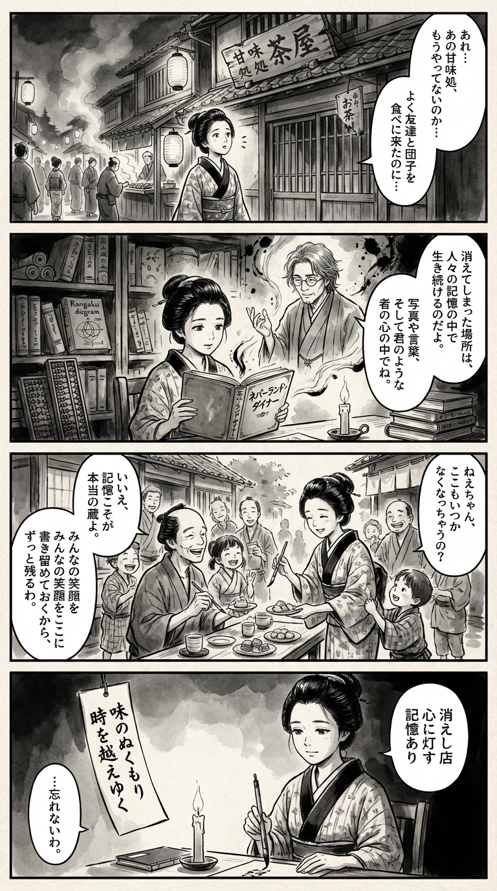

---
---
> **Language**: [日本語](../ja/都築響一-Neverland Diner 二度と行けないあの店で_review.html) | [English](../en/都築響一-Neverland Diner 二度と行けないあの店で_review.html) | [繁體中文](../zh-tw/都築響一-Neverland Diner 二度と行けないあの店で_review.html)
>
> [← Top / トップページ](../../)

## 📖 書籍情報
- **タイトル**: Neverland Diner 二度と行けないあの店で  
- **著者**: 都築響一  
- **ASIN**: B08TM9LVKX  
- **URL**: [https://www.amazon.co.jp/dp/B08TM9LVKX](https://www.amazon.co.jp/dp/B08TM9LVKX)  

---

## 🎯 この本の核心
『Neverland Diner 二度と行けないあの店で』は、すでに存在しない「店」をめぐる記憶のアーカイブである。そこに描かれるのは、食や空間を通して交わされた人間関係、そして時間の不可逆性だ。  

都築響一の編集による本書は、100組の寄稿者がそれぞれの「二度と行けない店」を語るアンソロジー形式で構成されている。消えた店は単なる場所ではなく、人生の一部であり、誰かとの関係や時代の空気を内包する「小宇宙」として描かれる。  

「食べる」という行為を通して、人は誰かと時間を共有し、やがてその時間が過去になる。喪失を語ることによって、記憶は再び息を吹き返す――本書はその循環を静かに見つめる文学的ドキュメントである。  

---

## 💡 キーインサイト
- **「おいしい記憶」は味ではなく体験の密度で決まる**  
  評価やランキングを超えて、誰と、どんな状況で食べたかが「おいしさ」を形づくる。食体験は感情と結びついた記憶装置であり、人生の瞬間を封じ込めるメディアでもある。  

- **店の消失は人生の一章の終わりを意味する**  
  閉店や取り壊しは、単なる経済的現象ではなく、個人史の断絶として描かれる。店がなくなることで、そこに通った人々の時間もまた終わりを迎える。  

- **「二度と行けない」ことが記憶を美しくする**  
  実在と幻想のあわいで、記憶は詩的に変質する。喪失があるからこそ、過去は輝きを増し、語るに値する物語となる。  

- **都市の変化は個人の記憶をも消し去る**  
  再開発や世代交代によって街が変わるとき、そこに刻まれた個人の歴史もまた消える。都市の記憶と個人の記憶が重なり合う痛みが、現代的な哀しみとして描かれている。  

- **語ることが記憶を生かす**  
  語りは追悼であり再生の手段である。失われた店を語ることで、過去の時間が再び現在に立ち上がる。  

---

## 🔍 現代的文脈との関連
2020年代の日本では、コロナ禍による店舗閉鎖や都市再開発が進み、「二度と行けない店」は現実の社会現象となった。喫茶店やスナックの閉店ラッシュは、個人の思い出と街の記憶が同時に失われるプロセスを可視化している。  

一方で、SNSやイベントを通じて「失われた場所」を再現・共有する試みも増えている。都築響一が提唱する「正統じゃない記録」は、こうした動きと共鳴し、公式な歴史に残らない日常の断片を未来へとつなぐ役割を果たす。  

本書は、過去を懐かしむだけでなく、喪失をどのように語り継ぐかという現代的課題への応答でもある。ノスタルジーを超えて、記憶を文化として再構築する試みなのだ。  

---

## 🚀 実践への提案
- **今ある店を記録する**  
  どんなに平凡な場所でも、いつかは「二度と行けない店」になる。写真を撮る、日記に書く、誰かと語る――その記録が未来の文化資産になる。  

- **「誰と食べるか」を意識する**  
  味や店の格ではなく、共に過ごす人との時間を大切にすること。食卓は人間関係を映す鏡であり、人生の記憶を形づくる場でもある。  

- **喪失を語り継ぐ**  
  消えた場所を語ることは、過去を悼むだけでなく、文化を継承する行為だ。自分の言葉で語ることで、記憶は再び息を吹き返す。  

- **「評価」より「体験」を選ぶ**  
  他人のレビューではなく、自分の直感で店を選ぶ。偶然の出会いが、人生の宝物になるかもしれない。  

---

## ⭐ 総合評価
『Neverland Diner 二度と行けないあの店で』は、喪失と記憶の関係を食という身近な行為を通して描いた、静かな感傷と洞察の書である。  

都市が変わり、人が去っても、記憶を語ることで時間は再び動き出す。過去を懐かしむだけでなく、今この瞬間をどう生き、どう記録するかを問いかける一冊だ。  

日常の中に潜む「永遠の一瞬」を見つけたい人、そして自分の人生の風景を言葉にしたい人に、深い余韻を残す読書体験をもたらしてくれるだろう。

---

&copy; shioki | [CC BY-NC-SA 4.0](https://creativecommons.org/licenses/by-nc-sa/4.0/)
