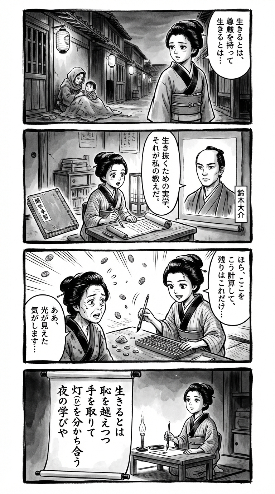

> **Language**: [日本語](../ja/里奈の物語_review.html) | [English](../en/里奈の物語_review.html) | [繁體中文](../zh-tw/里奈の物語_review.html)
>
> [← Top / トップページ](../../)

## 📖 書籍情報
- **タイトル**: 里奈の物語  
- **著者**: 鈴木 大介  
- **ASIN**: B081YSYRBH  
- **URL**: [https://www.amazon.co.jp/dp/B081YSYRBH](https://www.amazon.co.jp/dp/B081YSYRBH)

---

## 🎯 この本の核心
『里奈の物語』は、貧困と家庭崩壊の中で育った少女・里奈が、社会の周縁で生き抜く姿を描いた成長譚である。児童養護施設での孤独、援助交際や夜職に身を置く現実を通じて、彼女は「生きるとは何か」「女としての誇りとは何か」を模索していく。  

本作の特徴は、貧困や搾取を単なる悲劇として描かず、そこに宿る「生き抜く知恵」や「連帯の力」を見出している点にある。暴力と優しさ、搾取と自立が交錯する世界の中で、里奈は自らの軸を見つけようとする。その過程は、読者に「尊厳とは何か」という根源的な問いを突きつける。

---

## 💡 キーインサイト
- **「夜の実学」としての生き方の知恵**  
  志緒里の教え「ゼニでよろめくな」に象徴されるように、夜の世界には現実を生き抜くための倫理と知恵がある。社会の表舞台では語られない「実学」が、女性たちの生存戦略として描かれている。  

- **「稼ぐ」とは、生きることそのもの**  
  里奈が繰り返し問う「お金を稼ぐとは何か」は、単なる経済活動ではなく、生存そのものの問題である。金銭が命綱となる現実の中で、彼女は搾取されながらも主体的に生きる術を学んでいく。  

- **制度の限界と支援の空白**  
  行政や児童委員が形式的な支援に留まる描写は、制度の無力さを浮き彫りにする。現場のリアルを知る著者だからこそ描ける、支援の届かない現実が胸に突き刺さる。  

- **連帯が絶望を超える力になる**  
  冬美や茉莉との出会いを通じて、里奈は「共感」と「支え合い」の力を知る。孤立した少女たちが互いに寄り添う姿は、絶望を超える希望の象徴である。  

- **暴力の裏にある人間の痛み**  
  ヤクザの森永を通して、加害者にも被害者としての過去があることが示される。暴力と優しさが共存する世界で、里奈は人間の複雑さと向き合う。

---

## 🔍 現代的文脈との関連
本作の主題である「貧困」「制度の限界」「女性の生き方」は、現代日本においても依然として深刻な問題である。特に若年女性の貧困や、支援制度の空白は社会的課題として繰り返し指摘されている。  

『里奈の物語』は、統計や政策では見えない「生の声」を物語として可視化する。現代社会における「見捨てられた人々」の現実を、読者に直視させる力を持つ。これは単なるフィクションではなく、現代日本の社会構造そのものを映す鏡である。

---

## 🚀 実践への提案
1. **現場の声を聞く支援を**
   制度の枠内では救えない人々の声を拾うことが、支援の第一歩である。現実に即した柔軟な支援体制の構築が求められる。

2. **教育に「生き抜く力」を取り入れる**
   学校教育の中で、志緒里の「夜の実学」に通じる現実的なサバイバル知識を教えることが、貧困の再生産を防ぐ鍵となる。

3. **「稼ぐこと」の倫理を再考する**
   経済的自立を目指す若者に、金銭の多寡ではなく「尊厳ある稼ぎ方」を教える必要がある。これは労働観の再構築にもつながる。

4. **孤立する若者に共感の場を**
   里奈が救われたのは、同じ痛みを知る仲間との出会いだった。支援現場では、共感と対話を軸にした居場所づくりが不可欠である。

5. **多様な生き方を尊重する文化を**
   夜の世界で生きる女性たちの誇りを否定せず、社会全体で多様な生き方を認める視点が必要だ。偏見を超えた理解が、共生社会の基盤となる。

---

## ⭐ 総合評価
『里奈の物語』は、社会の周縁に生きる少女の成長を通じて、「生きることの尊厳」を問う作品である。貧困、搾取、暴力といった重いテーマを扱いながらも、そこに確かに存在する希望と連帯を描き出している。  

鈴木大介の筆致は、ルポルタージュ的なリアリティと文学的な深みを兼ね備え、読者に強い没入感を与える。社会問題に関心を持つ読者はもちろん、人生の岐路で「どう生きるか」を考えるすべての人に読まれるべき一冊である。

---

&copy; shioki | [CC BY-NC-SA 4.0](https://creativecommons.org/licenses/by-nc-sa/4.0/)
