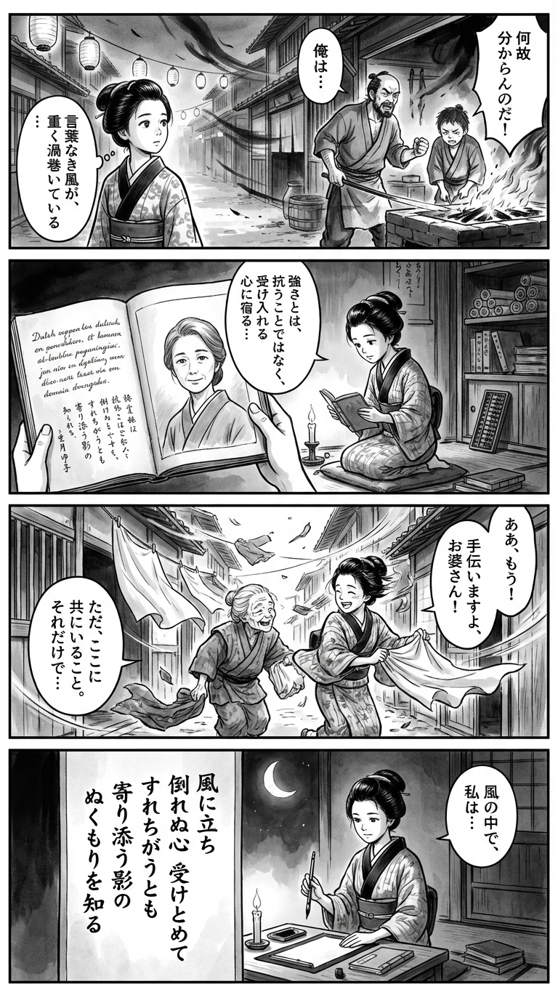

> **Language**: [日本語](../ja/風に立つ_review.html) | [English](../en/風に立つ_review.html) | [繁體中文](../zh-tw/風に立つ_review.html)
>
> [← Top / トップページ](../../)

## 📖 書籍情報
- **タイトル**: 風に立つ  
- **著者**: 柚月裕子  
- **ASIN**: B0CRKKYMQ7  
- **URL**: [https://www.amazon.co.jp/dp/B0CRKKYMQ7](https://www.amazon.co.jp/dp/B0CRKKYMQ7)

---

<picture>
  <source srcset="../../images/reviews/風に立つ_4panel.webp" type="image/webp">
  
</picture>
## 🎯 この本の核心
『風に立つ』は、岩手を舞台に、親子三世代の男性がそれぞれの過去と向き合いながら、断絶した絆を取り戻していく物語である。悟と父・孝雄の確執を軸に、家族という最も近くて最も理解しがたい存在の中に潜む「不器用な愛」が静かに描かれる。  

南部鉄器という伝統工芸を背景に、仕事と生き方、過去の痛みと再生が重ね合わされる構成は、単なる家族小説に留まらない深みを持つ。風に立つとは、運命に抗うことではなく、それを受け止めながらも倒れずに生きる姿勢を意味している。

---

## 💡 キーインサイト
- **理解し合えないことを受け入れる勇気**  
　家族であっても完全に理解し合うことはできないという現実を、悟は父との関係を通して学ぶ。理解不能な他者を拒絶せず、受け入れることこそが成熟の証である。  

- **不器用な優しさの力**  
　孝雄の愛情は言葉ではなく行動に宿る。直接的な表現を欠いていても、責任と誠実さをもって支える姿が、真の思いやりの形として描かれる。  

- **孤独を癒すのは寄り添う存在**  
　悟が気づくのは、理解よりも「そばにいること」の価値である。人は孤独を完全に消すことはできないが、誰かの存在がその痛みを和らげる。  

- **過去の痛みを生の糧に変える**  
　孝雄の人生は、喪失の記憶から生まれた再生の物語である。人は苦しみを避けるのではなく、それを意味づけることで前に進むことができる。  

- **風に立つ＝受容の強さ**  
　「風に立つ」という比喩は、抗うのではなく受け止める強さを象徴する。運命や不条理を抱えながらも、まっすぐに立ち続ける姿が本作の核心である。

---

## 🔍 現代的文脈との関連
本作が描く「家族の再生」と「地方の絆」は、現代日本が直面する社会課題と深く響き合う。少子高齢化や地方の過疎化が進む中で、家族や地域のつながりを再構築することは、社会の持続性を支える重要なテーマとなっている。  

また、柚月裕子が得意とするミステリー要素を排し、人間の内面に焦点を当てた本作は、近年増えている“癒し系ヒューマンドラマ”の潮流にも位置づけられる。コロナ禍以降、人と人との距離をどう取り戻すかという問いに対し、本作は「寄り添うことの意味」を静かに提示している。

---

## 🚀 実践への提案
1. **大切な人と対話を重ねる**
   完璧な理解を求めずとも、言葉を交わす努力が関係を変える。沈黙のままでは誤解が深まるだけである。

2. **過去の痛みを意味づける**
   避けるのではなく、自分の中で位置づけ直すことで、苦しみは次の行動の原動力になる。

3. **寄り添う姿勢を持つ**
   相手を変えようとするより、ただそばにいることが支えになる。共感は言葉以上の力を持つ。

4. **仕事や日常に生きる意味を見出す**
   職人のように、自分の行動に誇りと理由を持つことで、日々の生活が豊かになる。

5. **物語を通して他者を理解する**
   読書は他者の痛みを知り、自分の心を癒す行為である。定期的に物語に触れることで、内面の柔軟性を保てる。

---

## ⭐ 総合評価
『風に立つ』は、家族という最も身近な他者との関係を通じて、人間の孤独と再生を描いた静謐な傑作である。柚月裕子がこれまで培ってきた人間洞察の深さが、職人の手仕事のように丁寧に織り込まれている。  

親子の確執、失われた時間、そしてそれでも続いていく日常――そのすべてを受け止めながら生きる強さを、この物語は教えてくれる。家族関係に悩む人、人生の節目に立つ人にとって、深い癒しと再生の読書体験となるだろう。

---

&copy; shioki | [CC BY-NC-SA 4.0](https://creativecommons.org/licenses/by-nc-sa/4.0/)
