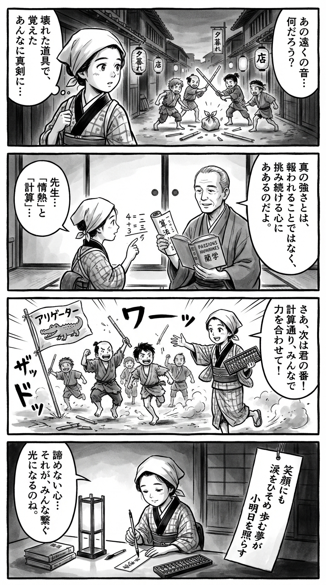

> **Language**: [日本語](../ja/ＧＯ！ＧＯ！アリゲーターズ_review.html) | [English](../en/ＧＯ！ＧＯ！アリゲーターズ_review.html) | [繁體中文](../zh-tw/ＧＯ！ＧＯ！アリゲーターズ_review.html)
>
> [← Top / トップページ](../../)

## 📖 書籍情報
- **タイトル**: ＧＯ！ＧＯ！アリゲーターズ  
- **著者**: 山本幸久  
- **ASIN**: B01MUE62N1  
- **URL**: [https://www.amazon.co.jp/dp/B01MUE62N1](https://www.amazon.co.jp/dp/B01MUE62N1)

---

<picture>
  <source srcset="../../images/reviews/ＧＯ！ＧＯ！アリゲーターズ_4panel.webp" type="image/webp">
  
</picture>
## 🎯 この本の核心
『ＧＯ！ＧＯ！アリゲーターズ』は、地方の独立リーグ球団を舞台に、夢と現実の狭間でもがく人々の姿を描いた再生の物語である。華やかなプロ野球の陰で、低賃金や不安定な環境に耐えながらも情熱を失わない選手たちと、彼らを支える人々の生き様が丁寧に描かれている。  

主人公・茜は、離婚や経済的困難を抱えながらも、球団マスコット「アリーちゃん」として働く中で、自らの存在意義を見出していく。彼女の成長は、他者との関わりを通じて自己を再発見する過程そのものであり、地域とのつながりや小さな夢の尊さを再確認させる。  

この作品は、「成功」や「名声」ではなく、日々の努力と仲間との絆の中にこそ幸福があるというメッセージを静かに提示している。

---

## 💡 キーインサイト
- **情熱は報酬を超える力を持つ**  
　アリゲーターズの選手たちは、月給十二万円という厳しい現実の中でも野球を続ける。経済的報酬よりも「好きなことを続ける」情熱が、人生を支える原動力となることを示している。  

- **「顔で笑って心で泣く」強さ**  
　茜がアリーちゃんとして笑顔を保つ姿は、内面の葛藤を抱えながらも前進する人間の強さを象徴する。社会の中で役割を果たすことの重みと、そこに潜む静かな勇気を描いている。  

- **小さな成功が大きな変化を生む**  
　観客数の増加や地域の反応など、些細な成果がチーム全体の士気を高める。日々の積み重ねが組織や人を変える力を持つことを教える。  

- **他者との関係が自己理解を深める**  
　茜は選手や仲間との関わりを通じて、自らの弱さや夢を見つめ直す。他者を理解することが、自己を受け入れる第一歩であることを物語っている。  

- **「本気で生きる」ことの意味**  
　笹塚の「人生ぜんぶ片手間」という言葉をきっかけに、茜は自分の生き方を見つめ直す。中途半端ではなく、何事にも本気で向き合う姿勢の重要性を訴えている。

---

## 🔍 現代的文脈との関連
現代社会では、非正規雇用や低賃金労働といった問題が広がり、「情熱」と「生活」のバランスを取ることが難しくなっている。本作に描かれる独立リーグの現実は、まさにその縮図である。  

また、SNS時代における「他者からの評価」に依存しがちな現代人にとって、茜の自己肯定のプロセスは示唆的である。見栄や比較ではなく、自分の役割を見出し、誇りを持って生きることの意義を再確認させる。  

地域社会とのつながりや「小さな幸福」を重視する本作の視点は、分断が進む現代において、共感と支え合いの価値を再考させるものである。

---

## 🚀 実践への提案
1. **小さな目標を設定し、継続する**
   アリゲーターズのように、無理のある目標でも日々の努力が変化を生む。現実的な小さな目標を立て、継続することで自己成長を実感できる。

2. **自分の居場所を見つける**
   茜が「アリゲーターズの一員」と感じたように、どんな環境でも自分の役割を見出すことが、自己肯定感を高める鍵となる。

3. **情熱を恐れずに持つ**
   経済的な不安や周囲の目を気にせず、好きなことに本気で取り組む勇気を持つ。情熱は困難を乗り越える力となる。

4. **仲間の努力を認め、支え合う**
   チームの精神を日常に応用し、他者の努力を認める姿勢を持つことで、職場や家庭の関係性が豊かになる。

5. **「笑顔の裏の自分」を大切にする**
   無理に強がるのではなく、自分の感情を理解しながら前進する。心の痛みを否定せず、受け入れることで人はより強くなれる。

---

## ⭐ 総合評価
『ＧＯ！ＧＯ！アリゲーターズ』は、華やかさとは無縁の現場で奮闘する人々の姿を通じて、「生きることの意味」を問い直す作品である。地方球団という小さな世界を舞台にしながらも、そこに描かれるのは普遍的な人間の希望と誇りだ。  

夢を追うことの苦しさと、それでも前へ進む勇気を描いた本作は、現代の読者に深い共感と励ましを与える。仕事や人生に迷いを感じるすべての人に、もう一度「本気で生きる」力を思い出させてくれる一冊である。

---

&copy; shioki | [CC BY-NC-SA 4.0](https://creativecommons.org/licenses/by-nc-sa/4.0/)
