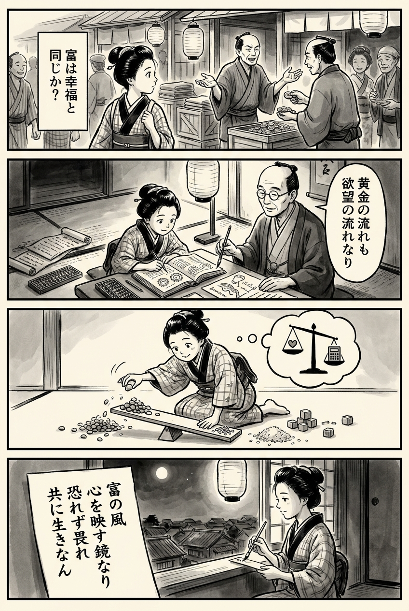

> **Language**: [日本語](../ja/14歳からの資本主義_review.html) | [English](../en/14歳からの資本主義_review.html) | [繁體中文](../zh-tw/14歳からの資本主義_review.html)
>
> [← Top / トップページ](../../)

# 書籍評論（繁體中文）

## 📖 書籍資訊
- **標題**: 14歲開始的資本主義  
- **作者**: 丸山俊一  
- **ASIN**: B07MTXR11L  
- **網址**: [https://www.amazon.co.jp/dp/B07MTXR11L](https://www.amazon.co.jp/dp/B07MTXR11L)  

---

<picture>
  <source srcset="../../images/reviews/14歳からの資本主義_4panel.webp" type="image/webp">
  
</picture>
## 🎯 這本書的核心
《14歲開始的資本主義》將資本主義描繪為一種「文化現象」，不僅僅是一個經濟系統，還規範著人類的思考、情感和欲望。丸山俊一揭示了資本主義所產生的不平等擴大及科技對勞動的重組，明確指出現代社會的結構性扭曲。

本書的特點在於，雖然以「14歲開始」為名，但並未簡化問題，反而深入探討人類的心理和倫理。從市場的自由與成長的關係、情感的市場化，到生活在合理性與非合理性之間的人類形象，從多層次的視角質疑資本主義的本質。

丸山將資本主義視為一種「不畏懼而敬畏」的存在。這意味著，無論是批評還是讚美，尋求共存的倫理態度才是本書的核心。

---

## 💡 關鍵見解
- **成長不再保證富裕**  
  經濟成長帶來社會整體幸福的神話已經崩潰。財富並未循環，貧富差距持續擴大。丸山直面這一現實，指出需要尋求新的「富裕定義」。

- **科技進步也可能帶來停滯**  
  人工智慧和自動化雖然提高了生產力，但也可能奪走就業，導致社會停滯。我們需要同時關注技術的好處與副作用。

- **情感的市場化侵蝕人性**  
  在當今「能讓人感動」「能引起共鳴」的情感商品化中，人類的內心也被市場邏輯所包圍。這意味著資本主義已深入人類的根本部分。

- **理性經濟人的幻想**  
  經濟學所假設的「理性人」形象與現實脫節。理解人類的非理性，才是思考未來經濟和社會的出發點。

- **「不畏懼而敬畏」的姿態**  
  我們無法完全控制資本主義。因此，與其恐懼，不如以敬畏的心態面對，這是成熟社會的條件。

---

## 🔍 與現代背景的關聯
現代資本主義因科技和全球市場的加速而變得前所未有的複雜。人工智慧的進步和社交媒體經

---

&copy; shioki | [CC BY-NC-SA 4.0](https://creativecommons.org/licenses/by-nc-sa/4.0/)
