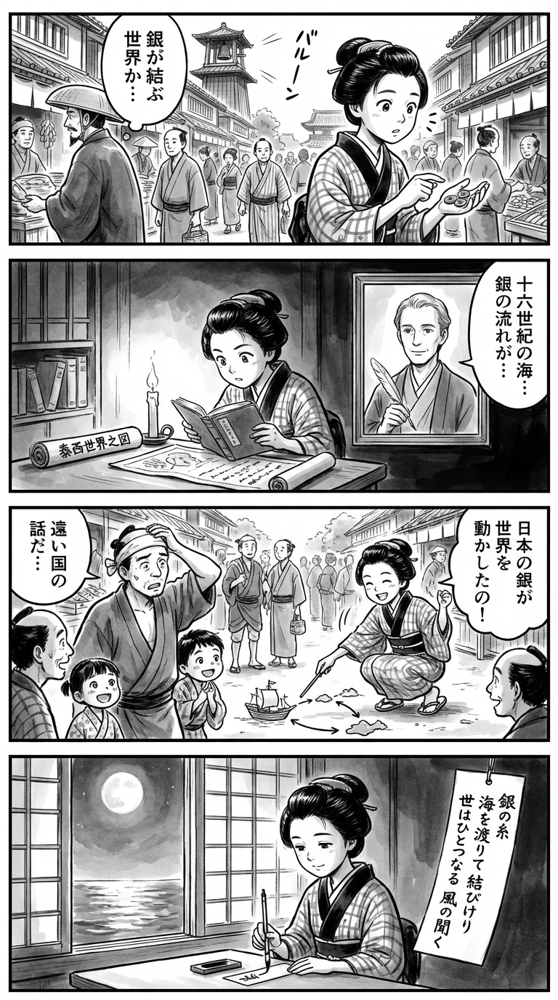

> **Language**: [日本語](../ja/16世紀「世界史」のはじまり_review.html) | [English](../en/16世紀「世界史」のはじまり_review.html) | [繁體中文](../zh-tw/16世紀「世界史」のはじまり_review.html)
>
> [← Top / トップページ](../../)

# 書籍評論（繁體中文）

## 📖 書籍資訊
- **標題**: 16世紀「世界史」のはじまり  
- **作者**: 玉木 俊明  
- **ASIN**: B092LXD5FL  
- **URL**: [https://www.amazon.co.jp/dp/B092LXD5FL](https://www.amazon.co.jp/dp/B092LXD5FL)  

---

<picture>
  <source srcset="../../images/reviews/16世紀「世界史」のはじまり_4panel.webp" type="image/webp">
  
</picture>
## 🎯 本書的核心
玉木俊明的《16世紀「世界史」のはじまり》是一部意欲之作，將歐洲的擴張描繪為「世界首次相互連結的時代」，而非單純的西洋史延續。作者將宗教改革、科學革命、主權國家的形成以及全球經濟的誕生視為一體的現象，將16世紀定位為「世界史的起點」。

特別值得注意的是，作者將日本的戰國時代與歐洲的近代國家形成並列。透過解讀信長、秀吉、家康的施策為「日本型主權國家」的萌芽，揭示了亞洲在世界史形成中所扮演的主動角色。作者以精緻的史料和結構性分析描繪了宗教與國家、經濟與科學交織的「世界史的胎動期」。

---

## 💡 關鍵洞見
- **「對抗宗教改革」比宗教改革更能驅動世界**  
  宗教改革僅是歐洲內部的事件，實際上驅動世界的是以耶穌會為中心的天主教重組。宗教透過全球傳教和知識輸出，形成了歐洲的世界影響力。

- **印刷術帶來的知識革命**  
  活版印刷的普及加速了知識的流通，為宗教改革和科學革命奠定了基礎。信息的民主化改變了社會結構，這一觀點與現代的數位革命相通。

- **日本的銀礦推動了世界經濟**  
  石見銀山的銀與西班牙的波托西銀並列，支撐了16世紀的世界經濟。指出日本在全球經濟中的核心地位，顛覆了傳統「周邊作為日本史」的觀念。

- **主權國家的形成推動了歷史的發展**  
  經過宗教戰爭後出現的主權國家，正是近代政治秩序的根源。通過比較菲利普二世和信長等人的統治，揭示了國家的形成是世界史的驅動力。

- **科學的輸出支撐了歐洲的優勢**  
  科學是歐洲能夠出口到中國的少數「商品」之一，知識的全球化成為文化支配的基礎。科學的普遍性形成了歐洲的軟實力。

---

## 🔍 與現代背景的關聯
本書的問題意識與近年來的「去歐洲中心史觀」和「後殖民史學」的潮流相呼應。自2020年代以來，歐美對大航海時代的重新評價強調了殖民主義的起點，亞洲和非洲的主體性角色受到關注。玉木的「多極世界史」論可謂這一潮流的先驅。

此外，在氣候變遷和資源問題的背景下，16世紀的全球經濟和銀的流通也在重新檢討中。本書暗示了在思考現代全球化時，歷史上權力、信息和資源的聯結的重要性。在考慮AI時代的信息流通和數位帝國主義時，16世紀的「印刷革命」的類比也具有啟發性。

---

## 🚀 實踐建議
1. **以全球視角重構歷史**  
   將世界史視為「相互連結的歷史」，而非「歐洲中心」，是非常重要的。意識到地區間的聯繫，能為現代國際問題提供洞察。

2. **理解信息技術變化作為社會變革的起點**  
   活版印刷使宗教改革成為可能，現代的數位技術同樣改變社會結構。意識到信息流通與權力的關係，是解讀現代政治和經濟的關鍵。

3. **重新評估軟實力的重要性**  
   歐洲能夠主導世界，不僅依賴軍事力量，還包括商業、科學和宗教等文化輸出。現代中，文化和知識的共享也影響國際關係。

4. **將國家形成的本質視為「徵稅與信息」**  
   國家的穩定依賴於財政和信息管理的透明度。通過16世紀的主權國家形成，可以看出現代治理的原則。

5. **重視邊緣的創造力**  
   推動歷史的從來不是「中心」，而是「周邊」。從日本和亞洲的例子中學習，在現代也應培養來自周邊的思維，以創造新的秩序。

---

## ⭐ 總體評價
《16世紀「世界史」のはじまり》是對重構世界史的知識挑戰。它將歐洲的擴張描繪為一個多極的相互作用，而非單方面的征服故事，這是本書最大的價值。

對於對歷史學、國際關係和經濟思想感興趣的讀者來說，本書是理解「全球化的起點」的必讀書籍。通過了解過去，這本書賦予讀者更深刻解讀現代全球社會的能力。

---

&copy; shioki | [CC BY-NC-SA 4.0](https://creativecommons.org/licenses/by-nc-sa/4.0/)
