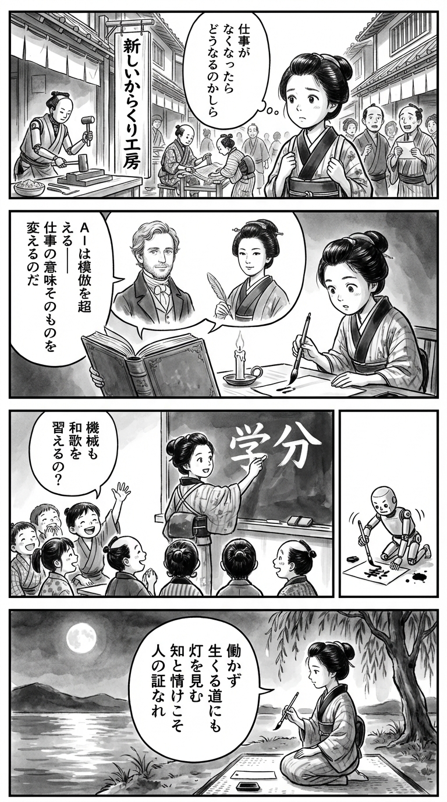

---
---
> **Language**: [日本語](../ja/WORLD WITHOUT WORK――AI時代の新「大きな政府」論_review.html) | [English](../en/WORLD WITHOUT WORK――AI時代の新「大きな政府」論_review.html) | [繁體中文](../zh-tw/WORLD WITHOUT WORK――AI時代の新「大きな政府」論_review.html)
>
> [← Top / トップページ](../../)

## 📖 書籍資訊
- **書名**: WORLD WITHOUT WORK――AI時代の新「大きな政府」論  
- **作者**: ダニエル・サスキンド and 上原裕美子  
- **ASIN**: B09V2DNJCD  
- **URL**: [https://www.amazon.co.jp/dp/B09V2DNJCD](https://www.amazon.co.jp/dp/B09V2DNJCD)  

---

## 對白

### Panel 1
**Scene**: 江戶時代的市集熱鬧非凡，町娘穿著和服走在街上，卻發現工匠與商人被會自動動作的機械人偶取代。她歪著頭若有所思，心中浮現疑問：「若工作消失了，人該如何是好？」背景的木牌上寫著「新機巧工房」，圍觀的百姓滿是驚奇。  
**Dialogue**: 「工作消失之後……我們還剩下什麼呢？」

### Panel 2
**Scene**: 夜裡，燭光搖曳的小書齋中，町娘打開一本厚重的外國皮革書。書頁間浮現兩位學者的形象——一位是神情沉穩的西洋學者，另一位是氣質端莊的日本女學者。兩人彷彿從書中開口，談論著：「人工智慧超越模仿，改變了『工作』的意義。」町娘凝神傾聽，筆尖停在半空。  
**Dialogue**: 「原來，不只是模仿……連工作的意義也在改變啊。」

### Panel 3
**Scene**: 隔日早晨，町娘在寺子屋前教導孩童，在黑板上用粉筆將「働（工作）」改寫成「學（學習）」與「分（分享）」。孩子們咯咯笑著，其中一人問：「機械也能學詩嗎？」一旁的機巧人偶笨拙地模仿她的筆畫，形成一幕人與機器並肩學習的趣景。  
**Dialogue**:  
孩子：「老師，機械也會作詩嗎？」  
町娘（笑）：「或許吧，但詩心，還得靠人去感受呢。」

### Panel 4
**Scene**: 傍晚，柳樹下的河畔。町娘靜靜坐著，將毛筆沾墨，在小短冊上寫下和歌。她凝望水面中映著的月影，神情平靜而深思。  
**Dialogue**: （無台詞，只有筆墨聲與風聲）  
**Tanka (translation)**:  
「即使不以勞動為生，也要尋找心中的光。  
知識與慈悲，才是人之所以為人的證明。」  
**Tanka (original)**:  
「  
働かず　生くる道にも　灯を見む  
知と情けこそ　人の証なれ  
」

## 🎯 本書的核心
《WORLD WITHOUT WORK》以「工作不足的世界」即將到來為前提，探討AI與自動化發展所帶來的衝擊。作者ダニエル・サスキンド梳理了科技取代人類勞動的歷史脈絡，並冷靜分析AI所引發的社會與經濟轉型。  

本書關注的焦點並非「工作的消失」，而是「工作性質與分配的變化」。作者指出，AI經歷了不再模仿人類智能、而是直接產出成果的「實用主義革命」，這將從根本上改變勞動的意義與社會結構。  

為了應對這樣的變化，作者主張國家必須重新扮演核心角色，回歸「大政府」的模式。本書不僅是經濟學論述，更是一部重新思考「工作意義」與「人生目的」的哲學著作。  

---

## 💡 關鍵洞見
- **AI不再模仿人類，而是超越人類**  
  現代AI並非重現人類思考，而是以更高效率達成結果的「實用主義智能」。這動搖了以人類為中心的智能觀，連創造性與判斷性的職業也可能被自動化取代。  

- **重點不在「工作數量」，而在「工作品質」**  
  技術進步不只是減少就業機會，更改變了工作的本質。人類必須重新定義自身應該負責的任務，教育與職業訓練也需要根本性的改革。  

- **不平等的擴大是科技的副作用**  
  高技能族群受益，而中產階級逐漸消失，社會兩極化加劇。AI時代的貧富差距不僅是經濟問題，也可能導致社會連帶的崩解。  

- **「摩擦性科技失業」成為新現實**  
  即使工作存在，人們仍可能因技能、地區或身份不符而無法就業。這不再是景氣循環的問題，而是結構性的社會挑戰。  

- **國家的再定義與再分配的必然性**  
  面對市場機制無法解決的貧富差距與失業問題，國家必須積極介入。作者主張透過基本收入與公共服務的擴充，實現「富足的再分配」。  

---

## 🔍 與現代脈絡的關聯
自2024年起，隨著生成式AI與自動化的急速發展，全球的就業結構正劇烈變化。根據OECD報告，至2030年先進國家中有27%的工作面臨自動化風險，サスキンド的警告正逐漸成為現實。  

同時，歐美與日本也出現「後工作文化」與「四天工作制」等新趨勢，重新定義「工作」的意義。UBI（基本收入）實驗與AI稅等再分配政策也在擴大，本書的「大政府」論正好回應了這一時代需求。  

當AI持續提升生產力，「如何重新設計人類的角色」已成為經濟政策、文化與倫理的核心議題。サスキンド的主張，正是這場轉型期中的方向指引。  

---

## 🚀 實踐建議
- **培養與AI協作的能力**  
  不應將AI視為敵人，而要學會與之互補。應有意識地培養創造力、批判性思考與同理心等「AI難以取代的能力」。  

- **「重新定義」教育**  
  學校與企業訓練應從傳授制式技能轉向培養問題設定能力與再學習的彈性。這是防止AI時代「摩擦性失業」的最實際方法。  

- **重建社會連帶**  
  當工作不再是人生目的時，應重新評價社區活動、照護與文化創造等非經濟價值，藉此建立超越勞動中心社會的「意義共同體」。  

- **關注政策議題**  
  再分配與社會保障的設計不應僅由專家決定。每位公民都應思考「我們想選擇什麼樣的未來」，並以政治意志表達，這是AI時代民主的基礎。  

---

## ⭐ 綜合評價
《WORLD WITHOUT WORK》是探討AI時代勞動與人類未來最全面的分析之一。它跨越經濟學、哲學與社會政策，提出科技對人類社會的根本性挑戰。  

本書不僅是未來預測或技術論，而是向讀者拋出「我們為何而工作」、「國家應在多大程度上支撐人民」等倫理與政治問題。對於所有生活在AI時代的人而言，這是思考未來的起點之書。

---

&copy; shioki | [CC BY-NC-SA 4.0](https://creativecommons.org/licenses/by-nc-sa/4.0/)
