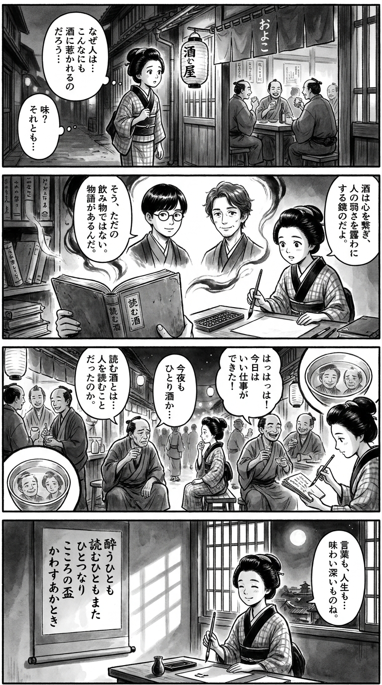

> **Language**: [日本語](../ja/“よむ”お酒_review.html) | [English](../en/“よむ”お酒_review.html) | [繁體中文](../zh-tw/“よむ”お酒_review.html)
>
> [← Top / トップページ](../../)

# 書籍評論（Markdown・繁體中文）

## 📖 書籍資訊
- **標題**: “よむ”お酒  
- **作者**: パリッコ and スズキナオ  
- **ASIN**: B081GXV66V  
- **URL**: [https://www.amazon.co.jp/dp/B081GXV66V](https://www.amazon.co.jp/dp/B081GXV66V)  

---

<picture>
  <source srcset="../../images/reviews/“よむ”お酒_4panel.webp" type="image/webp">
  
</picture>
## 🎯 這本書的核心
《“よむ”お酒》是一本重新詮釋酒的散文集，將酒視為「閱讀的對象」而非「飲用的物品」。作者パリッコ和スズキナオ觀察日常生活中的飲酒瞬間，細膩地挖掘其中潛藏的人類情感與社會風景。  

酒不僅僅是嗜好品，而是療癒孤獨、連結他人、重新審視自我的媒介。透過居酒屋和立飲等場所，他們輕巧地提出「飲酒＝生活」的等式。  

此外，對於逐漸消失的昭和酒場的懷舊情懷，以及在醉酒中自我認知的變化等，對於酒的文化與心理的雙面探討中，幽默與哲學共存。

---

## 💡 關鍵洞察
- **酒是共感的媒介**  
  「喝酒的人對酒友很寬容」這一段落象徵著，酒是分享人類脆弱的工具，促進對他人的理解。透過醉酒，人們認識到自己的脆弱，變得更加寬容。

- **「取材酒」的逆說示範工作方式的彈性**  
  模糊工作與享樂界限的「取材酒」行為，象徵著現代工作方式的多樣化。對於將喜愛的事物變成工作的喜悅與困難，幽默地進行描繪。

- **對無酒文化的諷刺與洞察**  
  對無酒精啤酒的考察，尖銳地觸及現代社會的「替代性滿足」。人們在避開真實的同時，卻又渴望真實的感受，輕巧地描繪出人類的欲望結構。

- **作為消逝酒場的記錄的文學**  
  對於已經拆除的「庚申酒場」等的描寫，留下了即使在物理上消失，卻仍在心中延續的共同體記憶。酒場不僅僅是一個地方，更是映照人類溫暖與時間積累的文化遺產。

- **醉酒是擴展意識的行為**  
  適度的醉酒開啟感官，讓人重新發現與世界的連結。透過酒的媒介，在自我與他人、現實與想像之間穿梭，成為作者創作的動力。

---

## 🔍 與現代文脈的關聯
在現代日本，特別是年輕一代中，「不喝酒的自由」逐漸擴展，酒不再是社交的必需品。另一方面，手工釀造酒、地方酒、自然派葡萄酒等「品味背景」的文化興起。  

《“よむ”お酒》正是這一潮流的前沿。重新定義酒為「體驗」和「故事」，並從文化和情感的角度深入探討飲酒的意義，與現代飲酒文化的變化相呼應。  

此外，在無酒精和低酒精飲品擴展的背景下，本書將焦點放在「感受」和「表達」上，而非「醉酒」。將酒場描繪為學習與共感的場所，為健康導向的社會提供了新的「享受酒的方式」。

---

## 🚀 實踐建議
1. **擁有屬於自己的「小酒場時間」**  
   在避開人潮的安靜場所享用一杯，能讓心靈重置。選擇飲酒的地方本身就是與自我對話的過程。  

2. **將酒場視為「人際關係的教室」**  
   觀察居酒屋中的互動，學習與他人的距離感。酒場可以重新發現為磨練社交技能的場所。  

3. **將喜愛的事物用文字表達出來**  
   將飲酒的感想或回憶寫成文章，能加深對酒的理解，讓日常生活變得更加豐富。寫作是飲酒的延伸。  

4. **練習「醉酒中保持冷靜」**  
   了解自己的極限，適度享受。意識到飲酒的過程，能帶來更深的味道與自我認識。  

5. **記錄消逝的場所**  
   用照片或文字保留自己喜愛的酒場，這是對文化的傳承。個人的記錄將成為時代的見證。  

---

## ⭐ 總體評價
《“よむ”お酒》是一本透過酒重新審視人類生活的珍貴散文集。在輕快的筆調背後，孤獨、共感、創造等普遍主題充滿生機。  

將飲酒轉化為「閱讀」的本書，不僅對酒愛好者開放，也對所有希望細膩品味日常的人們敞開大門。透過酒作為媒介觀察世界，重新審視自我——這是一部教會我們靜享奢華的作品。

---

&copy; shioki | [CC BY-NC-SA 4.0](https://creativecommons.org/licenses/by-nc-sa/4.0/)
