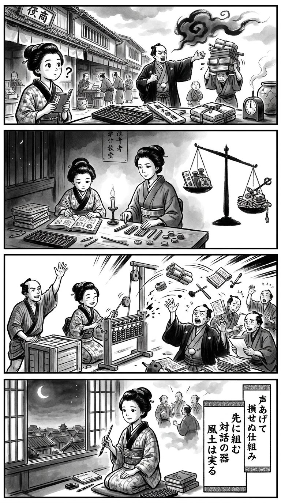

> **Language**: [日本語](../ja/「対話」がやってきた_review.html) | [English](../en/「対話」がやってきた_review.html) | [繁體中文](../zh-tw/「対話」がやってきた_review.html)
>
> [← Top / トップページ](../../)

# 書評翻譯（繁體中文）

## 📖 書籍資訊
- **標題**: 「對話」來了
- **作者**: 勅使川原真衣
- **ASIN**: B0HFZN7T7W
- **URL**: [https://www.amazon.co.jp/dp/B0HFZN7T7W](https://www.amazon.co.jp/dp/B0HFZN7T7W)

---

<picture>
  <source srcset="../../images/reviews/「対話」がやってきた_4panel.webp" type="image/webp">
  
</picture>
## 🎯 本書的核心

本書所探討的是，將組織不當行為或沉默用「風土」「意識」「溝通不足」等抽象詞彙來解釋的危險性。這些詞彙雖然能引發討論的感覺，但卻使得評價制度、權限、期限、配置、報復人事等具體原因變得不明顯。

作者不將不正當行為或沉默簡化為個人的弱點，而是將目光轉向使這些行為合理化的條件。對話並非萬能藥，只有當說話者不會受到懲罰或孤立的「容器」存在時，對話才會發揮作用——這種顛覆性的視角正是本書的核心。

---

## 💡 關鍵洞察

- **風土是制度的沉澱物，而非設計目標**  
  即使試圖透過口號或培訓直接改變風土，如果評價、權限和負擔分配不變，行為也不會改變。制度改變了人們的合理性，風土則是這些判斷的累積，這種因果關係的理解至關重要。

- **在對話之前，需要設計「說話後」的情境**  
  在發言者可能面臨調動、減分或責任集中等不利環境下，保持沉默反而更具合理性。心理安全性並不是鼓勵發言的口號，而是源於不會讓發言者受到懲罰的制度結果。

- **將個人責任與選擇可能性分開考慮**  
  即使不正當行為的當事人承認是「自己的判斷」，但在該工作場所中，並不一定存在其他現實的選擇。如果不調查期限壓力、前輩的慣例以及停止時的負擔，責任追究將不會是防止再發的措施，而是尋找替罪羊。

- **改善後的惡化可能是問題的可視化**  
  報告數量、停線、延遲交付的增加不一定意味著改革失敗。這些問題可能是之前在帳外或某人的身體內處理的，現在終於出現在可以計算的地方。

- **承擔正義的人也應受到制度的保護**  
  改革會產生記錄、調整、再測試等新工作，讓推動者感到疲憊。依賴英雄式的自我犧牲進行的改革，與「不以強者為前提的組織」這一理念本身是矛盾的。

---

## 🔍 與現代背景的關聯

在當前重視騷擾對策、心理安全性和多元化推動的背景下，「對話」和「風通暢」已成為組織改革的流行語。然而，如果在保留權力差異和評價制度的情況下僅要求發言，組織的責任可能會轉嫁到「不敢發言的個人」身上。

本書促使人們從矯正個人意識的思維轉向改變使沉默和不正當行為合理化的結構。它不僅關注單次的培訓或對話活動，而是針對舉報後的保護、權限分配、評價標準以及看不見的負擔，對現代組織發展具有敏銳的現實性。

---

## 🚀 實踐建議

1. **將抽象詞彙具體化**  
   在會議中提到「風土」「心理安全性」等詞彙時，應重新詢問誰在何種過程中會受到何種不利影響。將抽象詞彙翻譯為評價、配置、期限和權限，能讓可變更的課題顯現出來。

2. **明文化發言後的責任分擔**  
   不應將異常申報者的記錄、解釋和期限調整集中於一人。若能制定管理職或專業部門承擔後續應對的程序，便能減弱「說了就虧」的合理性。

3. **從小規模的試點開始**  
   與其進行全公司的對話運動，不如針對特定部門和期限進行制度變更，這樣更容易進行驗證。應測量停止件數、報告數、期限及額外工作，並判斷表面數據的惡化是否為問題的可視化。

4. **將「麻煩」「不可能」視為改善數據**  
   不應將現場的無奈視為意識不足，而應盤點流程、人員、表單和再作業中存在的困難。將那些由某人忍耐而吸收的負擔可視化，將有助於持續改善。

5. **將結構改善的貢獻納入評價**  
   除了達成期限外，還需將異常的早期申報、再發防止及負擔偏差的糾正納入評價。改變僅讓默默處理問題的人受益的制度，將會改變日常的判斷。

---

## ⭐ 總體評價

本書的意義不在於否定「更坦率地對話」的善意，而在於嚴格質疑這種善意能夠運作的條件。在讚揚對話之前，應該關注誰無法發言，以及發言後誰會受到損失，這一主張具有超越組織論的倫理重擔。

本書推薦給企業主、人事負責人、管理職、內部舉報及品質管理相關人員，當然也適合那些對改革的正義感到疲憊的人。閱讀後，會留下在評判他人行為之前，思考那個人是否真的有其他選擇的視角。

---

&copy; shioki | [CC BY-NC-SA 4.0](https://creativecommons.org/licenses/by-nc-sa/4.0/)
