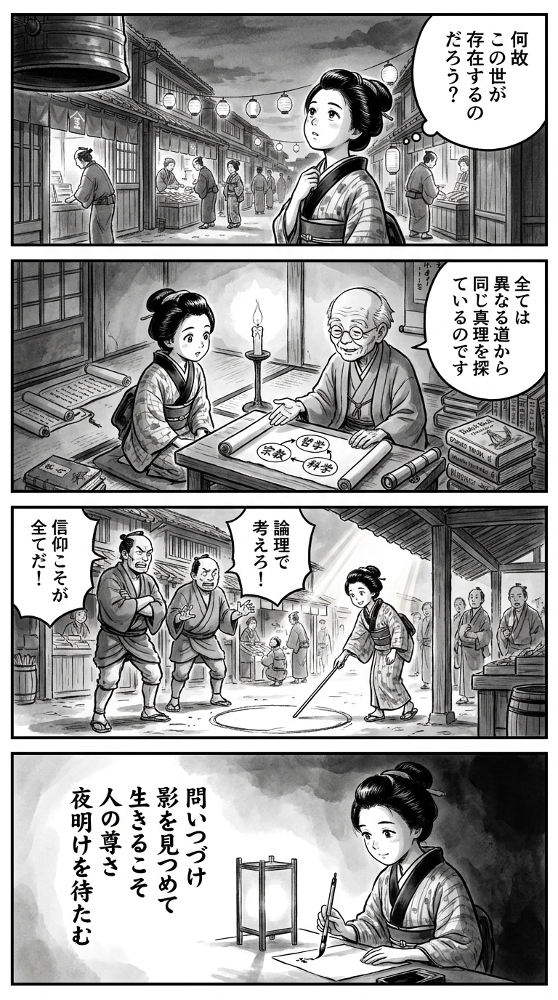

> **Language**: [日本語](../ja/【ビジネス書大賞特別賞受賞作】哲学と宗教全史_review.html) | [English](../en/【ビジネス書大賞特別賞受賞作】哲学と宗教全史_review.html) | [繁體中文](../zh-tw/【ビジネス書大賞特別賞受賞作】哲学と宗教全史_review.html)
>
> [← Top / トップページ](../../)

# 📖 書籍資訊
- **標題**: 【商業書大賞特別獎獲獎作】哲學與宗教全史  
- **作者**: 出口治明  
- **ASIN**: B07V9LGB92  
- **URL**: [https://www.amazon.co.jp/dp/B07V9LGB92](https://www.amazon.co.jp/dp/B07V9LGB92)  

---

<picture>
  <source srcset="../../images/reviews/【ビジネス書大賞特別賞受賞作】哲学と宗教全史_4panel.webp" type="image/webp">
  
</picture>

## 對白

### Panel 1
**Scene**: 在黃昏的江戶街道上，町娘在寺廟的鐘前停下，凝視著晚霞。她默默思考著：「這個世界到底為何存在？」她的表情既好奇又平靜。背景中有紙燈籠和正在關閉店鋪的市民，展現出對存在的靜思時刻。

### Panel 2
**Scene**: 在一間充滿卷軸和進口荷蘭書籍的小書房裡，町娘專心聆聽一位訪問學者的講解。這位學者看起來像作家出口春秋，年長的白髮老人，戴著眼鏡，面容溫和而智慧，穿著簡單的學者袍。他指著一幅顯示三個圓圈的卷軸圖，圓圈標記為「宗教」、「哲學」和「科學」，解釋它們如何從不同的路徑尋求同一真理。燭光柔和地在他們身上閃爍。

### Panel 3
**Scene**: 町娘運用她新獲得的見解：在市場上，她調解兩位商人的爭吵——一位以信仰爭辯，另一位則以邏輯反駁。她冷靜地用棍子在灰塵中畫出一個圓圈，將兩者在同一束透過屋簷的陽光下團結起來。商人們驚訝地停下，町娘微笑著，似乎知道了什麼——一個優雅而幽默的轉折。

### Panel 4
**Scene**: 夜幕降臨。町娘坐在燈光下，手握毛筆，準備在和紙上寫下她的短歌，捕捉書的精髓——質疑與尋求內心平靜的統一：  
「問いつづけ  
影を見つめて  
生きるこそ  
人の尊さ  
夜明けを待たむ」  
她的臉龐柔和地被燈光照亮，眼中充滿安靜的決心，隨著墨水的乾燥，流露出一種持久的尊嚴與驚奇。

## 🎯 這本書的核心
本書以人類自古以來所持有的「世界為何存在」和「人類是什麼」這些根本性問題為軸心，描繪宗教、哲學和科學的歷史，形成一個連貫的思考流。出口治明提出宗教以故事解釋世界的起源，哲學以理性重新提問，科學則以實證進行探索的三層結構。

思想與社會結構及經濟富裕是不可分割的，知識人的誕生需要「社會的餘裕」這一觀點貫穿始終。此外，書中細緻描繪了自蘇格拉底以來，哲學如何經歷「從外界到內心」的轉變，並將焦點轉向倫理和幸福等人類生存問題。

最終，本書展示了即使科學進步，人類的苦難依然不變的現實，並向讀者訴說「不斷提問才是人類的尊嚴」。

---

## 💡 關鍵洞見
- **哲學、宗教、科學是對同一問題的不同回答**  
  宗教以故事、哲學以理性、科學以實證來解釋世界的觀點，促進了對知識分裂的整合理解。本書的獨特性在於描繪了這些關係的互補性，而非對立。

- **思想源於社會的富裕**  
  經濟基礎的建立使自由思考成為可能，這一觀點成為解讀思想史的關鍵，顯示了支持知識誕生的「餘白」的重要性。

- **人類的認知始終有限**  
  通過柏拉圖的洞穴比喻，指出我們所見的可能並非真實，而是“影子”。意識到認知的不完全性是哲學思考的起點。

- **幸福不是快樂而是心靈的平靜**  
  共同的「面對苦難的方式」在伊壁鳩魯、斯多卡派和佛教中，根本上重新審視了現代消費社會中的幸福觀。重視靜謐與穩定的思想，對現代人提供了深刻的啟示。

- **無意識的力量驅動人類**  
  修正以理性為中心的哲學觀，承認無意識的支配，使人類理解變得更現實和複雜。警惕對自由意志的過度信任，促進謙遜的自我認識是重要的。

---

## 🔍 與現代文脈的關聯
在AI包圍資訊、真偽邊界模糊的現代，「與問題共存」的姿態比以往任何時候都更加迫切。出口治明所提出的宗教、哲學和科學的連續性，成為重新整合分裂知識社會的智識基礎。

此外，在氣候變遷和社會分裂加劇的時代，宗教和哲學所擁有的「共同體力量」和「關懷倫理」正在重新被評價。本書描繪的思想史，作為從產業成長型社會轉向生命維持型社會的精神資源也發揮著作用。

進一步地，在AI時代的「人性重新定義」中，本書的視角同樣有效。理解作為擁有無意識和局限的人類，將成為考慮與科技共存的起點。

---

## 🚀 實踐建議
1. **用自己的話思考根本問題**  
   思考「世界是什麼」和「我為何活著」等問題，並非依賴他人的答案，而是用自己的話語來思考，這是鍛鍊思考能力的第一步。

2. **懷疑自己認知的偏見**  
   如洞穴比喻所示，我們可能總是看到影子。在做出判斷或發言之前，養成問「我忽略了什麼」的習慣是重要的。

3. **追求心靈的平靜而非快樂**  
   通過實踐重視穩定心靈平靜的思想，而非短暫的刺激，來接近持久的幸福。可以有意識地確保靜謐的時間，如冥想或閱讀。

4. **理解社會結構如何塑造思考**  
   認識到自己的價值觀和信念是社會環境的產物，將深化對他人的理解，並使超越對立的對話成為可能。

5. **將知識轉化為行動**  
   不要讓哲學僅僅停留在知識層面，而是要反映在日常選擇和行動中。本書教導我們，思考是改變世界的實踐力量。

---

## ⭐ 總體評價
《哲學與宗教全史》是一本以壯大的規模描繪宗教、哲學和科學貫穿的「人類知識系譜」的知識冒險書。出口治明清晰的敘述方式，將艱澀的思想史以生活化的問題呈現給讀者。

這本書將使面對AI時代不確定性的每一個人重新確認「思考的意義」。對於超越知識，探索「生活的哲學」的讀者而言，這是一本應該跨越時代持續閱讀的作品。

---

&copy; shioki | [CC BY-NC-SA 4.0](https://creativecommons.org/licenses/by-nc-sa/4.0/)
