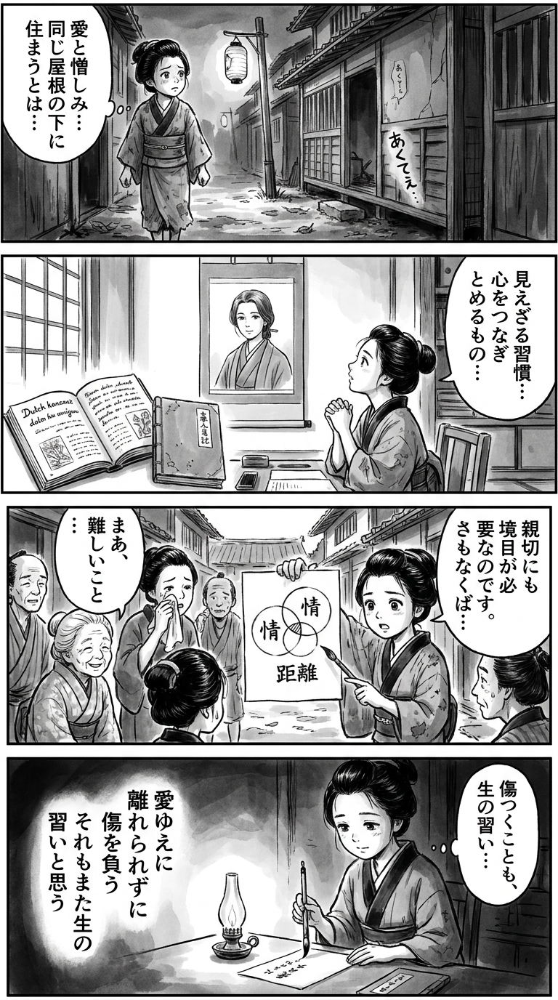

> **Language**: [日本語](../ja/あくてえ_review.html) | [English](../en/あくてえ_review.html) | [繁體中文](../zh-tw/あくてえ_review.html)
>
> [← Top / トップページ](../../)

# 書籍評論（Markdown・繁體中文）

## 📖 書籍資訊
- **標題**: あくてえ  
- **作者**: 山下紘加  
- **ASIN**: B0B6C9R8VY  
- **URL**: [https://www.amazon.co.jp/dp/B0B6C9R8VY](https://www.amazon.co.jp/dp/B0B6C9R8VY)  

---

<picture>
  <source srcset="../../images/reviews/あくてえ_4panel.webp" type="image/webp">
  
</picture>

## 對白

### Panel 1
**Scene**: 町娘在黃昏的江戶小巷中行走，聽見附近長屋傳來家庭爭吵的聲音。她停下腳步，因為那些尖銳的言辭而感到困擾，低聲自語著愛與怨恨如何能共處於同一屋簷下。街燈閃爍，晚風帶來微弱的「あくてえ」回音。

### Panel 2
**Scene**: 在她的小書房裡，她打開一本荷蘭哲學書，旁邊是一本磨損的日本家庭日記。牆上掛著一幅想像中的學者的卷軸肖像，這位學者看起來像作家山下弘香——一位冷靜、深思的女性，簡單地束著中長的黑髮，眼神溫柔卻又銳利，穿著樸素的袍子。町娘凝視著卷軸，似乎在尋找關於將心靈相連的「習慣」的智慧。

### Panel 3
**Scene**: 第二天，她在社區裡進行了一個實驗：她畫出一個幾何圖形，顯示「愛與距離的圓圈」，向困惑的鄰居解釋善良需要界限，否則會像藤蔓一樣纏繞。一位老婦人輕輕地笑了，而另一位則流下了淚水——町娘意識到，即使是同情也可能造成傷害。

### Panel 4
**Scene**: 夜晚。在燈光下，她在一條紙上寫下一首和歌，神情平靜而懷舊。這首短詩寫道：  
「愛ゆえに  
　離れられずに  
　傷を負う  
　それもまた生の  
　習いと思う」  
一個靜謐的理解時刻，她的毛筆微微顫抖，凝視著小小的火焰。

## 🎯 這本書的核心
《あくてえ》透過三代女性交織的封閉家庭關係，描繪了「愛」與「詛咒」是表裡一體的作品。婆婆、きいちゃん和我這三位女性互相仇恨、依賴，活在無法逃脫的關係中。維繫她們之間的不是理性，而是像回巢本能般的「習性」所保持的羈絆。

老化與照護的現實、女性的生活困境，以及在夢想與現實之間搖擺的自我實現的掙扎，都在淡然的筆觸中銳利地刻畫出來。她們只能在暴言與沉默之間表達情感的樣子，直指現代社會中「家庭」這一制度的極限。

---

## 💡 關鍵見解
- **家庭是以習性而非理性相連結**  
  家庭的羈絆不是基於愛或理性的選擇，而是無意識的歸屬本能所維持。即使互相傷害，人類對於作為歸宿的家庭的依戀與弱點無法捨棄。

- **弱點也可以成為支配的手段**  
  老化或無力感不僅是受害者的狀態，也可能成為支配他人的武器。婆婆的「弱點」作為束縛家庭的無形力量，模糊了受害與加害的界線。

- **善良會侵蝕人**  
  無條件的善良可能使對方依賴，並腐蝕關係。きいちゃん的「溫水般的愛」對女兒而言是安慰，同時也是無法逃脫的束縛。

- **逃避不是罪，而是生存的策略**  
  從現實中逃避不是弱點，而是生存的本能行為。角色們所找到的「逃避之地」，成為在絕望中自我保護的最後防線。

- **「あくてえ」是祈禱的言語**  
  聽起來像是暴言的「あくてえ」，其實是渴望被理解的切實願望的表達。潛藏在語言暴力背後的祈禱情感，為整部作品注入了靜默的熱度。

---

## 🔍 與現代背景的關聯
在現代社會中，家庭與社區的關係日益淡薄，而依賴與共依賴的結構則以更難以察覺的形式再生產。《あくてえ》所描繪的「習性作為家庭」，映射出在孤立與資訊不對稱日益加深的現代，人們仍然被他人所束縛的結構。

此外，善意與善良轉變為獨善的主題，與當前重視包容性設計與當事人思維的潮流相呼應。關心他人有時會轉變為支配他人的結構，這一洞察為重新思考家庭乃至整個社會的關係提供了契機。

---

## 🚀 實踐建議
1. **為善良設立界限**  
   無限制的善良可能使對方依賴，為了對他人著想，有時需要勇氣保持距離。

2. **有意識地擁有逃避之地**  
   在日常生活中設置保護自己的「避難所」，有助於精神的持續。希望將興趣、創作和孤獨的時間視為「再生之地」而非「逃避」。

3. **接受無法結束的現實**  
   不必試圖完全解決問題，而是要培養「在承擔中生活」的姿態，這樣能夠增強與現實的妥協能力。

4. **重新檢視語言的使用**  
   不應以暴言表達情感，而應努力將其轉化為「傳達的語言」。語言既可以破壞，也可以療癒。

5. **翻譯代際間的斷裂**  
   以「翻譯」的方式理解擁有不同價值觀的對方的言語，能夠擴展對話的可能性，而非斷裂。

---

## ⭐ 總體評價
《あくてえ》是一部赤裸裸地描繪人類弱點與韌性的傑作，以家庭這一最親近且無法逃避的共同體為舞台。角色們在暴力與善良、逃避與現實之間搖擺的樣子，讓讀者同時感受到痛苦與共鳴。

本作應該成為那些在家庭關係中感到疲憊、對與他人保持距離感到困惑的人必讀的一本書。讀後，「あくてえ」所吐露的無法生存的人類切實祈禱，將靜靜地留在心中。

---

&copy; shioki | [CC BY-NC-SA 4.0](https://creativecommons.org/licenses/by-nc-sa/4.0/)
