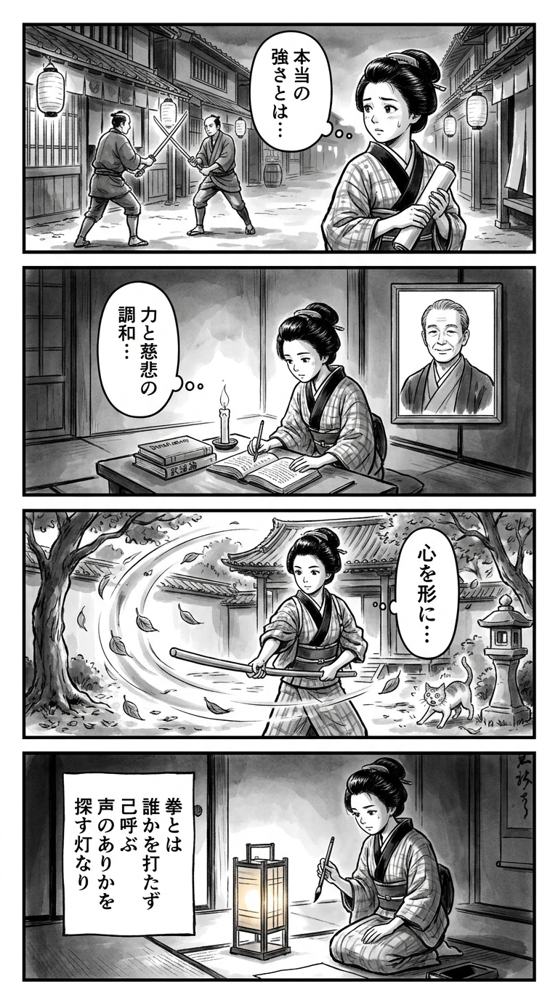

> **Language**: [日本語](../ja/あたしの拳が吼えるんだ_review.html) | [English](../en/あたしの拳が吼えるんだ_review.html) | [繁體中文](../zh-tw/あたしの拳が吼えるんだ_review.html)
>
> [← Top / トップページ](../../)

# 書籍評論（繁體中文）

## 📖 書籍資訊
- **標題**: あたしの拳が吼えるんだ  
- **作者**: 山本幸久  
- **ASIN**: B0BS9SZMNV  
- **URL**: [https://www.amazon.co.jp/dp/B0BS9SZMNV](https://www.amazon.co.jp/dp/B0BS9SZMNV)  

---

<picture>
  <source srcset="../../images/reviews/あたしの拳が吼えるんだ_4panel.webp" type="image/webp">
  
</picture>
## 🎯 這本書的核心
《あたしの拳が吼えるんだ》是講述少女風花透過拳擊面對自己內心的矛盾與情感的波動，並逐漸成長的故事。揮舞拳頭的行為被描繪為自我表達與控制的象徵，而非暴力，並重新思考什麼是力量的本質。

透過與母親陽菜子之間的關係以及與夥伴們的友情，風花學會了「相信自己」的意義，而非「打倒某個人」。儘管經歷了失去與別離，她仍然找到再次站起來的力量，透過「吼叫的拳頭」來確認自己的存在。

這個故事生動地描繪了人類在暴力與溫柔、憤怒與愛之間的複雜情感，並以拳擊為舞台展現出來。

---

## 💡 關鍵見解
- **拳頭是自我表達與控制的象徵**  
  如同「你的拳頭只會在擂台上吼叫」這句話所示，力量不應該是無序的，而應該在適當的場合中昇華。故事描繪了情感不是被壓抑，而是以社會上有效的方式表達的成熟。

- **接受人性的多面性所需的勇氣**  
  「每個人都有好的一面和壞的一面」的價值觀貫穿整個故事。超越善惡與強弱的簡單二元對立，展現了在矛盾中生活的尊嚴。

- **努力能改變他人**  
  風花的真摯態度影響了周圍的人，改變了他們的生活方式。努力不僅是為了自己，還能產生影響他人的連鎖反應，這一觀點十分重要。

- **失去不是結束，而是再生的契機**  
  故事描繪了經歷別離與悲傷後依然存在的羈絆。透過失去，人們重新以新的方式連結，並持續成長的希望支撐著整個故事。

- **「戰鬥」是與自我的對話**  
  拳擊比賽被描繪為一種面對自我的行為，超越了打倒對手的目的。即使心中懷有恐懼與迷惘，如何處理內心的「吼叫拳頭」象徵著人生的核心。

---

## 🔍 與現代文脈的關聯
本作描繪的「女性的拳頭」，可以被解讀為現代社會中女性自我決定與表達的象徵。近年來，女性如何使用自己的身體與情感，以及如何發聲受到關注，而拳擊這一主題正是其延伸。

此外，在「憤怒」與「戰鬥」常被負面看待的風潮中，本作重新詮釋了這些情感為合理的情緒。揮舞拳頭不是暴力，而是對壓迫的抵抗，也是自我保護的表達。

更進一步地，將力量重新定義為「站起來」而非「勝利」，這一點與當代的女性主義與心理健康的討論相呼應。風花的成長正是社會中重新找回自己聲音的過程。

---

## 🚀 實踐建議
1. **找到自己「拳頭」吼叫的地方**  
   擁有一個能夠建設性地發揮情感與能量的場所，是自我成長的第一步。重要的是在正確的場合表達怒火與熱情，而非壓抑。

2. **同時看到他人的「好」與「壞」**  
   不要簡單地評價他人，接受他們作為包含矛盾的存在，這樣能增進共感與人性理解。

3. **持續努力以影響周圍的人**  
   自己的努力不知不覺中會成為他人的激勵。持續的態度能帶來周圍的變化。

4. **不懼失去，相信連結**  
   即使經歷別離與變化，只要有信任與記憶，關係仍會持續。將失去視為再生的契機。

5. **接受內心的矛盾**  
   認可強大與脆弱、憤怒與溫柔都是自己的一部分，這將導向成熟的自我理解。

---

## ⭐ 總體評價
《あたしの拳が吼えるんだ》是一部超越青春小說的「自我發現之旅」。透過拳擊這一肉體競技，描繪了情感的控制、與他人的關係，以及生存力量的本質。

讀者在追隨風花的成長過程中，將會在自己內心找到「吼叫的拳頭」。這不是暴力，而是信任自己、面對世界的力量。這部作品靜靜地推動著所有希望兼顧強大與溫柔的人。

---

&copy; shioki | [CC BY-NC-SA 4.0](https://creativecommons.org/licenses/by-nc-sa/4.0/)
