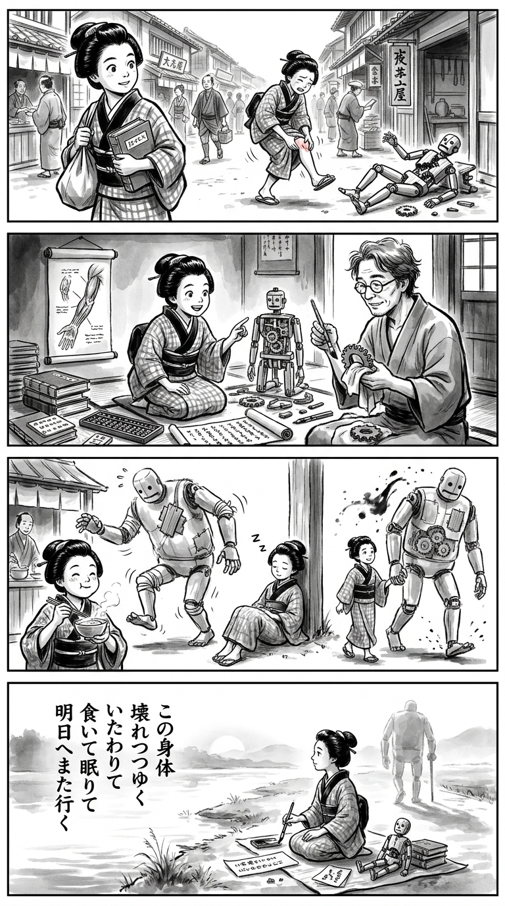

> **Language**: [日本語](../ja/このロボで、行けるところまで行くしかないのだ。_review.html) | [English](../en/このロボで、行けるところまで行くしかないのだ。_review.html) | [繁體中文](../zh-tw/このロボで、行けるところまで行くしかないのだ。_review.html)
>
> [← Top / トップページ](../../)

# 📖 書籍資訊
- **標題**: 這個機器人，除了走到能走的地方，別無選擇。
- **作者**: 鈴木直
- **ASIN**: B0HB9B89SB
- **URL**: [https://www.amazon.co.jp/dp/B0HB9B89SB](https://www.amazon.co.jp/dp/B0HB9B89SB)

---

<picture>
  <source srcset="../../images/reviews/このロボで、行けるところまで行くしかないのだ。_4panel.webp" type="image/webp">
  
</picture>
## 🎯 這本書的核心
本書描繪的是中年期面對身體衰退、家庭距離、工作失敗以及身邊人事物的喪失所帶來的真實感受。作者將身體比作一個無法隨心所欲的巨大機器人，認為在面對故障時，唯有與這個機體協作，才能繼續向前。

這裡並沒有簡單的克服或積極向上的態度。自由與孤獨、成長的喜悅與寂寞、對健康的渴望與飲食的快樂等矛盾，並未被解決，而是以準確的語言呈現出來。吃、睡、走路、與人見面這些小小的日常行為，正是將無法回答的人生連接到明天的靜謐視角，這是本書的核心所在。

---

## 💡 關鍵見解
- **身體不是支配的對象，而是合作的夥伴**  
  不應將衰老或疼痛視為意志薄弱或失敗，而是要確認身體這個不完美機體的狀態，並進行必要的維護。自我接納並非放棄，而是在承認極限的基礎上繼續生活的現實態度。

- **即使失去，並不意味著一切都消失**  
  關閉的酒吧和已故的朋友無法回到過去，但味道、記憶、紙片和傳承的習慣中仍然留有痕跡。本書不輕易安慰失去，而是細緻地觀察那些仍在從人到人之間流轉的存在。

- **支撐人生的是小小的恢復反覆**  
  當深陷低谷時，整體人生的解決方案不易找到。然而，睡覺、吃熱豆腐、稍微散步等行為，卻能成為跨越當天、邁向明天的基石。

- **失敗的過去也能改變其意義**  
  公司職員時代的失敗不會被美化，但與同事的對話和在便宜酒吧度過的時光也不會被否定。通過同時承認痛苦與快樂，過去不再僅是失敗，而是支撐當前價值觀的歷程。

- **將矛盾用語言表達本身就有價值**  
  對於「雖然快樂，但也孤獨；雖然孤獨，但也快樂」的感受，作者並未強加不合理的結論。否定擁有相反情感的自己，而是首先將當前的狀態語言化，這種姿態賦予了本書誠實性與普遍性。

---

## 🔍 與現代背景的關聯
在高齡化和工作方式長期化的當代，中年期不再是生命的終點，而是感受到衰退的同時，持續承擔工作、家庭和社會責任的漫長過程。本書向我們展示了在一個不斷要求自我管理和成長的社會中，人們仍然是帶著不適和迷惘生活的存在。

書名中的「機器人」並非指實際的機械技術，而是對身體的比喻。然而，正因為在AI和自動化提升效率的時代，無法修復的部分、無法割捨的情感、與他人的記憶等非效率的事物的價值愈加突出。將中年描繪成不僅是衰退，而是能夠想像年輕人和老年人的雙方，並重新檢視社會結構的立場，這一點也具有現代意義。

---

## 🚀 實踐建議
1. **將身體的不適視為「維護項目」**  
   不要試圖用忍耐來克服疼痛或不適，而是應該尋求就診、休息和運動習慣的調整。不要責備身體，而是將其視為未來仍需共同運動的夥伴，將自我接納轉化為具體的關懷。

2. **為低落日設定最低限度的恢復步驟**  
   準備三個即使在沒有精力時也能執行的行為，例如「吃熱的東西」、「早點睡」、「早上稍微走一走」。不必一次解決大問題，而是將目標集中在度過當天上。

3. **為喚起回憶的物品附上簡短的記錄**  
   選擇幾張不想丟棄的紙片或照片，寫下與誰、何種時光的回憶。不是無限制地保存物品，而是整理成為記憶的入口，這樣在失去之後也能確認經驗的延續性。

4. **不要將與人見面的機會延後**  
   不必等待大旅行或特別的活動，將用餐、通話、短暫散步納入計劃。因為關係不一定會永續，積累能實現的接觸，將成為對抗孤獨的現實準備。

5. **在表達意見時包含迷惘**  
   不要因為未找到社會問題的完全正解而保持沉默，而是帶著保留地說出「我有這樣的感受」。在想像不同世代和立場的同時參與對話，是將中年經驗回饋社會的一種方式。

---

## ⭐ 總體評價
本書的魅力在於不僅僅以悲慘的角度來講述中年期，同時也不將其塑造成充滿希望的重新出發故事。在直面衰退、孤獨和失敗的同時，從湯豆腐、散步和酒吧的記憶等生活細節中，提取出生存的觸感。

對於那些對身體變化感到困惑的人、對孩子成長感到喜悅與寂寞的人、以及拖著過去失敗的人，這本書特別能夠深入人心。這不僅是一本沒有劇烈答案的書，而是能夠帶回「這具身體、這段歷程、這些矛盾，讓我再往前走一點」的平靜覺悟。

---

&copy; shioki | [CC BY-NC-SA 4.0](https://creativecommons.org/licenses/by-nc-sa/4.0/)
