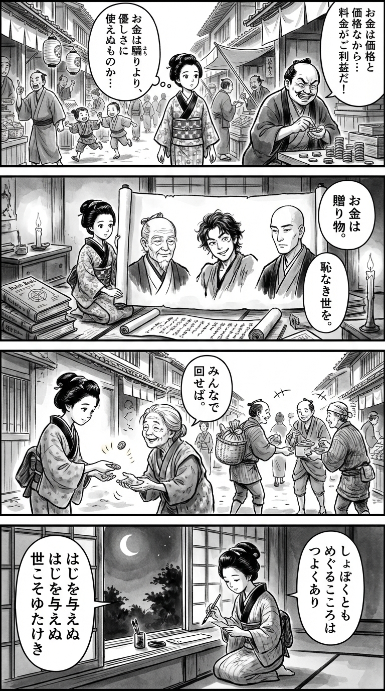

> **Language**: [日本語](../ja/しょぼい生活革命_review.html) | [English](../en/しょぼい生活革命_review.html) | [繁體中文](../zh-tw/しょぼい生活革命_review.html)
>
> [← Top / トップページ](../../)

# 書籍評論（Markdown・繁體中文）

## 📖 書籍資訊
- **標題**: しょぼい生活革命  
- **作者**: 内田樹, えらいてんちょう（矢内東紀）, and 中田考  
- **ASIN**: B083Z23W6N  
- **網址**: [https://www.amazon.co.jp/dp/B083Z23W6N](https://www.amazon.co.jp/dp/B083Z23W6N)  

---

<picture>
  <source srcset="../../images/reviews/しょぼい生活革命_4panel.webp" type="image/webp">
  
</picture>

## 對白

### Panel 1
**Scene**: 町娘在繁忙的江戶市場中漫步，觀察著商人們高聲叫賣和顧客們討價還價。她看著一位富有的商人貪婪地數著錢幣，心中感到一絲不安。背景中，紙燈籠搖曳，孩子們在追逐玩耍。她自言自語，思考著金錢是否可以用來施予善良，而不是驕傲。

### Panel 2
**Scene**: 在她的小書房裡，卷軸和荷蘭書籍散落一地，她展開一張描繪三位哲學家的羊皮紙，畫作呈現出想像中的江戶風格肖像：一位年長者，面容平靜而智慧，頭上梳著學者的髻（靈感來自內田龍），另一位年輕、頑皮，略顯古怪，散亂的頭髮和活潑的眼神（靈感來自偉大天朝），還有一位高大的沉思者，面帶僧侶般的沉穩（靈感來自中田光）。他們的畫面似乎在對頁面訴說著「金錢作為禮物」和「沒有羞辱的社會」。燭光閃爍，投下深邃的墨影。

### Panel 3
**Scene**: 町娘站在一個社區場景中，將幾枚硬幣給予一位失去錢包的老鄰居。鄰居感激地微笑，隨後其他居民也開始自發地分享物品和食物。硬幣在空中飛舞，如同小小的發光圓圈，呼應著「循環的球」的隱喻。這個場景展現了江戶街道的簡單中，流動的情感溫暖。

### Panel 4
**Scene**: 黃昏降臨。町娘跪在窗邊，手握毛筆，正在小小的短冊上寫和歌。月光透過紙製的障子灑下，照亮了她安詳的面容。垂直書寫的短詩如下：

**Tanka (translation)**: 即使微薄，  
流轉的心靈，  
依然堅強，  
不給予羞恥，  
這世道才豐饒。  
**Tanka (original)**: しょぼくとも  
めぐるこころは  
つよくあり  
はじを与えぬ  
世こそゆたけき

## 🎯 本書的核心
《しょぼい生活革命》是一場思想對話，探討在龐大的資本主義和國家主義結構下，個人和地方的「小共同體」如何能夠抵抗。作者們並不要求重新設計經濟、教育和福利等制度，而是希望透過人與人之間的關係和倫理的重建來改變社會。

本書的中心思想在於，「しょぼい」這個詞所暗示的，並不是華麗或效率，而是向可持續和倫理的生活方式轉變。重新理解貨幣為贈與，並追求不帶來屈辱的社會，這一思想也是對現代消費社會的靜默革命的提議。

---

## 💡 關鍵見解
- **貨幣是贈與的工具**  
  將貨幣比喻為「足球」，透過循環來活化社會的比喻，促進了經濟的倫理重新定義。貨幣的囤積會導致停滯的洞察，對現代金融主義提出根本的批判。

- **不帶來屈辱的社會是健康的**  
  以「禮貌」作為社會的基礎，優先考慮不帶來屈辱的關係，這是一個貫穿組織論、福利論和倫理學的軸心。重視人性的尊嚴而非制度的視角貫穿始終。

- **成熟就是複雜化**  
  反對將簡化或效率視為善的社會風潮，將「容許複雜性的智慧」視為成熟的標誌。不將思考「總結」，而是帶著模糊性和多義性進行思考，這才是真正智慧的條件。

- **小共同體抵抗國家**  
  不是個人主義也不是全體主義，基於信任和贈與的小集體才有可能抵抗龐大的權力結構。這是孤立的現代人重新與他人連結的實踐哲學。

- **知識的傳承伴隨著「憧憬」**  
  教育並不是知識的傳遞，而是共享「仰角（憧憬）」的活動。重建知識「傳遞」的文化，是恢復教育倫理基礎的嘗試。

---

## 🔍 與現代文脈的關聯
本書的思想與2020年代以來的「脫離過度消費」和「極簡主義」的關注深度共鳴。在城市生活的疲憊和商業主義的厭倦中，「しょぼい生活」不僅僅是簡樸的生活，而是作為倫理和自律的生活重建而受到關注。

此外，隨著媒體和娛樂行業中對「大人的事情」和商業壓力的不信任加劇，內田、 中田和えらいてんちょう的對話成為恢復文化自主性的思想支撐。超越社會公正和專家主義的過度依賴，這可以被視為生活者選擇自己倫理的時代指引。

---

## 🚀 實踐建議
1. **將貨幣用作贈與**  
   不要囤積剩餘，將其回饋給需要的人，以促進經濟的循環。讓貨幣「流動」是社會活化的關鍵。

2. **有意識地培養小共同體**  
   重視家庭、社區和朋友等小單位的合作，實踐不依賴國家或市場的相互支持。

3. **建立不帶來屈辱的關係**  
   在工作和家庭中，意識到不損害對方尊嚴的言語和態度。這是支撐「禮貌社會」的最小單位倫理。

4. **不懼怕複雜性地思考**  
   不要用「總之」來簡化，而是訓練自己在模糊的情況下進行思考。這是成熟思考的第一步。

5. **將知識與「憧憬」一同傳遞**  
   在將自己的經驗和學習傳遞給他人時，應該意識到不僅僅是信息，而是分享其中的熱情和尊敬。

---

## ⭐ 總體評價
《しょぼい生活革命》是對現代社會困境的靜默反抗之書。質疑以效率和成長為至上的價值觀，倡導人際關係和倫理的重生，這種姿態既具哲學性又具實踐性。

讀者將通過這本書發現「しょぼい」中潛藏的力量和希望。這場革命並不是改變社會結構，而是從改變自己的生活方式開始——這是本書所提出的最現實的願景。

---

&copy; shioki | [CC BY-NC-SA 4.0](https://creativecommons.org/licenses/by-nc-sa/4.0/)
