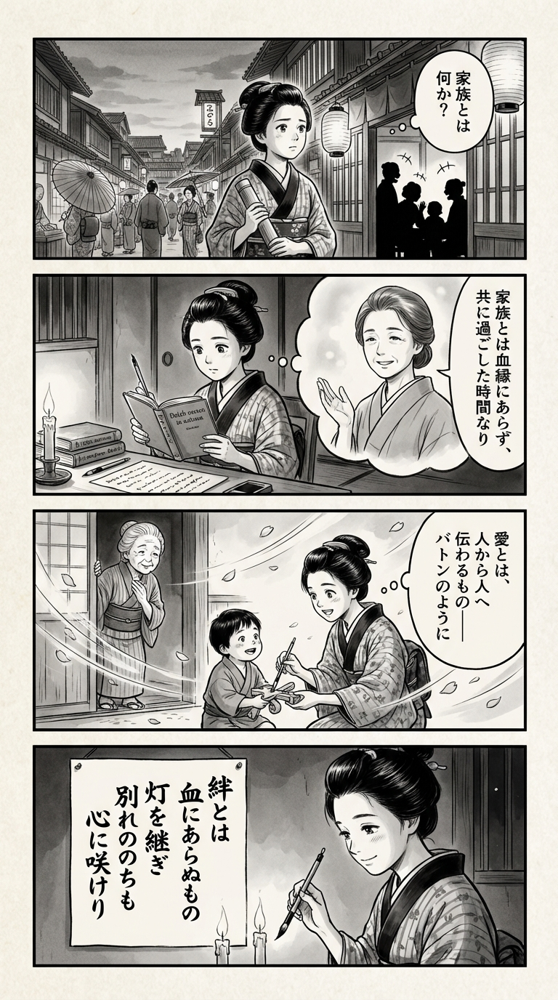

> **Language**: [日本語](../ja/そして、バトンは渡された_review.html) | [English](../en/そして、バトンは渡された_review.html) | [繁體中文](../zh-tw/そして、バトンは渡された_review.html)
>
> [← Top / トップページ](../../)

# 書籍評論（Markdown・繁體中文）

## 📖 書籍資訊
- **標題**: そして、バトンは渡された  
- **作者**: 瀬尾 まいこ  
- **ASIN**: B08H1SKN8X  
- **URL**: [https://www.amazon.co.jp/dp/B08H1SKN8X](https://www.amazon.co.jp/dp/B08H1SKN8X)  

---

<picture>
  <source srcset="../../images/reviews/そして、バトンは渡された_4panel.webp" type="image/webp">
  
</picture>

## 對白

### Panel 1
**Scene**: 町娘在黃昏的江戶街道上走著，聽見長屋裡一家人歡笑的聲音。她停下腳步，手中握著竹製算術盒，表情沉思。燈籠的光芒閃爍，照亮了她的疑問：「什麼才是家庭？」背景展示著熱鬧的江戶街區，狹窄的小巷和紙燈籠隨處可見。

### Panel 2
**Scene**: 在她的小房間裡，她坐著閱讀一本荷蘭文書籍和一卷手寫的卷軸。在微弱的蠟燭光下，一位平靜的女性在她的想像中出現——這位老師的形象靈感來自作家瀬尾舞子，描繪成一位柔和的中年女性，擁有柔和的眼神，簡單的肩長髮束起，穿著樸素的和服。想像中的導師親切地微笑，彷彿在告訴她：「家庭不是由血緣所綁定，而是由共享的時光所連結。」町娘專心地聆聽，筆尖懸在空中。

### Panel 3
**Scene**: 第二天早上，她幫鄰居的孩子修補一個壞掉的玩具。孩子的祖母在一旁觀看，感動不已。微風輕拂，櫻花瓣飄舞在場景中。町娘意識到愛與關懷是從一個人傳遞到另一個人——就像接力賽一樣——她的眼中閃爍著發現的光芒。構圖中使用動態的斜線花瓣來傳達情感的運動。

### Panel 4
**Scene**: 在她安靜的房間裡，她在懸掛的卷軸上寫著和歌，筆因感動而微微顫抖。蠟燭的光芒閃爍，映照在她的眼中，她柔和地微笑。短詩的短冊上寫著她的詩句，以毛筆書寫的日本垂直文字：

「  
絆とは  
血にあらぬもの  
灯を継ぎ  
別れののちも  
心に咲けり  
」

## 🎯 本書的核心
瀬尾まいこの《そして、バトンは渡された》是一個靜謐的故事，對於「家庭是什麼」這一根本問題提供了答案。主角優子在多位父母之間成長，過程中學會了「共同度過的時間」和「對彼此的關心」才是構成家庭的要素，而非血緣關係。

故事的中心是一個比喻「接力棒」。從父母到孩子，從人到人，愛與思念的傳遞照亮了人生的意義。即使經歷了別離與失去，愛依然以不同的形式延續。這份溫柔與堅韌深深留在讀者的心中。

---

## 💡 關鍵見解
- **家庭的定義超越血緣**  
　優子所經歷的多個家庭顯示了家庭的多樣性。日常的互動與關懷比血緣更能塑造「家庭」，這一觀點為現代社會提供了新的家庭觀。

- **別離不是結束，而是新的開始**  
　儘管承受著失去的痛苦，優子學會了珍惜「現在身邊的人」。不再害怕別離，而是透過別離邁向新的關係與未來，象徵著人生的重生。

- **愛以不同的形式延續**  
　即使相隔遙遠，信件和記憶中的話語依然傳遞著愛。愛超越時間與距離，自然地傳遞給下一代。

- **堅強就是接受情感**  
　優子流淚向前邁進的姿態告訴我們，真正的堅強在於接受情感，而非壓抑。透過悲傷，人們成長並再次獲得關心他人的力量。

- **幸福在於「傳遞」**  
　人生的幸福不在於獲得，而在於將愛與希望「接力」給他人。將愛情與希望作為「接力棒」傳遞的行為，正是生命的意義所在。

---

## 🔍 與現代背景的關聯
本作的主題與當前日本社會中「多樣家庭的接受」深刻共鳴。隨著離婚、再婚、收養、寄養制度等非血緣家庭形式的普及，「與誰生活」的問題在社會上變得越來越重要。

此外，電影化的過程中，「家庭是什麼」的重新思考正在擴展，描繪非傳統家庭的作品獲得了共鳴。在教育界，「生命的接力棒」「生活的傳承」等詞語被提及，世代間的聯繫價值也得到了重新評估。

在這樣的時代背景下，本作以溫柔與現實感描繪了「超越血緣的愛的傳承」這一普遍主題。讀者將重新審視超越家庭制度的「人與人之間的關係」的本質。

---

## 🚀 實踐建議
1. **珍惜身邊的人**  
　不被過去或未來所束縛，與眼前的人建立細膩的關係，這是幸福的基礎。日常生活中，僅僅說出「謝謝」也能讓關係變得溫暖。

2. **接受情感，給自己時間**  
　不否定眼淚與悲傷，接受它們能讓心靈得到整理。流露情感不是弱點，而是為重生而進行的自然行為。

3. **在小日常中尋找感恩**  
　在餐桌或對話等平凡的瞬間中尋找幸福。將注意力放在日常的「理所當然」上，能讓心靈平靜，並培養對他人的關懷。

4. **放下過去，相信未來**  
　不再執著於失去的事物，尋找未來建立的關係與時間中的希望。相信失去之後的重生，人們會獲得向前的力量。

5. **意識到自己的「接力棒」**  
　思考自己從誰那裡接過什麼，又將什麼傳遞給誰。這是尋找人生軸心的行為，也是感受與他人聯繫的第一步。

---

## ⭐ 總評
《そして、バトンは渡された》以靜謐的筆觸重新定義了「家庭」的概念。透過描繪超越血緣的羈絆和經歷別離後依然延續的愛，給讀者留下了深刻的餘韻。

這個故事陪伴著那些在家庭關係中掙扎的人、經歷過失去的人，以及所有尋找「與他人共同生活的意義」的人。讀後，心中會留下一種想要對他人表現溫暖的感覺。瀬尾まいこ所描繪的「接力棒」，也將靜靜地傳遞到讀者自己的生活中。

---

&copy; shioki | [CC BY-NC-SA 4.0](https://creativecommons.org/licenses/by-nc-sa/4.0/)
