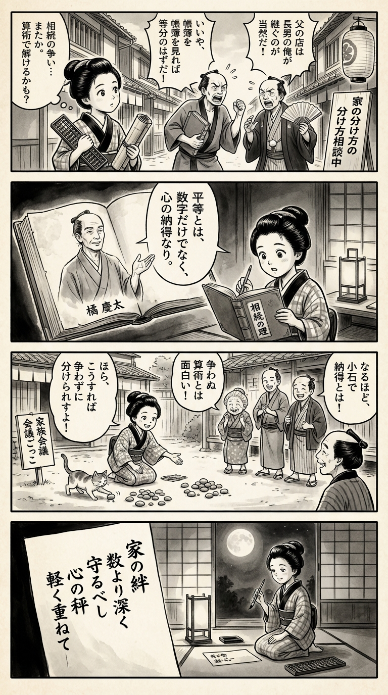

> **Language**: [日本語](../ja/ぶっちゃけ相続――日本一の相続専門YouTuber税理士がお金のソン・トクをとことん教えます！_review.html) | [English](../en/ぶっちゃけ相続――日本一の相続専門YouTuber税理士がお金のソン・トクをとことん教えます！_review.html) | [繁體中文](../zh-tw/ぶっちゃけ相続――日本一の相続専門YouTuber税理士がお金のソン・トクをとことん教えます！_review.html)
>
> [← Top / トップページ](../../)

# 書籍評論（Markdown・繁體中文）

## 📖 書籍資訊
- **標題**: ぶっちゃけ相続――日本一の相続専門YouTuber税理士がお金のソン・トクをとことん教えます！  
- **作者**: 橘 慶太  
- **ASIN**: B0BZR1QKS5  
- **URL**: [https://www.amazon.co.jp/dp/B0BZR1QKS5](https://www.amazon.co.jp/dp/B0BZR1QKS5)  

---

<picture>
  <source srcset="../../images/reviews/ぶっちゃけ相続――日本一の相続専門YouTuber税理士がお金のソン・トクをとことん教えます！_4panel.webp" type="image/webp">
  
</picture>

## 對白

### Panel 1
**Scene**: 在江戶城鎮的街道上，好奇的町娘聽到兩位商人因父親的商店繼承問題爭吵。她歪著頭思考，手中拿著算盤和竹卷。背景的招牌寫著「家の分け方相談中」（正在諮詢繼承問題）。氣氛緊張卻又幽默——一位商人緊握著帳本，另一位則揮舞著扇子表示抗議。
**Dialogue**: [無]

### Panel 2
**Scene**: 在燭光照明的書房裡，町娘打開一本名為「相続の理」（繼承的邏輯）的荷蘭書籍。羊皮紙上出現了一位冷靜、學識淵博的男子插圖，他有著溫柔的眼神、短髮束起，沒有眼鏡——這是一位受「橘 慶太」啟發的智慧教師形象，從頁面上指導她。他的手勢似乎在清晰地解釋，表情親切而堅定，暗示著專業和公正。
**Dialogue**: [無]

### Panel 3
**Scene**: 町娘在長屋的庭院中召集鄰居舉行「家族會議ごっこ」（模擬家庭會議）。她用地上的小石子展示如果大家同意，資產可以靈活分配。圍觀者們笑著，因為她開玩笑說「争わぬ算術」（和平的算術）。一隻貓在其中一顆石子上拍打，增添了幽默和動感。
**Dialogue**: [無]

### Panel 4
**Scene**: 夜幕降臨。町娘跪在紙燈籠旁，手握毛筆，柔和地凝視著透過障子照進來的月光。在短冊上，她寫下了一首捕捉書本精髓的和歌——強調和諧而非數字，才能保護世代的財富。這首短詩如下：
**Tanka (translation)**: 家庭的羈絆，  
比數字更深厚，  
應當守護，  
心中的天平，  
輕重交疊。  
**Tanka (original)**: 家の絆  
数より深く  
守るべし  
心の秤  
軽く重ねて

## 🎯 本書的核心
本書的核心在於徹底解釋「為了不讓相續變成“爭族”的知識與實務」。從法律、稅務、心理三個方面，專家以易懂的方式提出實現圓滿相續的方法。  

作者橘慶太先生作為在YouTube上處理大量諮詢案例的實務者，重視理論與現場的真實性。對於法定相續分、遺囑的撰寫、生前贈與、稅務調查應對等主題，作者以讀者能夠「自我理解」的方式進行深入淺出的解說。  

最終，本書得出「家庭的信任關係才是最大的節稅策略」的結論。將相續重新定義為保護家庭未來的行為，而不僅僅是財產分配，這一點是本書的最大特色。  

---

## 💡 關鍵洞察
- **「法定相續分僅為參考」—靈活分配是可能的**  
  相續不必受限於法定比例，只要全員同意即可自由分配。在理解法律框架的基礎上，優先考量家庭間的共識，這是防止爭端的第一步。  

- **「特別受益沒有時效」—長期贈與管理的重要性**  
  過去的贈與在相續時需重新計算，因此準確記錄長期的資產轉移至關重要。缺乏記錄可能導致後續的糾紛或課稅風險。  

- **「相續稅隨著相續人數的增加而減少」—理解制度結構是節稅的關鍵**  
  理解稅制的運作，進行一次及二次相續的設計，能合法地實現節稅。這不是單一的對策，而是需要跨世代的資產設計。  

- **「名義存款是最受調查的重點」—實質而非形式受到重視**  
  僅僅變更名義並不會被認可為贈與，實際的管理權限更為重要。通帳和印章的處理方式會影響是否成為課稅對象。  

- **「評估稅理士的專業性」—資格不如實務經驗重要**  
  專精於相續稅的稅理士數量有限，事前的評估至關重要。建議根據解釋能力和調查態度等實務能力來選擇。  

---

## 🔍 與現代背景的關聯
隨著日本社會高齡化的加劇，相續案件數量急劇增加。自2015年基礎控除縮小以來，相續稅的課稅對象擴大，對一般家庭來說，相續稅對策成為現實的課題。  

此外，2024年以後的贈與稅新規則及2026年的不動產評估修訂，使得傳統的節稅方案變得不再適用。在這樣的制度變化中，本書所提倡的「提前準備」、「家庭共識形成」、「與專家的合作」變得愈加重要。  

作者強調的「家庭和睦才是最大的相續對策」的理念，不僅僅是情感論，而應被重新評估為在制度改革與稅務風險時代中的現實策略。  

---

## 🚀 實踐建議
1. **在撰寫遺囑時取得「意識能力診斷書」**  
   附上醫師的證明可以確保遺囑的有效性，防止後續的無效主張。這是提高法律穩定性的最實用手段。  

2. **每次都要撰寫贈與契約書並保留親筆簽名**  
   清楚記錄贈與的事實，作為稅務調查時的證據。不僅要有形式上的文件，日期與簽名的一致性也能提高信任度。  

3. **確認並保存過去10年的通帳**  
   這是稅務調查中最重要的資料，並且是判斷名義存款有無的基礎。應儘早向銀行索取交易歷史。  

4. **定期召開家庭會議，共享相續方針**  
   不要將相續視為禁忌，及早進行討論可以防止情感上的對立。家庭間的信任建立是最有效的風險回避策略。  

5. **比較多位專精於相續稅的稅理士進行選擇**  
   在委託前與多位專家面談，根據解釋能力、實績及對二次相續的理解度來判斷。專業性的評估將影響最終的節稅效果。  

---

## ⭐ 總體評價
《ぶっちゃけ相続》是一本將相續這一複雜且情感化的主題，從法律、稅務、心理三位一體進行整理的實務書。作者基於豐富的現場經驗所提供的具體案例，排除了專業書籍中常見的抽象論述，升華為讀者能立即行動的實踐知識。  

特別是「家庭的圓滿是最大的節稅策略」的結論，在制度改革日益加速的現代依然是普遍真理。本書提供了一個重新思考相續的契機，將其視為家庭未來設計的重要一環。

---

&copy; shioki | [CC BY-NC-SA 4.0](https://creativecommons.org/licenses/by-nc-sa/4.0/)
