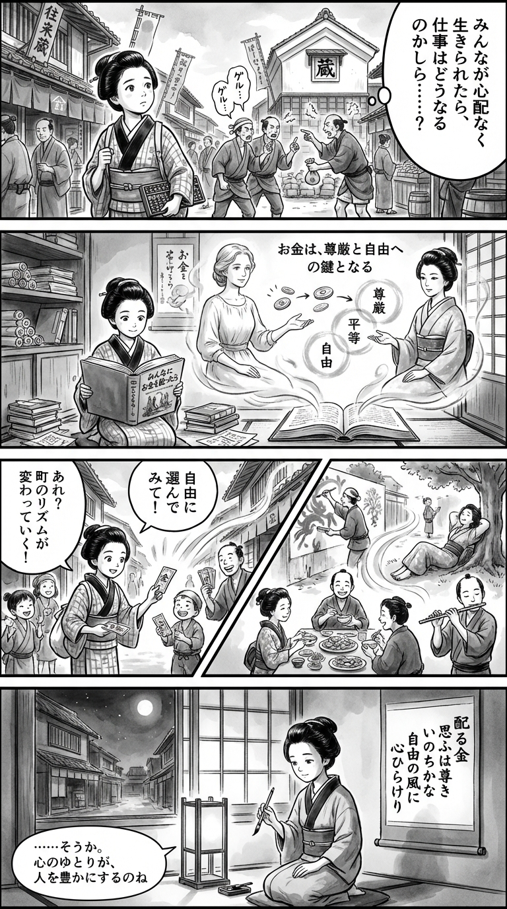

> **Language**: [日本語](../ja/みんなにお金を配ったら――ベーシックインカムは世界でどう議論されているか？_review.html) | [English](../en/みんなにお金を配ったら――ベーシックインカムは世界でどう議論されているか？_review.html) | [繁體中文](../zh-tw/みんなにお金を配ったら――ベーシックインカムは世界でどう議論されているか？_review.html)
>
> [← Top / トップページ](../../)

# 書籍評論（Markdown・繁體中文）

## 📖 書籍資訊
- **標題**: みんなにお金を配ったら――ベーシックインカムは世界でどう議論されているか？  
- **作者**: アニー・ローリー and 上原裕美子  
- **ASIN**: B07YG24NWS  
- **URL**: [https://www.amazon.co.jp/dp/B07YG24NWS](https://www.amazon.co.jp/dp/B07YG24NWS)  

---

## 對白

### Panel 1
**Scene**: 町娘在繁忙的江戶市場中走動，觀察一群工人在米倉附近爭論不公平的工資。她若有所思地歪著頭，手中握著算盤，低聲自語：「如果每個人都能無憂無慮，那工作會變成什麼呢？」背景是熱鬧的街道，掛著橫幅和商販的攤位。

**Dialogue**: 「如果每個人都能無憂無慮，那工作會變成什麼呢？」

### Panel 2
**Scene**: 在她的小書房裡，滿是卷軸和荷蘭書籍，她正在閱讀一本翻譯的論文，題為「如果大家都能分配金錢」。滑動的屏風上出現兩位飄渺的教師形象——一位是柔和的西方女性，頭髮束起，眼神溫和（靈感來自安妮·洛瑞），另一位是沉穩的日本女性，穿著和服，散發著安靜的智慧（靈感來自上原由美子）。她們似乎在通過微弱的書法圖示解釋尊嚴、平等和自由的理念，硬幣變成光圈。

**Dialogue**: （無對話）

### Panel 3
**Scene**: 受到啟發的町娘在小巷中進行一個有趣的「實驗」——她給孩子和商販們發放小紙幣，邀請他們「自由選擇」。場景變得熱鬧，人們開始畫畫、休息、分享食物，並微笑。町娘驚訝地發現，慷慨改變了城鎮的節奏。大膽的斜構圖展示了她的喜悅和驚奇。

**Dialogue**: （無對話）

### Panel 4
**Scene**: 夜幕降臨。町娘坐在燈光下，手握毛筆和墨石，凝視著障子外安靜的街道。她在懸掛的卷軸上寫下一首短歌，神情平靜，充滿新獲得的洞察。這首短詩寫道：

**Tanka (translation)**: 分發金錢，思考其尊貴，生命如此，心靈在自由的風中展開。

**Tanka (original)**: 配る金  
　思ふは尊き  
　いのちかな  
　自由の風に  
　心ひらけり

## 🎯 這本書的核心
本書試圖將基本收入（UBI）重新定義為一種支持人類尊嚴與自由的「價值理念」，而不僅僅是一項經濟政策。作者アニー・ローリー論述了在人工智慧和自動化使雇用結構劇變的現代，UBI是實現社會穩定與個人自立的關鍵。  

書中質疑美國根深蒂固的「勞動是美德」信念，並將UBI描繪為超越貧困、性別和種族不平等的普遍社會契約。通過肯尼亞和印度等地的實驗案例，提供了現金給付能夠恢復人們尊嚴並促進社會參與的實證依據。  

---

## 💡 關鍵見解
- **政策是選擇的結果**  
  作者指出，經濟差距和貧困並非自然現象，而是社會選擇的政策結果。UBI作為「另一種選擇」，提供了更公正社會設計的可能性。  

- **UBI是21世紀的工會**  
  有了無條件的收入保障，勞動者可以拒絕不合理的勞動條件。UBI成為重新分配勞動市場談判力的制度性支柱，賦予個人「選擇的自由」。  

- **貧困奪走思考能力**  
  書中引用研究指出，金錢焦慮會降低認知能力，並主張UBI是恢復「思考的餘裕」的手段。這不僅是經濟支持，更是恢復人類判斷力和創造力的行為。  

- **重新定義勞動改變社會**  
  書中提出應將照護工作和創造性活動視為勞動。UBI超越以GDP為中心的價值觀，成為建立以人類生活為中心的新倫理的契機。  

- **全員一律的原則力量**  
  無論條件或屬性如何，對所有人給付的機制能夠消除社會污名，形成超越分裂的共同基礎。公平性和包容性是UBI的核心。  

---

## 🔍 與現代背景的關聯
截至2026年，人工智慧和自動化的進展再次引發了對UBI的討論。OpenAI的Sam Altman提出的「普遍基本計算」和Elon Musk的「普遍高收入」構想，成為重構資本和勞動概念的嘗試，備受關注。  

這些趨勢與本書所描繪的「技術變革下的社會選擇」主題相呼應。在AI主導生產的時代，我們如何定義人類的價值。作者的主張與現金給付向數位資源分配演變的現代討論密切相關。  

---

## 🚀 實踐建議
1. **考慮擴大現金給付型支援**  
   如肯尼亞和印度的實驗所示，現金給付能促進貧困減少和社會參與。作為減少行政成本、實現靈活支援的有效手段。  

2. **推進提高勞動者談判力的制度改革**  
   有了最低收入保障，勞動者可以拒絕不合理的條件。部分UBI的導入將有助於勞動市場的健康發展。  

3. **制度性評價照護工作和無償勞動**  
   需要將家務、育兒、護理等無償勞動社會化，並擴充報酬和支援。這將有助於實現性別平等。  

4. **將財政支出重新定義為「投資」**  
   需要將社會保障視為未來生產力和社會穩定的投資，而非成本的思維轉變。  

5. **透過普遍制度消除污名**  
   為了防止條件性給付產生的歧視和偏見，應當追求全員一律的制度設計。  

---

## ⭐ 總體評價
本書是一部在哲學、經濟和倫理的交匯點上解讀基本收入討論的珍貴著作。作者通過數據和現場的聲音，深入挖掘「分配金錢」這一簡單行為背後的社會和人性意義。  

在思考AI時代的勞動與福利未來時，本書不僅僅是政策論，更是一本探討「人類生活方式」的書，值得推薦給關心如何超越經濟框架、保護自由與尊嚴的讀者。

---

&copy; shioki | [CC BY-NC-SA 4.0](https://creativecommons.org/licenses/by-nc-sa/4.0/)
