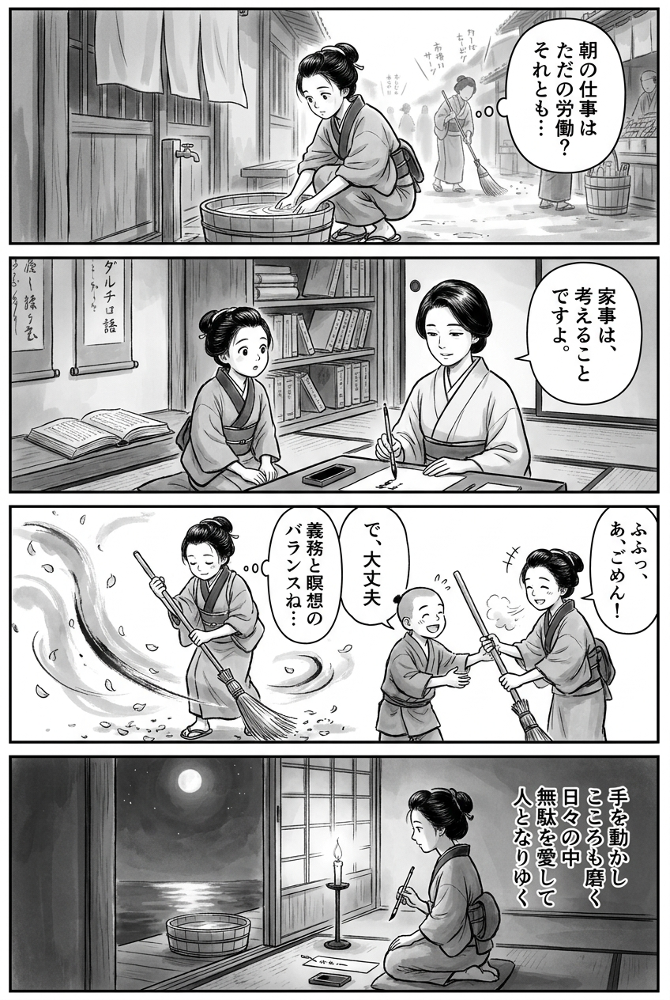

> **Language**: [日本語](../ja/むしろ、考える家事【電子特典付き】_review.html) | [English](../en/むしろ、考える家事【電子特典付き】_review.html) | [繁體中文](../zh-tw/むしろ、考える家事【電子特典付き】_review.html)
>
> [← Top / トップページ](../../)

# 書籍評論（Markdown・繁體中文）

## 📖 書籍資訊
- **標題**: むしろ、考える家事【電子特典付き】  
- **作者**: 山崎ナオコーラ  
- **ASIN**: B08XYMH4ZZ  
- **URL**: [https://www.amazon.co.jp/dp/B08XYMH4ZZ](https://www.amazon.co.jp/dp/B08XYMH4ZZ)  

---

<picture>
  <source srcset="../../images/reviews/むしろ、考える家事【電子特典付き】_4panel.webp" type="image/webp">
  
</picture>
## 🎯 這本書的核心
山崎ナオコーラ的《むしろ、考える家事》是一部思想性散文，將家事重新定義為人類思考、感受和連結的活動，而不僅僅是「勞動」或「義務」。作者主張，透過家事，人類的思索得以深化，並能重建與社會和環境的關係。

家事是AI或機器無法取代的「人性行為」，在日常的重複中蘊含著祈禱和創造力，作者如此闡述。此外，家事不應僅限於女性的角色，而應被視為超越性別的「生活工作」，並且考慮到社會結構的變革。

本書對於追求效率和節省時間的現代社會，提出了一個靜默的挑戰，旨在重新連結「思考」與「生活」。

---

## 💡 關鍵洞見
- **家事是社會活動，也是思考的場所**  
  透過家事進行思考本身就是一種社會行為，並且成為創造的起點。家庭內的思考有可能引發社會的變化。

- **AI無法取代的人性行為**  
  在家事中產生的思考和情感是機器無法重現的。在效率化的時代，家事被描繪為人性最後的堡壘。

- **「無名的家事」中蘊含的祈禱與價值**  
  看似無意義的重複工作，實際上是一種維持世界的祈禱行為。作者肯定「無駄」，並在其中發現人性的深度。

- **家事是個人與世界之間的媒介**  
  洗碗或打掃等行為中，產生了與他人和自然的共鳴。家事不是孤立的家庭內勞動，而是與社會連結的感知起點。

- **超越性別的生活重構**  
  將家事從女性角色中解放出來，重新定義為每個人都應承擔的人性活動。提出不受性別束縛的「生活平等」。

---

## 🔍 與現代背景的關聯
在現代日本，約有80%的無償勞動由女性承擔，家庭事務、育兒和護理的年產值達到143兆日元，卻未反映在GDP中。這樣的結構性偏差被指出是少子化、工資停滯和性別差距的根源。

山崎ナオコーラ的觀點是對這一社會扭曲的思想性反擊。她將「思考家事」本身視為社會變革的起點，並將家事從「看不見的勞動」轉化為「人性的創造」。

此外，在AI和自動化日益進步的社會中，本書也重新確認了人類「用自己的頭腦思考」的價值。透過家事進行思考並與社會連結的想法，展示了後效率社會的新倫理。

---

## 🚀 實踐建議
1. **將家事轉變為「思考的時間」**  
   有意識地將清掃或洗碗的時間用作思考和創造的靜謐時光。以思考的深化為目的，而非效率。

2. **不將工作與家事分開，將其視為「整體生活的創造」**  
   將家事視為具有社會價值的創造行為，為日常行為重新賦予意義。柔和地模糊工作與生活的界限是關鍵。

3. **在「無意義的工作」中發現價值**  
   不追求效率，品味重複中的靜謐與祈禱。看似無用的時間，反而支撐著人性。

4. **透過家事意識到社會與環境**  
   在購物和烹飪的選擇中，將環境考量和社會公正聯繫起來。以日常行為改變社會的視角。

5. **將家事變成與他人共鳴的場所**  
   共享烹飪和清掃，與家人或朋友一起「創造生活」的體驗。讓家事不再孤獨，而成為連結的場所。

---

## ⭐ 總體評價
《むしろ、考える家事》是一本從家庭這一最親近的地方重新審視社會的思想性著作。通過將家事重新定義為「人類的思索與祈禱之地」，促使讀者重新發現日常生活。

對於在追求效率和成果的現代社會中感到疲憊的人，或是希望將家事重新視為創造的人，本書將帶來深刻的共鳴與靜默的勇氣。  
閱讀本書本身就是一種哲學思考生活的行為。

---

&copy; shioki | [CC BY-NC-SA 4.0](https://creativecommons.org/licenses/by-nc-sa/4.0/)
