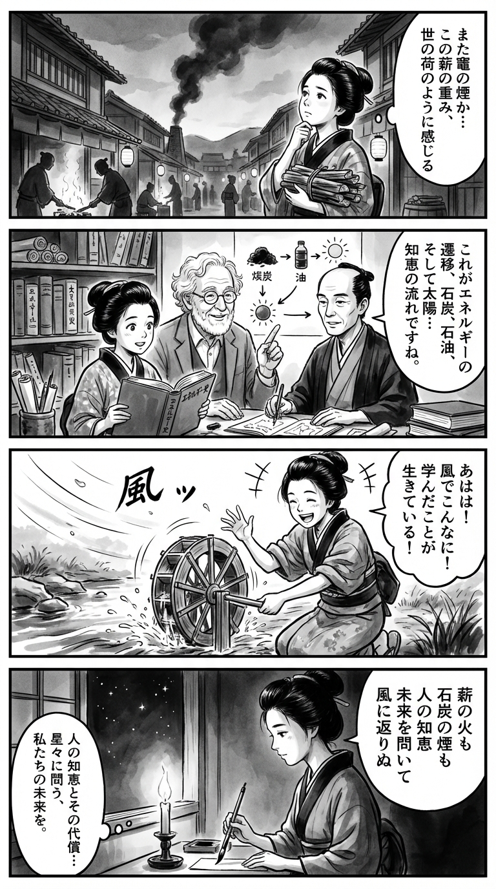

---
---
> **Language**: [日本語](../ja/エネルギー400年史：薪から石炭、石油、原子力、再生可能エネルギーまで_review.html) | [English](../en/エネルギー400年史：薪から石炭、石油、原子力、再生可能エネルギーまで_review.html) | [繁體中文](../zh-tw/エネルギー400年史：薪から石炭、石油、原子力、再生可能エネルギーまで_review.html)
>
> [← Top / トップページ](../../)

## 📖 書籍資訊
- **書名**: エネルギー400年史：薪から石炭、石油、原子力、再生可能エネルギーまで  
- **作者**: リチャード・ローズ and 秋山 勝  
- **ASIN**: B083ZDMHKH  
- **URL**: [https://www.amazon.co.jp/dp/B083ZDMHKH](https://www.amazon.co.jp/dp/B083ZDMHKH)  

---

## 對白

### Panel 1
**Scene**: 江戶時代的黃昏街道上，身穿和服的町娘肩扛著柴火，停下腳步凝視從窯口升起的黑煙。她微微歪頭，若有所思，彷彿感受到燃料對世界的負擔。背景中可見瓦屋屋頂、燈籠微光，以及忙著添柴的町人們。  
**Dialogue**: （無台詞，僅有沉思的神情）

### Panel 2
**Scene**: 在一間擺滿卷軸與外國書籍的小書齋裡，町娘打開一本厚重的外文書，封面上寫著「エネルギー史」。她身旁坐著一位溫和的外國老學者，圓眼鏡、柔和的眼神、微卷的頭髮；另一位神情沉穩、目光銳利的日本學者正指著煤炭、石油與太陽的圖解講解。整個空氣中瀰漫著好奇與敬意。  
**Dialogue**: （日本學者）「能源的流轉，正如人心的變化。」

### Panel 3
**Scene**: 河畔邊，町娘親手組裝了一個小水車，試著運用水流的力量，就像她學到的「能源轉換」理論。忽然一陣風起，水車轉得比預期更快，水花濺濕了她的和服，她開懷大笑，感受到學問與生活交融的喜悅。  
**Dialogue**: 「哈哈，風也來幫忙了呢！」

### Panel 4
**Scene**: 夜裡，她坐在燈光下，在細長的短冊上寫下和歌。燈火微微搖曳，她抬頭望向遠方的星空，思索著人類創造力的光與影。  
**Dialogue**: （低聲自語）「知識的火焰，也會問向未來吧……」  
**Tanka (translation)**:  
「無論是柴火的焰，還是煤煙的影，皆是人類的智慧。  
向未來發問的心，終將隨風回響。」  
**Tanka (original)**:  
「薪の火も  
　石炭の煙も  
　人の知恵  
　未来を問いて  
　風に返りぬ」

## 🎯 本書的核心
本書以橫跨四百年的能源史——從柴薪、煤炭、石油、核能到再生能源——描繪出人類的創意與慾望，以及其所付出的代價，是一部壯闊的史詩。作者以科學家與發明家的試錯歷程為主軸，追溯技術創新的連鎖如何改變社會結構，並塑造文明的樣貌。  

作者リチャード・ローズ將能源視為不僅僅是燃料或技術，而是「人類智慧與倫理的試金石」。他揭示進步背後潛藏的環境破壞、勞動剝削與倫理困境，並將當代的氣候危機置於歷史的延長線上，向讀者提出對未來選擇的深刻提問。  

---

## 💡 關鍵洞見
- **氣候變遷是歷史的結果**  
  當前的環境問題，是過去四百年能源使用累積的結果。從柴薪到煤炭、再到石油的選擇連鎖，最終導致了現代的氣候危機。這樣的觀點對於構想永續未來至關重要。  

- **技術創新會改變社會形態**  
  蒸氣機與煤氣燈的出現，徹底改變了勞動與都市生活的節奏。技術不只是工具，更具有改變社會時間感與價值觀的力量。  

- **科學與技術的融合孕育創新**  
  正如布萊克的潛熱理論支撐了瓦特改良蒸氣機一樣，理論與實踐的互動使技術進步成為可能。沒有科學的理解，就無法達成高效且安全的能源利用。  

- **進步的背後總有犧牲**  
  從礦工的艱苦環境到核能的悲劇，能源革命始終伴隨著人類的犧牲。全書貫穿著一個警訊：技術的進步並不必然帶來幸福。  

- **發明是群體而非個人的成果**  
  如同聚集在瓦特工坊的年輕人們，創新是在知識網絡中孕育的。科學家、工程師與企業家的協作，共同推動了能源史的發展。  

---

## 🔍 與現代脈絡的關聯
現代社會正處於「脫碳化」與「再生能源轉型」的新一輪能源革命之中。本書所描繪的歷史轉折，正是理解這場進行中的變革的羅盤。  

根據國際能源署（IEA）的預測，到了2050年，再生能源可能將占全球電力的大部分。然而，正如ローズ筆下的歷史轉換一樣，這場變化同樣伴隨著社會與倫理的摩擦。學習能源史，不僅是為了理解技術的未來，更是為了反思人類選擇的倫理。  

---

## 🚀 實踐建議
- **以歷史視角思考能源問題**  
  將當前的氣候危機視為「過去的遺產」，不僅有助於超越短期的技術解方，也能促使我們重新審視長期的文明設計。  

- **檢驗技術創新的社會影響**  
  新技術的導入必然伴隨副作用。AI與再生能源技術的普及，也應事先評估其對勞動結構與倫理觀的影響。  

- **促進科學與技術的對話**  
  加強理論與實踐的橋樑，深化基礎研究與應用技術的連結，才能建立更安全且永續的能源社會。  

- **推動從過去犧牲中學習的倫理教育**  
  不忘礦工與核能事故的教訓，建立能將技術進步與人類幸福相結合的教育與政策，至關重要。  

---

## ⭐ 總體評價
《エネルギー400年史》是一場橫跨科學史、技術史與環境史的知識冒險。它不僅僅是能源的通史，更深刻地探問「人類的創意與責任」。  

本書既不盲目讚頌技術進步，也不陷於悲觀，而是細緻地描繪出其複雜的雙面性。對能源議題感興趣的讀者，或是研究科學史與倫理學的人，都能從中獲得豐富啟發。理解過去，正是選擇未來的力量——本書以平靜而有力的筆觸，傳達了這個訊息。

---

&copy; shioki | [CC BY-NC-SA 4.0](https://creativecommons.org/licenses/by-nc-sa/4.0/)
