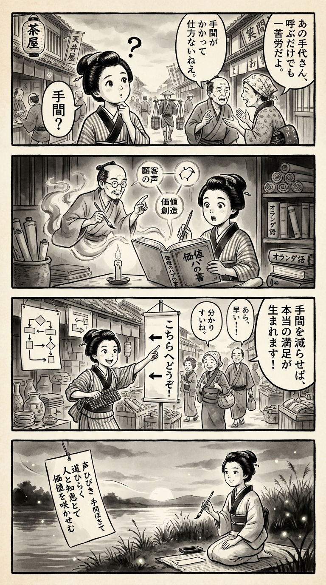

> **Language**: [日本語](../ja/コンタクトセンターマネージメントの教科書――CXに革命を起こす、世界水準の成功方程式_review.html) | [English](../en/コンタクトセンターマネージメントの教科書――CXに革命を起こす、世界水準の成功方程式_review.html) | [繁體中文](../zh-tw/コンタクトセンターマネージメントの教科書――CXに革命を起こす、世界水準の成功方程式_review.html)
>
> [← Top / トップページ](../../)

# 書籍評論（繁體中文）

## 📖 書籍資訊
- **標題**: コンタクトセンターマネージメントの教科書――CXに革命を起こす、世界水準の成功方程式  
- **作者**: 株式会社船井総合研究所 プロシード事業部  
- **ASIN**: B0GX34KTH1  
- **URL**: [https://www.amazon.co.jp/dp/B0GX34KTH1](https://www.amazon.co.jp/dp/B0GX34KTH1)  

---

<picture>
  <source srcset="../../images/reviews/コンタクトセンターマネージメントの教科書――CXに革命を起こす、世界水準の成功方程式_4panel.webp" type="image/webp">
  
</picture>

## 對白

### Panel 1
**Scene**: 在繁忙的江戶街道上，町娘聆聽鄰居們抱怨從當地服務櫃檯獲得幫助的麻煩。她若有所思地歪著頭，感受到一種「顧客負擔」。背景中有茶館和懸掛著漢字標牌的紙燈籠。她的表情混合著好奇與同情。

### Panel 2
**Scene**: 在一間燭光閃爍的書房裡，滿是卷軸和荷蘭書籍，她正在閱讀一本名為「價值的哈布之書」的神秘新著作。書中出現了一位學者形象的角色，想像成一位穿著商人袍子、髮型整齊、表情冷靜、戴著圓形眼鏡的中年男子，像靈魂般的老師從書中浮現，手勢指向象徵「顧客之聲」和「價值創造」的相互連結圓圈的圖表。町娘驚訝地看著，手中握著毛筆。

### Panel 3
**Scene**: 她在當地商販的攤位上應用她的新見解。利用算盤和巧妙的標示，她重新組織流程，讓顧客能更快且不混淆地獲得所需。驚訝的顧客們面帶微笑，感到如釋重負，而她自豪地解釋：「減少他們的顧客負擔帶來真正的滿足。」背景中展示了她像旗幟般懸掛的創意圖表。

### Panel 4
**Scene**: 在黃昏的河岸邊，町娘跪下，手握毛筆，於隨風飄動的短冊上作詩。螢火蟲閃爍。她平靜的微笑反映出對於人與知識必須和諧共存的理解。短詩如下：

「聲ひびき  
　手間をほどきて  
　道ひらく  
　人と知恵とで  
　価値を咲かせむ」

## 🎯 這本書的核心
本書是一本系統性的管理書，旨在將傳統上被視為「成本中心」的聯絡中心轉變為創造企業價值的「價值樞紐」。作者提出了以CX（顧客體驗）為中心的經營方法，並重新定義中心運營為戰略資產。

其核心觀點在於減少顧客的「麻煩」，並建立分析VOC（顧客之聲）以促進商品及服務改善的機制。此外，書中精細整理了與現場實務直接相關的元素，如AI與人類的協作、知識管理及數據驅動的KPI設計等。

這不僅僅是一本理論書，更是針對現場問題的實踐指南，成為志在推動CX改革的經理人的羅盤。

---

## 💡 關鍵洞察
- **減少顧客的“麻煩”是CX的核心**  
  顧客滿意度與「情感滿意」相比，更直接與「麻煩的少」相關。重新檢視顧客的行為過程，可以根本改變CX的質量。

- **VOC是企業成長的源泉**  
  投訴或詢問的背後，潛藏著商品改善或新產品開發的線索。分析VOC並將其作為全公司的知識來運用，能帶來競爭優勢。

- **AI是“合作夥伴”，完全依賴則是風險**  
  將AI視為僅僅是自動化工具，而非補充人類判斷的夥伴是非常重要的。適當的分工能夠兼顧生產力與品質。

- **防止溝通者孤立有助於降低離職率**  
  確保心理安全性並明確職業發展路徑，可以維持現場的穩定性與應對品質。人員留任是提升CX的前提條件。

- **知識管理實現品質的均一化**  
  系統性地整理應對手冊和FAQ，排除個人依賴，能夠提升整個組織的品質。知識共享是中心運營的生命線。

---

## 🔍 與現代文脈的關聯
近年來，聯絡中心不再僅僅是顧客服務部門，而是成為影響企業品牌體驗的戰略據點。在AI導入和全通路化的進程中，顧客期望獲得「快速、準確、無壓力」的解決體驗。

此外，由於人力成本上升和人力資源短缺，傳統的人海戰術運營已達到極限。隨著AI代理和自動化工具的導入，現場的心理安全性和職業支持的重要性也在增加。本書的建議在這一行業結構轉型期中，提供了兼顧技術與人性化的實踐指導。

---

## 🚀 實踐建議
1. **可視化服務旅程**  
   明確顧客在哪些地方感到不滿或麻煩，並設定改善的優先順序。這樣可以制定具體的CX提升行動計劃。

2. **建立知識基礎，提高搜尋性**  
   創建一個讓溝通者能夠即時獲取所需資訊的環境，同時提升應對品質和效率。

3. **將AI導入視為“生產力改善”的手段，而非“省力化”**  
   在應對詢問數量增加的同時，最大化人力資源的價值。AI是現場的合作夥伴。

4. **明確職業發展路徑與評價制度**  
   提供公平的評價標準和成長路徑，以提高動機和留任率，防止因離職導致的品質下降。

5. **實施基於KPI樹的數據驅動改善**  
   結構性地整理定量指標，明確改善的因果關係，以持續產生成果。

---

## ⭐ 總體評價
本書是一本實踐指南，旨在將聯絡中心從單純的「顧客服務現場」轉變為「推動企業成長的戰略資產」。理論與現場知識緊密融合，對於志在推動CX改革的企業主和經理人來說，是一本必讀之作。

讀者不僅能學會如何利用AI和數據分析等最新技術，還能獲得重新定義「人類工作的意義」的視角。通過技術與人性的和諧，為實現真正以顧客為中心的經營提供了明確的路徑。

---

&copy; shioki | [CC BY-NC-SA 4.0](https://creativecommons.org/licenses/by-nc-sa/4.0/)
