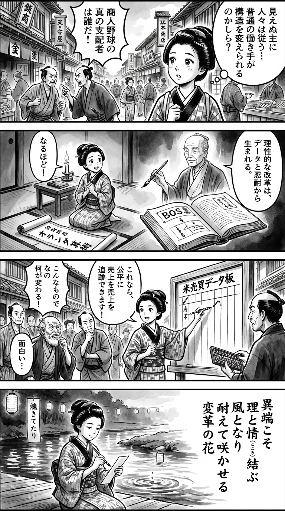

> **Language**: [日本語](../ja/サラリーマン球団社長_review.html) | [English](../en/サラリーマン球団社長_review.html) | [繁體中文](../zh-tw/サラリーマン球団社長_review.html)
>
> [← Top / トップページ](../../)

# 書籍評論（繁體中文）

## 📖 書籍資訊
- **標題**: サラリーマン球団社長  
- **作者**: 清武 英利  
- **ASIN**: B0DTY8Q45K  
- **URL**: [https://www.amazon.co.jp/dp/B0DTY8Q45K](https://www.amazon.co.jp/dp/B0DTY8Q45K)  

---

<picture>
  <source srcset="../../images/reviews/サラリーマン球団社長_4panel.webp" type="image/webp">
  
</picture>
## 🎯 這本書的核心
《サラリーマン球団社長》是企業社會的「門外漢」挑戰職業棒球這個異世界，實現組織改革的真實紀錄。作者清武英利透過一位上班族以熱情和理性挑戰球團經營的過程，描繪出異端者帶來變革的可能性。  

本書的中心在於象徵數據革命的「棒球運營系統（BOS）」的導入，以及廣島鯉魚隊的育成哲學等，圍繞著球界現代化的試行錯誤。這裡面充滿了與母公司的支配結構和舊有習俗抗爭的現場真實感。  

最終，本書證明了「忍耐的時間會產生價值」這一信念，並展示了上班族的踏實努力能夠改變組織的力量。改革唯有通過異端者的勇氣和耐心的積累才能實現。

---

## 💡 關鍵見解
- **異端者才能實現改革**  
  主流之外的「旁流人士」正是能為僵化的組織打開風口的人。本書以實例展示了不受既有秩序影響的視角如何成為變革的原動力。  

- **數據與熱情的融合創造新經營**  
  BOS的導入象徵著擺脫情感判斷，實現理性與熱情的平衡。數據化的評價提升了組織的透明度和公正性。  

- **「現地化」與權限下放的重要性**  
  子公司經營的成功必須賦予現場權限和責任。母公司的過度干預會導致失敗，這一教訓適用於各種組織。  

- **育成型經營的哲學**  
  像廣島鯉魚隊一樣，重視長期育成而非短期成果的姿態，對企業經營同樣適用。累積手作的價值才是持續競爭力的來源。  

- **「共存共榮」是幻想**  
  通過對以巨人為中心的球界結構的批評，呼籲需要的是自立的經營，而非依賴。地方球團的奮鬥與中小企業的生存戰略相呼應。

---

## 🔍 與現代背景的關聯
在當前的日本企業中，因繼承者不足和副業解禁的背景下，「上班族經營者」的存在被重新評價。清武所描繪的「來自異業的改革者」正是這一潮流的先驅。  

此外，隨著數據驅動經營和治理改革的推進，像BOS這樣的系統導入不僅是體育界的課題，也與企業經營的整體挑戰相重疊。理性與熱情、數據與人性化的融合，暗示了AI時代的領導者形象。  

再者，打破「共存共榮」幻想的地方球團形象，與抗拒中央集權結構的地方企業和創業公司的奮鬥相呼應。在上班族轉型為經營者的時代，本書重新發現了「從現場改變的力量」。

---

## 🚀 實踐建議
1. **積極引入異領域的視角**  
   打破組織的僵化需要勇氣去任用「門外漢」。異業的見解能帶來新的風氣。  

2. **徹底執行基於數據的決策**  
   以客觀數據為基礎的判斷能提高組織的透明度和信任度，而非依賴情感或慣例。  

3. **將育成與獨特性作為經營的核心**  
   重視長期的人才培養和文化形成，而非短期利益，這將支持持續成長。  

4. **推進權限下放至現場**  
   採納「現地化」的思維，將判斷和責任委託給現場，能夠產生速度和創造力。  

5. **重新定義「忍耐的時間」為價值**  
   不要將成果出現之前的忍耐視為「浪費」，而是要建立一種共享長期信念的文化，這將成為組織的底氣。

---

## ⭐ 總體評價
《サラリーマン球団社長》描繪了一位來自異業的挑戰者如何撼動既有秩序，改變組織的過程。透過棒球這一舞台，照亮了企業社會的結構問題和領導力的本質。  

本書給予上班族希望，即使是上班族也能擁有「經營者的視角」。對於那些不懼變化、堅持信念不斷挑戰的人來說，本書同時提供了勇氣和策略的啟發。

---

&copy; shioki | [CC BY-NC-SA 4.0](https://creativecommons.org/licenses/by-nc-sa/4.0/)
