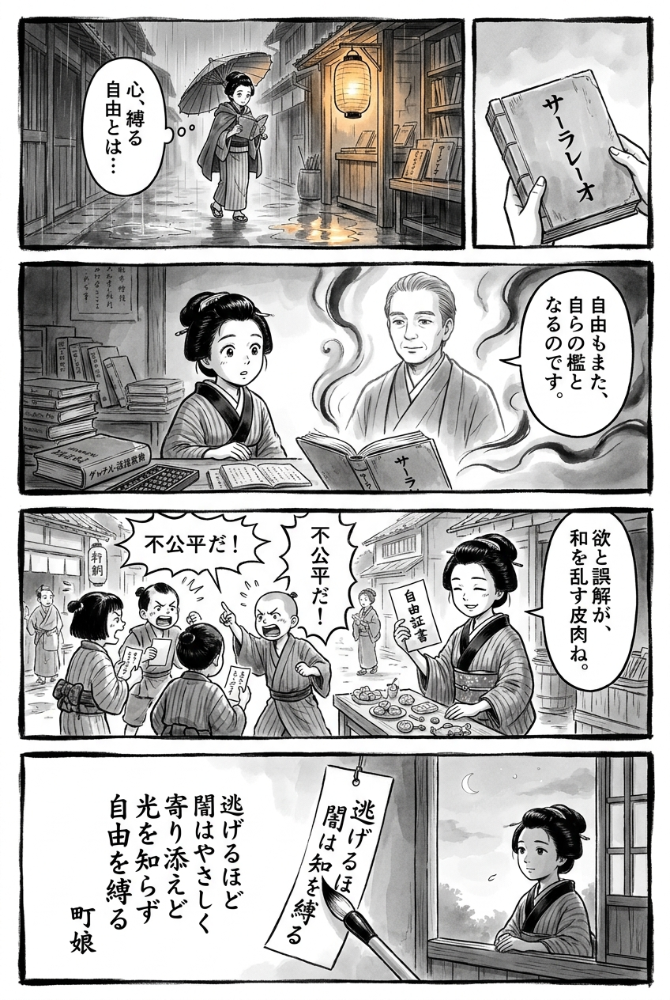

> **Language**: [日本語](../ja/サーラレーオ_review.html) | [English](../en/サーラレーオ_review.html) | [繁體中文](../zh-tw/サーラレーオ_review.html)
>
> [← Top / トップページ](../../)

# 書籍評論（繁體中文）

## 📖 書籍資訊
- **標題**: サーラレーオ  
- **作者**: 新庄耕  
- **ASIN**: B07GDH823X  
- **URL**: [https://www.amazon.co.jp/dp/B07GDH823X](https://www.amazon.co.jp/dp/B07GDH823X)  

---

<picture>
  <source srcset="../../images/reviews/サーラレーオ_4panel.webp" type="image/webp">
  
</picture>

## 對白

### Panel 1
**Scene**: 小町娘在黃昏的江戶小巷中走過，雨水潺潺，停在一個燈籠照亮的書攤前。她拿起一本稀有的外國書籍，低聲喃喃自語著「束縛心靈的自由」。氣氛靜謐卻又不安，燈光在水坑中泛起波紋，她凝視著書封上以毛筆字寫的「サーラレーオ」。

### Panel 2
**Scene**: 在她的小書房裡，她打開書本，旁邊放著荷蘭字典和算盤。燭光中出現了一位神秘的學者——一位冷靜的中年男子，姿態學者，想像中的作者新條光：短髮整齊，眼神深思，穿著樸素的衣袍，散發著安靜的智慧。他似乎從書頁中走出，輕聲解釋「自由可能成為自己的囚籠」。小町娘聆聽著，眼中閃爍著頓悟的光芒。

### Panel 3
**Scene**: 次日早晨，她通過一個有趣的實驗來應用這個想法：她試圖用自己手寫的「自由便條」在鄰居的小孩之間交易糖果，以「購買自由」。隨之而來的是混亂，孩子們因公平問題爭吵不休，顯示出貪婪和誤解如何迅速破壞和諧。她看著這一切，嘴角露出一絲苦澀的微笑，意識到其中的諷刺。

### Panel 4
**Scene**: 黃昏再次降臨。小町娘坐在窗邊，手握毛筆，凝視著漸漸暗淡的天空。在一個懸掛的短冊上，她寫下了一首深刻的和歌，捕捉了「サーラレーオ」的精髓——接受自己的陰影：
**Tanka (translation)**: 逃避的時候，黑暗是如此溫柔，雖然相伴卻不知光明，卻束縛了自由。
**Tanka (original)**: 「逃げるほど  
　闇はやさしく  
　寄り添えど  
　光を知らず  
　自由を縛る」

## 🎯 這本書的核心
《サーラレーオ》是一部徹底描繪堕落與逃避所帶來的「無救贖」的故事。主角カセ在犯罪與背叛中反覆掙扎，試圖在某個地方為自己的行為辯護。然而，這種嘗試在金錢與快樂主宰的現實中崩潰，他只能接受自己的毀滅。

在異國的曼谷喧囂與孤獨中，カセ渴望自由，卻最終被自己的欲望與恐懼所囚禁。本作冷酷地揭示了現代社會中「逃避的代價」與「人類的不可重生性」。新庄耕以無情的筆觸描繪了生活在城市邊緣者的現實。

---

## 💡 關鍵洞見
- **束縛自由的「黑暗田野」**  
  對カセ而言，黑暗田野是成功與自由的象徵，但同時也是將他束縛於犯罪與孤立連鎖的存在。為了獲得自由而選擇的手段，最終卻奪走了他的自由，這一悖論構成了作品的核心。

- **異國的逃避是新的監獄**  
  曼谷這片異國土地對カセ來說並非救贖之地，反而成為放大孤獨與不安的舞台。透過逃避獲得的自由只是一場幻想，現實的沉重始終追逼著他。

- **金錢腐蝕友情**  
  自從擁有巨額金錢的那一刻起，カセ的人際關係便開始崩潰。圍繞金錢的不公平如同試金石，決定了他的孤立與堕落。

- **「サーラレーオ」這一斷罪之詞**  
  泰語中的「サーラレーオ」象徵著カセ接受自己堕落的瞬間。透過這個詞，他首次理解了自己的本質，達到了無處可逃的自我認識。

- **作為幻想的愛與快樂**  
  對カセ而言，愛與性不過是現實逃避的手段。快樂不僅無法治癒他，反而引導他走向更深的虛無，加速了自我崩潰的速度。

---

## 🔍 與現代文脈的相關性
《サーラレーオ》中描繪的毒品交易與非法經濟結構，與現代匿名化、線上化的藥物交易實態相呼應。在社交媒體與加密應用普及的背景下，犯罪不再是特定的「地下社會」問題，而是每個人都可能接觸到的現實。

此外，在當前社會中，年輕人的孤立與心理健康問題受到廣泛關注，像カセ這樣的「逃避個體」並非特例。新庄耕的筆觸透過城市邊緣的孤獨與欲望，照亮了現代社會的脆弱。《サーラレーオ》不僅是一部犯罪小說，更是描繪現代日本「看不見的結構」的文學作品。

---

## 🚀 實踐建議
1. **選擇直視而非逃避**  
   逃避問題雖然能帶來短暫的安息，但無法根本解決。直視現實的勇氣才是斷絕毀滅連鎖的第一步。

2. **重視信任而非金錢**  
   追求短期利益可能會損害長期信任。正如カセ與アリ的關係所示，人際關係的崩潰帶來的損失遠比金錢上的成功更為嚴重。

3. **停止自我欺瞞，深化自我理解**  
   直視自己的弱點與醜陋雖然痛苦，但這是重生的唯一途徑。缺乏自我理解會成為重複毀滅性選擇的溫床。

4. **建立「連結」以防孤立**  
   在異文化環境或城市生活中，避免孤立需要努力建立與可信賴他人的關係。孤獨往往是堕落的溫床。

5. **斷絕對快樂的依賴，培養內心的充實**  
   選擇不依賴毒品、性或金錢刺激等外部因素，而是追求內心的滿足，將是重獲真正自由的關鍵。

---

## ⭐ 總體評價
《サーラレーオ》是極限描繪人類堕落與孤獨的現代犯罪文學的巔峰之作。新庄耕冷酷而精緻地描寫了生活在城市黑暗中的人的心理，向讀者揭示了「逃避的代價」。

這部作品不僅僅是一部犯罪小說，更是映射現代社會結構性孤立的鏡子。對於希望直視人類弱點與欲望走向的讀者而言，本書將帶來深刻的震撼與洞察。

---

&copy; shioki | [CC BY-NC-SA 4.0](https://creativecommons.org/licenses/by-nc-sa/4.0/)
