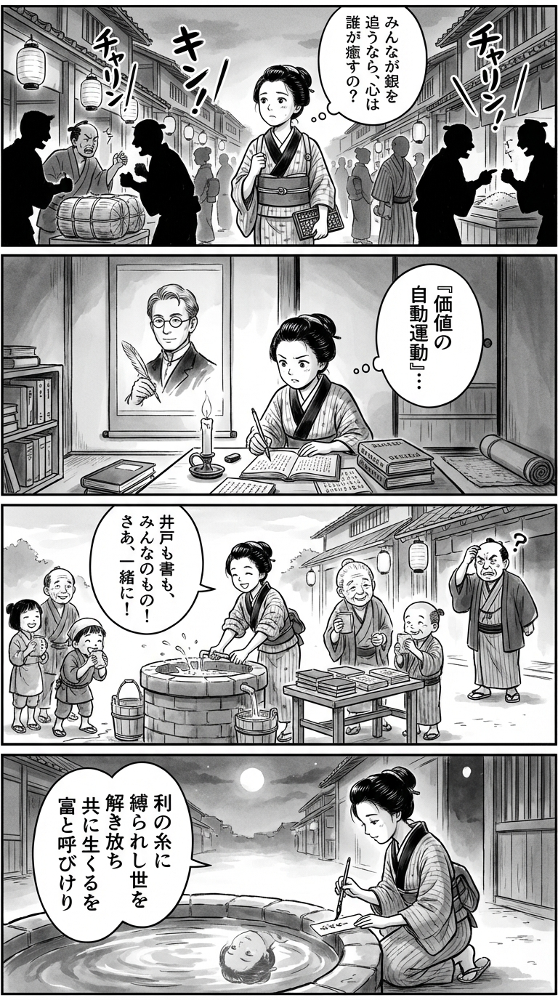

> **Language**: [日本語](../ja/ゼロからの『資本論』_review.html) | [English](../en/ゼロからの『資本論』_review.html) | [繁體中文](../zh-tw/ゼロからの『資本論』_review.html)
>
> [← Top / トップページ](../../)

# 書籍評論（繁體中文）

## 📖 書籍資訊
- **標題**: 零開始的《資本論》  
- **作者**: 斎藤 幸平  
- **ASIN**: B0BRV5XW2Y  
- **URL**: [https://www.amazon.co.jp/dp/B0BRV5XW2Y](https://www.amazon.co.jp/dp/B0BRV5XW2Y)  

---

<picture>
  <source srcset="../../images/reviews/ゼロからの『資本論』_4panel.webp" type="image/webp">
  
</picture>

## 對白

### Panel 1
**Scene**: 小町娘在黃昏的江戶市場中穿行，手裡拿著小算盤和筆記本，耳邊聽到商人們為利潤和價格爭論，聲音如同硬幣的機械碰撞。她停下來，困惑地思考著：「如果大家都追逐銀子，那麼誰來照顧心靈呢？」背景中有燈籠和稻草堆，暗示著商業的脈動。

**Dialogue**: 「如果大家都追逐銀子，那麼誰來照顧心靈呢？」

### Panel 2
**Scene**: 在一間狹長的長屋裡，她在燭光下專心研究荷蘭語和日語的文本。她身後的掛軸上是一位冷靜、學識淵博的男子的肖像，想像中的斎藤公平：整齊的短髮，圓形眼鏡後溫和而又深邃的眼神，持著羽毛筆的沉思姿勢。女孩閱讀著他關於「價值的自動運動」的話語，臉上流露出驚嘆與靜默的反叛。

**Dialogue**: （無）

### Panel 3
**Scene**: 曙光灑進街道，她為鄰居設置了一個小「公共井」，免費提供水和書籍。孩子們和老人們面帶微笑聚集在一起，而一位商人則困惑地旁觀——這裡沒有利潤，但卻充滿了快樂。女孩笑著，袖子捲起，體現了「重拾公共財的理念」。

**Dialogue**: （無）

### Panel 4
**Scene**: 在寧靜的傍晚，她跪在井邊，手持毛筆，正在狹窄的紙條上作和歌。井水的倒影柔和地閃爍。短詩的內容如下：

**Tanka (translation)**: 在利潤的束縛中，解放這個世界，與他人共同生活，這才是真正的富足。

**Tanka (original)**:  
利の糸に  
縛られし世を  
解き放ち  
共に生くるを  
富と呼びけり

## 🎯 本書的核心
《零開始的《資本論》》是對馬克思理論進行重構的一次嘗試，旨在將其與現代社會的現實相對照。作者斎藤幸平揭示了資本主義如何透過「價值的自動運動」來支配人類，並重新思考我們在這一結構中如何生活。  

本書聚焦於三個危機：勞動的疏離、商品化導致的〈共同體〉喪失，以及環境破壞。這些不僅僅是經濟問題，而是奪取人類自由與創造力的社會結構問題。  

斎藤基於馬克思晚年的思想，提出了以脫成長和共享為基礎的「新富裕」構想。他主張，想像資本主義的外部正是當前最迫切的思想實踐。

---

## 💡 關鍵見解
- **「價值」的自動運動支配人類**  
　在資本主義中，增利本身成為目的，人類的欲望和幸福僅僅是手段。作者稱這一結構為「價值的自動運動」，揭示了我們被自己創造的體系所支配的逆轉現象。  

- **商品化奪走社會的〈富〉**  
　水、教育、公共空間等被商品化，導致人們的共同性逐漸喪失。作者重新檢視馬克思所指出的「富裕的悖論」，並將其與當代的新自由主義社會相結合。  

- **勞動的疏離與自發的服從**  
　勞動者相信自己是自由工作的，但實際上卻不得不遵循資本的邏輯以維持生計。作者揭示了這一「自發的服從」結構，並強調打破自由的幻想的必要性。  

- **技術創新助長支配的強化**  
　從泰勒主義到算法勞動，技術的進步並未解放勞動者，反而用於提高管理效率。作者直面這一現實，重新思考技術的社會方向。  

- **〈共同體〉的再生是真正的共產主義**  
　基於馬克思晚年的思想，斎藤提出「脫成長共產主義」。這不是以國家為主導的社會主義，而是基於自治和共享的民主社會重建。

---

## 🔍 與現代背景的關聯
本書提出的問題與氣候危機、貧富差距擴大、AI導致的勞動自動化等現代課題深刻共鳴。在資本主義增長同時損害地球環境和人類尊嚴的現狀下，「脫成長」和「共同體的再生」不再是單純的理想論，而是浮現為現實的生存策略。  

此外，隨著全球供應鏈和數位平台的支配結構加強，地方自治和合作社經濟的意義也被重新評估。斎藤的論述為這一潮流提供了理論支持的思想基礎。

---

## 🚀 實踐建議
1. **採取行動保護和再生〈共同體〉**  
　保護公共圖書館、公園、水資源等共享財產，將是社會再生的第一步。參與地方合作社和市民運動，有助於重建〈共同體〉。  

2. **縮短工作時間，培養連帶感**  
　重獲自由時間是超越資本支配的條件。透過工會和NPO等協會，共同思考、學習和行動的空間至關重要。  

3. **選擇脫成長型的生活方式**  
　停止過度消費，轉向重視修理和再利用的生活，以減少環境負擔，恢復人際關係的豐富性。這不僅是節約，而是價值觀的轉變。  

4. **支持地方自治與國際連帶**  
　通過市民自治和全球公民連帶，建立抵抗資本主義暴走的現實基礎。小規模自治的積累將帶來重大變革。  

5. **閱讀《資本論》，鍛鍊想像力**  
　學習理論是改變現實的第一步。透過《資本論》將社會的不自由進行語言化，重新獲得構想不同未來的能力。

---

## ⭐ 總體評價
《零開始的《資本論》》將艱澀的馬克思理論與現代社會的脈絡相結合，為讀者提供了「想像資本主義之外的力量」的思想入門書。理論與實踐、哲學與生活的結合，充滿了超越單純經濟書籍的智力刺激。  

對於感受到資本主義矛盾卻無法言說其結構的讀者來說，本書將成為思考的羅盤。它提供了一種「希望的理論」，以構想不同社會的可能性，而非對未來的悲觀。

---

&copy; shioki | [CC BY-NC-SA 4.0](https://creativecommons.org/licenses/by-nc-sa/4.0/)
