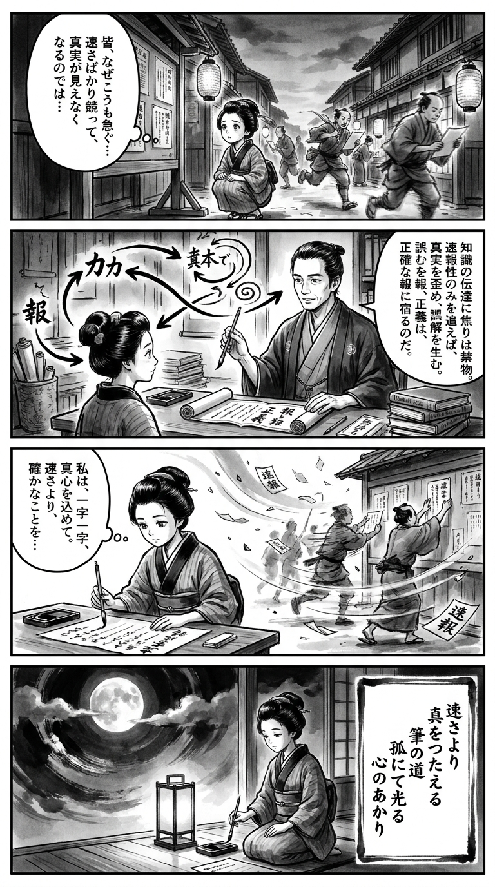

> **Language**: [日本語](../ja/ゼロ打ち_review.html) | [English](../en/ゼロ打ち_review.html) | [繁體中文](../zh-tw/ゼロ打ち_review.html)
>
> [← Top / トップページ](../../)

# 書籍評論（繁體中文）

## 📖 書籍資訊
- **標題**: ゼロ打ち  
- **作者**: 相場英雄  
- **ASIN**: B0CWNH59CV  
- **URL**: [https://www.amazon.co.jp/dp/B0CWNH59CV](https://www.amazon.co.jp/dp/B0CWNH59CV)  

---

<picture>
  <source srcset="../../images/reviews/ゼロ打ち_4panel.webp" type="image/webp">
  
</picture>
## 🎯 本書的核心
《ゼロ打ち》是一部描繪報導與政治之間癒合，以及在這兩者之間掙扎的記者良心的社會派懸疑小說。故事以報社「大和新聞」為背景，記者片山在政治權力與經營壓力中，堅持「傳遞真相」的使命。  

故事透過象徵速報競爭的「ゼロ打ち」報導慣例，質疑速度至上的主義如何侵蝕倫理。此外，書中還層層描繪了女性記者在職業生涯中面臨的障礙、政治資金的不正當行為以及報導現場的腐敗結構，展現了現代社會的縮影。  

相場英雄透過片山孤獨的鬥爭，尖銳地指出報導自由並非制度所能保障，而是依賴於每位記者的「內心勇氣」。  

---

## 💡 關鍵見解
- **報導的正義與經營的矛盾**  
　隨著銷售數量和廣告收入的減少，報導機構在「為經營而報導」和「傳遞真相的使命」之間撕裂。片山的掙扎象徵了現代媒體所面臨的結構性病痛。  

- **政治與媒體的交易結構**  
　如同「不借不貸」這句話所象徵的，報導與政治之間存在著相互依賴的關係。利害關係優先於理念的現實，要求讀者具備洞察信息背後真相的能力。  

- **速報性帶來的倫理危機**  
　「ゼロ打ち」是報導現場為了追求速度而置真相於不顧的象徵。對於速度超越準確性的現代社會，發出了尖銳的警鐘。  

- **女性記者的生存策略**  
　片山的形象體現了在性別和年齡限制下，仍堅持職業尊嚴的女性鬥爭。書中可視化了報導現場的性別結構，照亮了職場女性的現實。  

- **追求真相的孤獨與代價**  
　透過片山和三雲的形象，描繪了追求真相者如何孤立無援，甚至不惜以生命捍衛信念。報導自由建立在個人勇氣與犧牲之上。  

---

## 🔍 與現代背景的關聯
本作的主題與社交媒體時代的信息環境深刻共鳴。近年來，選舉報導和政治信息透過社交媒體和視頻直播瞬間擴散，速報性與印象操作的界限變得模糊。《ゼロ打ち》所描繪的「速度的失控」，正是現代信息空間中倫理危機的預兆。  

此外，選舉報導中的「當選速報」和「勝敗故事化」在現實政治報導中也受到質疑。相場英雄的筆觸，可以被解讀為對於信息在當代社會中不僅支撐民主，還可能被操控的批評。  

再者，女性記者的職業問題和抗爭組織邏輯的個人形象，與關於工作方式和性別平等的社會討論密切相關。《ゼロ打ち》不僅是一部報導小說，同時也是對生活在信息社會中的每個人的倫理拷問。  

---

## 🚀 實踐建議
1. **意識到信息背後的利害**  
　在閱讀報導或社交媒體帖子時，思考「誰會受益」，能夠培養辨別信息可靠性的能力。  

2. **重視準確性而非速度**  
　在競爭速報性的風潮中，主動保持「確認」和「等待」的姿態，將是防止錯誤信息擴散的第一步。  

3. **明確自己的職業倫理**  
　如同片山一樣，組織邏輯與個人信念衝突的情況對每個人而言都可能發生。將不可妥協的價值觀明文化，有助於建立長期的信任。  

4. **不忽視小的不正當行為**  
　對於「因為慣例」或「無可奈何」的合理化保持懷疑的敏感度，能夠切斷倫理腐敗的連鎖反應。  

5. **擁有支持孤獨正義的夥伴**  
　追求真相者容易孤立。擁有能夠分享信念的夥伴或對話空間，將成為持續勇氣的支撐。  

---

## ⭐ 總體評價
《ゼロ打ち》是一部通過報導現場描繪現代社會倫理危機的緊張且富有洞察力的社會派小說。書中勾勒出在速度與真相、組織與個人、理想與現實之間掙扎的人性，筆觸鋒利卻又溫暖。  

這本書不僅是報導工作者的必讀之作，也是所有處理信息的人必讀的書籍。讀者將透過片山的掙扎，被迫思考「對自己而言，真相是什麼」。相場英雄所描繪的現場現實，深深刺入現代社會生活的讀者心中。

---

&copy; shioki | [CC BY-NC-SA 4.0](https://creativecommons.org/licenses/by-nc-sa/4.0/)
