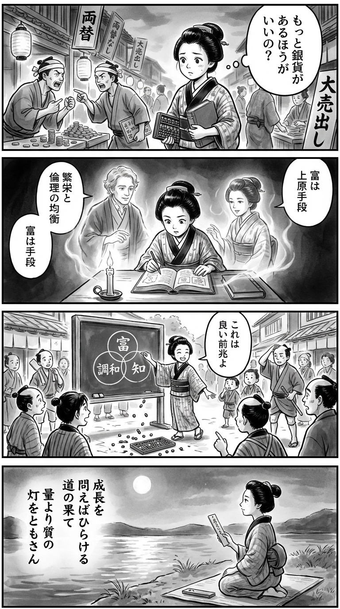

---
---
> **Language**: [日本語](../ja/ダニエル・サスキンド-上原裕美子-GROWTH――「脱」でも「親」でもない新成長論_review.html) | [English](../en/ダニエル・サスキンド-上原裕美子-GROWTH――「脱」でも「親」でもない新成長論_review.html) | [繁體中文](../zh-tw/ダニエル・サスキンド-上原裕美子-GROWTH――「脱」でも「親」でもない新成長論_review.html)
>
> [← Top / トップページ](../../)

## 📖 書籍資訊
- **書名**: GROWTH――「脱」でも「親」でもない新成長論  
- **作者**: ダニエル・サスキンド and 上原裕美子  
- **ASIN**: B0FMR5G68P  
- **URL**: [https://www.amazon.co.jp/dp/B0FMR5G68P](https://www.amazon.co.jp/dp/B0FMR5G68P)  

---

<picture>
  <source srcset="../../images/reviews/ダニエル・サスキンド-上原裕美子-GROWTH――「脱」でも「親」でもない新成長論_4panel.webp" type="image/webp">
  
</picture>
## 對白

### Panel 1
**Scene**: 江戶黃昏時分，町娘身著和服走在熱鬧的街道上，手中抱著算盤與荷蘭書。她聽見商人們為利潤爭論，心中默想：「銀子多就一定更好嗎？」好奇的眼神中閃過一絲不安。背景是掛著木牌與燈籠的市集街景。  
**Dialogue**: 「銀子多就一定更好嗎？」

### Panel 2
**Scene**: 在燭光搖曳的書齋裡，町娘專注閱讀外國書籍。書頁間浮現出兩位幻影導師——一位是溫和的西方學者，短卷髮、神情沉思；另一位是氣質端雅的日本女子，髮束整齊、目光柔和。兩人似乎在討論「繁榮與道德的平衡」，幽光映照著她的臉龐。  
**Dialogue**: （無明確台詞，氛圍為沉思與交流）

### Panel 3
**Scene**: 在熱鬧的町中廣場，町娘用粉筆在黑板上向鄰人解說「成長不必無止境」。她畫出標有「財富」、「和諧」、「知識」的圓圈。孩子與工匠們圍觀，既困惑又受到啟發。幽默一幕：算盤珠子散落一地，如種子般滾動。她微笑說這是好兆頭。  
**Dialogue**: 「看吧，這樣散開，也許是好預兆呢。」

### Panel 4
**Scene**: 月光靜照的河畔，町娘靜靜在細長的短冊上寫下和歌，神情安然而深思。詩句表達了對無盡成長的疑問，以及對「進步與意義之間和諧」的追尋。  
**Dialogue**: （無台詞，僅有書寫動作）  
**Tanka (translation)**:  
當我問成長之意，  
眼前的路便展開；  
在盡頭，  
我願點亮一盞燈——  
讓質勝於量的光長明。  
**Tanka (original)**:  
「  
成長を  
　問えばひらける  
　道の果て  
量より質の  
　灯をともさん  
」

## 🎯 本書的核心
《GROWTH》是一部從根本上質疑現代社會將「經濟成長」視為理所當然前提的著作。作者ダニエル・サスキンド以人類三十萬年歷史中大部分時間處於停滯期的宏觀視角指出，現代的持續成長其實是「例外現象」。  

本書的核心在於揭示成長所帶來的「繁榮」與「破壞」兩面性。面對技術進步與全球化帶來的富裕，同時也擴大了不平等與環境破壞，作者主張必須進行「成長的倫理性再設計」。  

本書批判以GDP為唯一衡量標準的經濟觀，並探索與人類目的相契合的「新型成長模式」，這不僅是一場經濟學的挑戰，更是一場哲學與倫理的探索。  

---

## 💡 關鍵洞見
- **經濟成長是人類歷史上的例外現象**  
  顛覆現代將成長視為「自然狀態」的常識，指出長期停滯才是人類歷史的常態。這一觀點瓦解了「無限成長」的幻想，促使人們重新思考永續性。  

- **「創意」才是成長的真正引擎**  
  不同於資本與勞動，創意具有非競爭性與累積性。知識的共享與擴散能突破報酬遞減的限制，實現持續的繁榮。  

- **GDP是道德上有缺陷的指標**  
  GDP僅衡量市場交易價值，卻無法反映社會價值與幸福。作者提出「GDP角色最小主義」，警告若將經濟政策與倫理判斷切割，將造成危險。  

- **技術進步同時帶來繁榮與分裂**  
  AI與自動化雖能提升生產力，卻可能削弱勞動的意義與社會連結。必須建立制度設計，確保成長成果能公平分配。  

- **成長曾是政治的逃避裝置**  
  成長至上主義長期作為逃避社會根本目的之哲學討論的手段。作者呼籲恢復「目的與手段的一致性」。  

---

## 🔍 與現代脈絡的關聯
本書提出的「既非脫成長、亦非親成長」的新成長論，位於2020年代興起的脫成長論與綠色成長論之間。面對氣候變遷、AI與自動化等動搖經濟結構的因素，社會需要超越「成長贊成或反對」的二元辯論。  

本書的觀點也與OECD與IMF推動的「包容性成長（inclusive growth）」潮流呼應，強調不僅追求經濟效率，更重視社會公正與倫理一致性。サスキンド的論述可視為重構AI時代經濟倫理的一項嘗試。  

---

## 🚀 實踐建議
- **嘗試擺脫對GDP的依賴**  
  在政策制定與企業經營中，採用除GDP外的多元指標，如幸福度、環境負荷、社會包容等，將經濟目標從「量」轉向「質」。  

- **建立技術的倫理治理**  
  從AI與自動化技術的設計階段即納入倫理考量，要求開發者承擔社會責任，引導技術力量朝「共享繁榮」的方向發展。  

- **重新投資於「有用的知識」**  
  加強對教育、科學與公共研究的投資，支持能創造社會價值的知識生產。善用知識的累積性，奠定永續成長的基礎。  

- **重建地方社會與勞動的意義**  
  推動重視社區凝聚力與勞動意義的政策，讓人們不僅「有用」，更能「連結」。這是重拾人性化經濟的關鍵。  

---

## ⭐ 綜合評價
《GROWTH》是一部罕見的著作，將經濟成長的討論從經濟學框架中解放出來，深入探討人類目的與倫理。作者既不將成長視為「善」，也不視為「惡」，而是從中庸的立場重新定義經濟的意義。  

對關心經濟學、哲學與科技倫理交會點的讀者而言，本書是一場開拓思維的智識挑戰。它追問我們究竟「為何」以及「為了什麼」而追求成長，堪稱後成長時代的思想羅盤。

---

&copy; shioki | [CC BY-NC-SA 4.0](https://creativecommons.org/licenses/by-nc-sa/4.0/)
