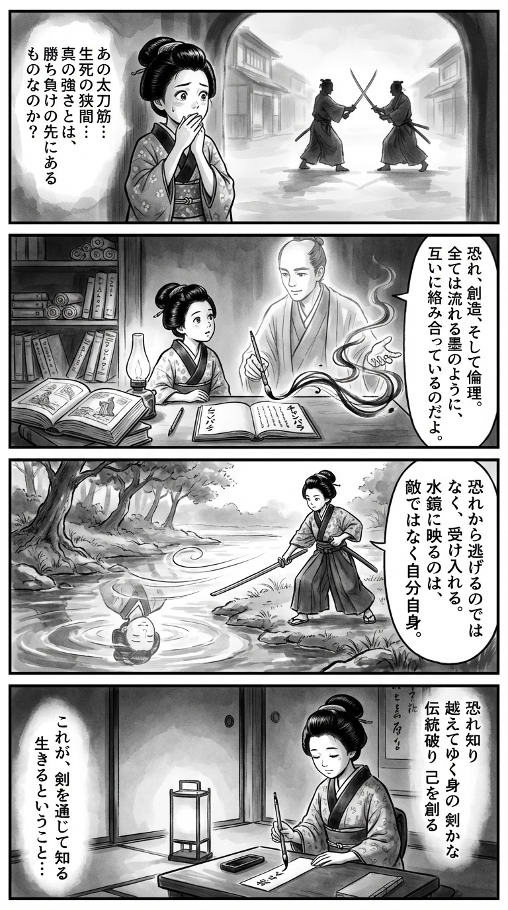

> **Language**: [日本語](../ja/チャンバラ_review.html) | [English](../en/チャンバラ_review.html) | [繁體中文](../zh-tw/チャンバラ_review.html)
>
> [← Top / トップページ](../../)

## 📖 書籍資訊
- **標題**: チャンバラ  
- **作者**: 佐藤賢一  
- **ASIN**: B0C9LM6KQ2  
- **URL**: [https://www.amazon.co.jp/dp/B0C9LM6KQ2](https://www.amazon.co.jp/dp/B0C9LM6KQ2)  

---

<picture>
  <source srcset="../../images/reviews/チャンバラ_4panel.webp" type="image/webp">
  
</picture>

## 對白

### Panel 1
**Scene**: 在黎明的江戶街道上，町娘走著，遠處看到兩名武士交劍。她停下腳步，心中感到不安卻又被他們激烈的動作所吸引。空氣中彌漫著“生與死”的沉重感。她自言自語，思考著“真正的力量”除了勝負之外還意味著什麼。

**Dialogue**: “真正的力量是什麼呢？”

### Panel 2
**Scene**: 在一間昏暗的書房裡，牆上掛滿了卷軸和荷蘭書籍，她正在閱讀一本新到的手稿，標題為「チャンバラ」。一位像作家佐藤健一的智者出現在她身邊，宛如書中的靈魂——他是一位冷靜而深思的男子，穿著簡單的袍子，眼神中透露著智慧和哲學的力量。他用毛筆比劃，表達著恐懼、創造和倫理交織在一起，如同流動的墨水。

**Dialogue**: “恐懼與創造，都是生命的一部分。”

### Panel 3
**Scene**: 在河邊，町娘用一根木棍練習劍法，模仿她所閱讀的內容。她的姿勢搖晃，然後在深呼吸中穩定下來——接受她的恐懼，而不是否認它。在水面倒影中，她看到的不是對手，而是自己，微笑著領悟，隨著風的輕拂，水面泛起漣漪。

**Dialogue**: “我不是對手，而是我自己。”

### Panel 4
**Scene**: 那天晚上，在紙燈籠的光下，她跪下來，在狹窄的短冊上寫下一首和歌，毛筆輕輕顫抖。墨水閃閃發光，她低聲吟誦著詩句——

**Tanka (translation)**: “知曉恐懼，超越自我的劍，打破傳統，創造自我。”

**Tanka (original)**:  
「恐れ知り  
　越えてゆく身の  
　剣（つるぎ）かな  
　伝統破り  
　己を創（つく）る」

## 🎯 這本書的核心
《チャンバラ》是一部透過傳奇劍士宮本武藏探討「生存是什麼」和「強大是什麼」的精神史詩。追求劍道極致的武藏，超越單純的勝負，追求「生命的真實感」，不斷面對恐懼、孤獨和倫理的對峙。

故事不僅描繪劍術的技巧，還透過精神與肉體、傳統與創造、權力與倫理等對立軸，深入挖掘武士存在的根源。武藏所達到的不是斬敵，而是超越自我的覺悟，這是一個透過劍道追求人的圓滿的哲學探索故事。

---

## 💡 關鍵見解
- **接受恐懼才能產生真正的強大**  
　武藏不否定真刀真槍的恐懼，反而將其視為生命的證明來接受。不是克服恐懼，而是與恐懼共存的姿態，使他成長為「活著的人」。

- **從破壞傳統中誕生創造**  
　武藏超越父親的流派創立「圓明流」，展現了僅僅守護是無法進化的真理。在理解傳統的基礎上進行破壞，建立新的體系才是創造的本質。

- **「氣」是連結精神與現實的力量**  
　劍的極意不在於肉體的技巧，而在於對「氣」這種無形力量的掌控。精神的集中能改變現實的描寫，體現了心身一如的哲學。

- **服從權力的劍會墮落**  
　武藏對藩的命令斬殺他人產生疑問，重新審視武士的倫理。若劍失去正義，則淪為單純的暴力，這是一個警鐘。

- **敗北中蘊含覺悟**  
　武藏只能通過敗北和迷惘來認識自己。不懼怕挫折，從中汲取學習的姿態，被描繪為真正成長的條件。

---

## 🔍 與現代文脈的關聯
在現代社會中，「接受恐懼的勇氣」和「超越傳統的創造力」依然是普遍的課題。在商業、藝術和體育界，打破既有框架創造新價值，正需要像武藏那樣的自我超越精神。

此外，在當今僅僅服從權力和組織的生活方式受到倫理質疑的時代，武藏「自己的劍要指向何方」的問題，對於考量個人信念與社會責任的平衡具有啟發意義。《チャンバラ》透過劍道照亮了現代人的生活方式。

---

## 🚀 實踐建議
1. **接受恐懼並付諸行動**  
　不否定不安和恐懼，而是將其轉化為行動的能量。像武藏一樣「在恐懼中行動」，才能產生真正的強大。

2. **學習傳統，並擁有超越的勇氣**  
　在深入理解既有知識和習俗的基礎上，打破它們並創造新的形式。創造力始於破壞的勇氣。

3. **鍛鍊專注力，讓心身一致**  
　在日常生活中意識到呼吸和姿勢，進行保持精神寧靜的訓練。心靈的集中能改變現實行動。

4. **將敗北視為學習的機會**  
　不以失敗為恥，從中獲取洞察。像武藏一樣「認識自己的弱點」，才能孕育出下一步的強大。

5. **重新審視自己的倫理**  
　確認每一個行動的目的和正義。不要隨波逐流於權力或他人的期待，堅持根據自己的信念揮舞劍的姿態。

---

## ⭐ 總體評價
《チャンバラ》超越了單純的時代小說框架，透過劍道探討人性的思想故事。戰鬥的描寫充滿力量，而其背後卻隱含著哲學的寧靜。

讀者在追尋武藏的成長過程中，將反思自己的恐懼、倫理和創造的姿態。這是劍的故事，但更是「生存的故事」。讀後將伴隨著靜謐的決心，重新審視自己的「劍」。

---

&copy; shioki | [CC BY-NC-SA 4.0](https://creativecommons.org/licenses/by-nc-sa/4.0/)
