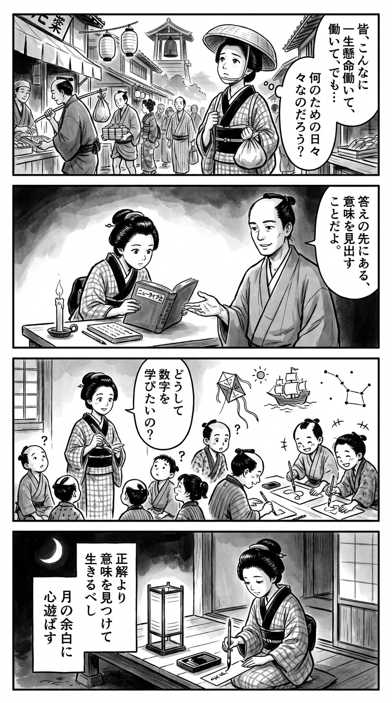

> **Language**: [日本語](../ja/ニュータイプの時代_review.html) | [English](../en/ニュータイプの時代_review.html) | [繁體中文](../zh-tw/ニュータイプの時代_review.html)
>
> [← Top / トップページ](../../)

# 書籍評論（繁體中文）

## 📖 書籍資訊
- **標題**: ニュータイプの時代  
- **作者**: 山口 周  
- **ASIN**: B07SSY4LJ9  
- **URL**: [https://www.amazon.co.jp/dp/B07SSY4LJ9](https://www.amazon.co.jp/dp/B07SSY4LJ9)  

---

<picture>
  <source srcset="../../images/reviews/ニュータイプの時代_4panel.webp" type="image/webp">
  
</picture>
## 對白

### Panel 1
**Scene**: 江戶的町娘站在熱鬧的市場旁，觀察商人們機械地重複著工作。她微微歪著頭，感覺到缺少了什麼——「大家都這麼努力工作，但……這一切到底是為了什麼？」背景展示了江戶的街道生活，燈籠和遠處的寺廟鐘聲。
**Dialogue**: 「大家都這麼努力工作，但……這一切到底是為了什麼？」

### Panel 2
**Scene**: 在她的小書房裡，燭光照亮著，町娘興奮地閱讀一本名為《ニュータイプ之書》的外國風格裝訂書籍。旁邊出現了一位冷靜而深思的學者，像是作者山口周的形象——一位想像中的江戶時代導師，面容沉穩，短髮整齊地束起，穿著樸素的羽織，散發著安靜的知識氣息。他向書本比劃，解釋「在答案之外尋找意義」。
**Dialogue**: 「在答案之外尋找意義。」

### Panel 3
**Scene**: 町娘現在在寺子屋教孩子們，但她並不是讓他們做算術練習，而是問他們「你們為什麼想學習數字？」孩子們看起來困惑，然後微笑著開始想像並畫出他們的夢想。墨筆的運動線捕捉到突如其來的溫暖和自發性——房間裡充滿了創造性的「遊戲」氣息。
**Dialogue**: 「你們為什麼想學習數字？」

### Panel 4
**Scene**: 傍晚。町娘坐在紙燈籠旁，凝視著映在墨石上的月亮。她在小短冊上寫著和歌，神情平靜而堅定。  
**Tanka (translation)**: 應該活出意義，而非僅僅追求正確答案。心靈在月亮的空白中遊蕩。  
**Tanka (original)**: 正解より　意味を見つけて　生きるべし  
月の余白に　心遊ばす

## 🎯 這本書的核心
《ニュータイプの時代》是一部描繪從「解決問題的能力」為價值的時代，轉變為「發現問題、創造意義的能力」被需求的時代的思想性商業書。作者山口周指出，在人工智慧和全球化使「給出正確答案的能力」商品化的背景下，人類的價值在於「構想力」和「意義賦予」。

本書的中心在於「有用」到「有意義」的價值轉移。筆者指出，在物質匱乏被解決的社會中，驅動人們的不是效率或合理性，而是「為什麼要這樣做」的故事。領導力和組織運營的方式也應該從「達成KPI」重新定義為「共享意義」。

此外，擁有在邏輯與直覺、秩序與遊戲之間靈活思考的能力，成為了新型態的條件。山口呼籲人類需要進化為超越系統、創造新意義的主體，而不是屈從於系統。

---

## 💡 關鍵洞察
- **「問題的稀缺化」是時代的本質**  
　當代社會中「需要解決的問題」正在枯竭。這並不是問題解決能力的極限，而是「想要怎樣的世界」的願景缺失。因此，領導者和個人需要具備發現問題和構想新價值的能力。

- **「給出正確答案的能力」正在失去價值**  
　在人工智慧能夠瞬間導出準確答案的時代，人類競爭的不是「正確答案」。相反，「提出問題的能力」和「發現意義的感性」成為了人工智慧無法取代的人類獨特領域。

- **「意義」是最大的動機裝置**  
　外部獎勵或命令的動機已經達到極限。人們自發行動的時候，是當他們理解「自己的工作有什麼意義」的時候。領導者應該通過這種「意義賦予」來引導人。

- **「遊戲」和「空白」能夠產生創造力**  
　越是追求效率，偶然的發現和創造性思維就越會消失。像3M和Google這樣制度化「遊戲時間」，能夠支持長期的創新。容忍短期的非效率文化，將會產生未來的競爭力。

- **「逃跑的勇氣」支撐著靈活性**  
　在變化劇烈的時代，重要的是不執著於環境，當感覺「這裡不對」時，做出離開的判斷。逃避並不是懦弱，而是為了保護自己的價值觀而進行的戰略行動。

---

## 🔍 與現代背景的關聯
本書的主張在人工智慧的興起和VUCA（不確定性、不穩定性、複雜性、模糊性）社會結構中迅速變得現實。山口所指出的「問題的稀缺化」和「正確答案的商品化」，正是數位化和自動化進展中的現代勞動市場的象徵。

此外，強調人文藝術和美學的重要性，正受到經營和教育領域的重新關注。在邏輯和效率無法創造新價值的認識逐漸擴散的背景下，本書提出了以「意義的創造」為軸心的新型人才形象。

再者，在現代專案型工作方式和個人職業自主性日益增強的情況下，擁有「內在動機」和「逃跑的勇氣」將成為生存策略。本書提供了這一思想基礎的一本書。

---

## 🚀 實踐建議
1. **養成重新思考「為什麼？」的習慣**  
　在日常業務中，不是問「做什麼」，而是問「為什麼要這樣做」，這樣可以磨練課題設定能力。這是新型態思考的起點。

2. **為團隊設置共享「意義」的時間**  
　除了KPI和數值目標，還應該討論「這份工作對社會有什麼意義」，以提高成員的內在動機。

3. **有意識地創造「遊戲的空白」**  
　不應該一味追求效率，而是要確保自由探索和偶然相遇的時間。創造性的想法往往是在非效率中誕生的。

4. **不害怕「逃跑」的選擇**  
　不應該依附於不健康的組織或價值觀，而是要有勇氣改變環境，這是保持職業靈活性和創造力的關鍵。

5. **接觸人文藝術，對常識進行相對化**  
　通過學習哲學、歷史、藝術等，擴展思維的框架。「懷疑理所當然」的視角將成為發現新問題的源泉。

---

## ⭐ 總體評價
《ニュータイプの時代》是一本促使所有在AI時代生存的商業人士從「給出正確答案的人」進化為「創造意義的人」的思想書。這不僅僅是技能論，而是對人類存在意義本身的重新思考，具有哲學的深度。

特別是對於領導者和教育者來說，這將成為重新定義「驅動人力」的契機。讀後會留下「我想以什麼為有意義的方式生活？」這一根本性問題。作為一個尋求意義而非效率的時代的羅盤，本書具有長久閱讀的價值。

---

&copy; shioki | [CC BY-NC-SA 4.0](https://creativecommons.org/licenses/by-nc-sa/4.0/)
