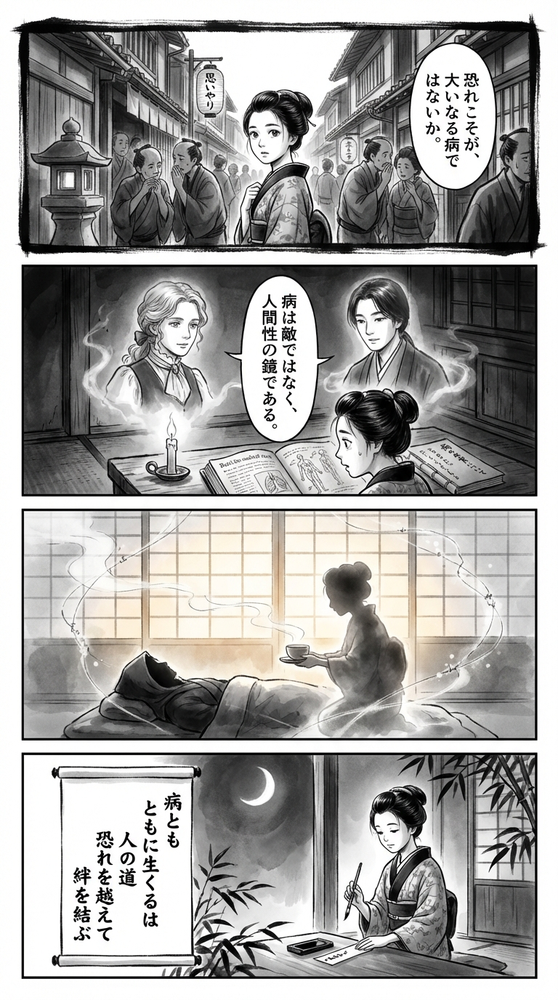

---
---
> **Language**: [日本語](../ja/パンデミックから何を学ぶか――子育て・仕事・コミュニティをめぐる医療人文学_review.html) | [English](../en/パンデミックから何を学ぶか――子育て・仕事・コミュニティをめぐる医療人文学_review.html) | [繁體中文](../zh-tw/パンデミックから何を学ぶか――子育て・仕事・コミュニティをめぐる医療人文学_review.html)
>
> [← Top / トップページ](../../)

## 📖 書籍資訊
- **書名**: パンデミックから何を学ぶか――子育て・仕事・コミュニティをめぐる医療人文学  
- **作者**: カリ・ニクソン and 桐谷知未  
- **ASIN**: B0BGLVM197  
- **URL**: [https://www.amazon.co.jp/dp/B0BGLVM197](https://www.amazon.co.jp/dp/B0BGLVM197)  

---

## 對白

### Panel 1
**Scene**: 江戶街巷中，町娘身著和服緩步前行。人們低聲議論著鄰鎮蔓延的神秘疫病，神情不安。她停下腳步，凝視那些焦慮的面孔，心中思忖：或許真正的病，是人心中的恐懼。背景是木造房屋與狹窄巷弄，一盞燈籠上隱約可見「思いやり（關懷）」的字樣。  
**Dialogue**: （心想）「恐懼，會不會才是更深的病呢……」

### Panel 2
**Scene**: 夜裡，她在燭光搖曳的小書齋中翻開荷蘭醫書與手抄譯本〈病之本性〉。書頁間浮現兩位幻影般的師者——一位是神情溫柔的西方女子（似 Kari Nixon），另一位是沉靜的日本學者（似桐谷知實）。兩人跨越時空對話，氣氛莊嚴而寧靜。町娘專注聆聽，眼神閃爍著領悟的光。  
**Dialogue**: 「疾病並非敵人，而是映照人性的鏡子。」  
（町娘心想）「原來如此……」

### Panel 3
**Scene**: 翌晨，她探訪生病的鄰居。沒有退避，反而端來熱茶，靜靜傾聽。畫面中，她的身影映在柔光透過紙門的光影裡，象徵著以共感跨越恐懼。淡淡的墨跡勾勒出人與人之間無形的連結——那是社群與共生的象徵。  
**Dialogue**: 「請慢慢喝，別勉強自己。」

### Panel 4
**Scene**: 夜幕下，月光灑入窗邊。她提筆在短冊上寫下和歌，神情平靜而明亮，彷彿已洞悉生命的柔軟與堅韌。  
**Dialogue**: （輕聲）「願這份心意，能傳達出去……」  
**Tanka (translation)**:  
與病同行，乃為人之道。  
越過恐懼，方能繫起羈絆。  
**Tanka (original)**:  
病とも  
ともに生くるは  
人の道  
恐れを越えて  
絆を結ぶ

## 🎯 本書的核心
本書並非將疫情僅視為傳染病的流行，而是透過醫療人文學的視角，將其作為一面映照人類社會結構、倫理與生死觀的「鏡子」。作者カリ・ニクソン與桐谷知未重新定義「疾病」──不是敵人，而是「與我們共存的存在」，並從人類與疾病共進化的觀點出發，提出一種新的共存之道。  

疫情揭示了人類對科學的過度信任、社會的分裂，以及逃避死亡文化的脆弱。本書在倫理、文化與科學的交會點上重新思考這些課題，並提出超越恐懼與孤立，重建「社群、創造力與溝通」的可能。  

---

## 💡 關鍵洞見
- **疾病是人類的一部分**  
  作者指出「人類在某種意義上也是病毒的一部分」，重新以共生的視角審視人類與病原體的關係。接受疾病與我們共存的現實，而非試圖徹底排除，是人類成熟的重要一步。  

- **風險無法被完全消除**  
  本書批判追求「完全安全」的社會幻想，強調「如何接受風險」是一種倫理選擇。疫情之後的社會設計，應建立在以風險為前提的彈性共存思想之上。  

- **科學是社會建構的產物**  
  科學知識並非中立，而是在文化與政治脈絡中形成。唯有將科學理解為「人類的實踐活動」，我們才能看見更健康、更民主的知識形態。  

- **接受死亡，才能重新擁抱生命**  
  作者指出，恐懼與逃避死亡的文化正在削弱人性。唯有將死亡視為生命的一部分，勇於談論死亡，才能重新找回豐富而完整的生命經驗。  

- **溝通是生存的關鍵**  
  超越分裂的對話，是克服社會危機的力量。透過與不同立場的人交流，能激發創造性的想法與共感。  

---

## 🔍 與當代脈絡的關聯
在疫情之後的日本社會，遠距工作與在家教育的普及，使家庭與工作的界線、個人與社會的界線變得模糊。特別是育兒世代，孤立與心理健康惡化的問題日益嚴重，形成所謂的「照護危機」。  

本書提出的「社群・創造力・溝通」三大理念，正是對應這些現代課題的實踐指引。重建線上與線下的混合連結、重新評價照護勞動，以及恢復能夠談論「包含死亡的生命整體性」的文化——這些都是對疫情所提出問題的回應。  

---

## 🚀 實踐建議
- **跨越分裂，主動對話**  
  有意識地與政治、社會立場不同的人交流。以理解為前提，而非敵意，開啟對話，這是修復社會裂痕的第一步。  

- **不要追求零風險**  
  在防疫與社會政策中，不應追求「完全安全」，而應以「降低風險」為現實目標。如此可避免過度恐懼與排斥。  

- **將科學視為人類的實踐活動**  
  不將科學知識絕對化，而是理解其社會與倫理背景。如此才能建立科學與公民之間健康的關係。  

- **重拾面對死亡的文化**  
  不再將死亡視為禁忌，創造能共同分享失落與悲傷的空間。談論死亡，正是重新發現生命意義的契機。  

- **重建社群**  
  善用地方與線上連結，選擇團結而非孤立。建立合作與共感的場域，是面對下一次危機的最大準備。  

---

## ⭐ 綜合評價
《パンデミックから何を学ぶか》是一部深刻探問「人類存在意義」的省思之書。它從醫療人文學的視角出發，跨越科學、倫理與文化的界線，向讀者拋出「何謂真正的生活」這一根本問題。  

對於在疫情後感到疲憊的人，或關心照護與社群重建的人而言，本書不僅是學術著作，更是一部帶來希望的作品。作為超越恐懼、重拾人性的重要指南，這是當下最值得閱讀的一本書。

---

&copy; shioki | [CC BY-NC-SA 4.0](https://creativecommons.org/licenses/by-nc-sa/4.0/)
