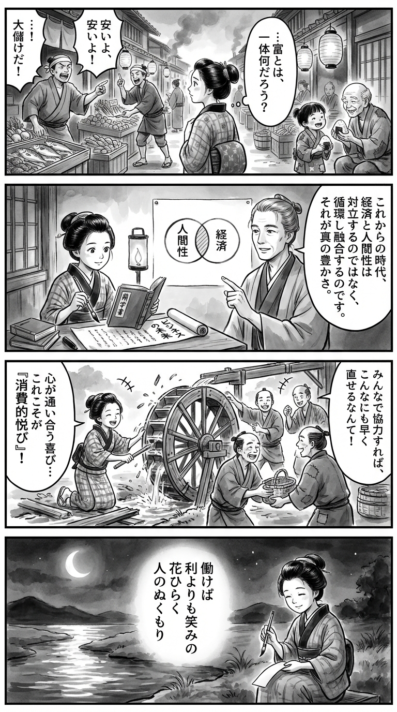

> **Language**: [日本語](../ja/ビジネスの未来――エコノミーにヒューマニティを取り戻す_review.html) | [English](../en/ビジネスの未来――エコノミーにヒューマニティを取り戻す_review.html) | [繁體中文](../zh-tw/ビジネスの未来――エコノミーにヒューマニティを取り戻す_review.html)
>
> [← Top / トップページ](../../)

# 書籍評論（繁體中文）

## 📖 書籍資訊
- **標題**: ビジネスの未来――エコノミーにヒューマニティを取り戻す  
- **作者**: 山口 周  
- **ASIN**: B08PZ9HRJM  
- **URL**: [https://www.amazon.co.jp/dp/B08PZ9HRJM](https://www.amazon.co.jp/dp/B08PZ9HRJM)  

---

<picture>
  <source srcset="../../images/reviews/ビジネスの未来――エコノミーにヒューマニティを取り戻す_4panel.webp" type="image/webp">
  
</picture>

## 對白

### Panel 1
**Scene**: 町娘在黃昏的江戶市場中漫步，觀察著商人們大聲叫賣著利潤和優惠。她停下腳步，凝視著一個孩子與一位老者分享著飯糰，臉上流露出沉思的神情。背景中有木製攤位、燈籠和忙碌的市民，整體氛圍靜謐而內省，彷彿她感受到一個關於「財富」真正意義的問題正在形成。

### Panel 2
**Scene**: 在小書房裡，燈光下的町娘正在閱讀一本荷蘭文的書籍和一卷名為「ビジネスの未来」的神秘新卷軸。她的身邊出現了一位冷靜的學者形象——她的導師，模仿自作家山口周：想像中是一位思慮周到的中年男子，眼神溫和，整齊的頭髮束起，穿著簡單的長袍，散發著平靜而智慧的氣息。他指向一個標有「人間性 (humanity)」和「經濟 (economy)」的圓形圖表，整體構圖感覺哲學而溫暖。

### Panel 3
**Scene**: 町娘運用所學，幫助鄰居修理一個壞掉的水車，笑著一起工作。這個場景充滿動感，筆觸強調了運動和快樂。人們不是在交換金錢，而是交換微笑和手工製作的物品。社區的感覺和「圓滿的喜悅」充滿了整個畫面。

### Panel 4
**Scene**: 夜幕降臨，町娘坐在河邊，月光下用毛筆寫著短歌。紙張在墨水的洗染下柔和地發光。詩句寫在一個垂直的短冊上：

「  
働けば  
利よりも笑みの  
花ひらく  
人のぬくもり  
富にまさりて  
」

她平靜地微笑著，河水映照著月亮——象徵著經濟與人性之間的和諧。

## 🎯 本書的核心
本書是一部思想書，展望了以經濟成長為至上命題的現代社會的終結，提倡從「經濟合理性」轉向「人性」。作者山口周將當前成長放緩的現代視為「成熟的高原」，並闡述了超越物質豐富飽和後新價值觀的必要性。

其核心在於回歸「活動本身就是喜悅」的消費主義生活方式。這是一個試圖將經濟與人類幸福的手段，而非人生的滿足本身重新連結的社會再設計的嘗試。

此外，作者主張個人作為「資本主義的駭客」，可以透過日常消費和行動從內部改變社會。這裡提出了一個思想羅盤，讓我們不必懼怕成長的終結，而是從中重建人性化的未來。

---

## 💡 關鍵見解
- **經濟成長不再是目的**  
  在追求成長本身無法保證幸福的時代，有必要將經濟的目的重新定義為「人類的滿足」。作者使用「高原社會」的比喻，正面看待成長的停止，視其為成熟的徵兆。

- **未來在「經濟合理性極限曲線」之外**  
  在不產生利潤的領域中，潛藏著社會問題和新價值。像Linux開發這樣基於「贈與」和「支持」的活動，顯示了推動下一代經濟的可能性。

- **「勞動＝喜悅」的重新定義**  
  提議將勞動重構為活動本身的喜悅，而非報酬的手段。借用流暢理論，描繪出能夠實現創造性和充實生活的社會形象。

- **「負責任的消費」塑造未來**  
  透過消費行為，選擇將哪些企業或文化留給下一代。個人的選擇「駭客」市場，決定了社會的方向。

- **社會變革從「我」開始**  
  不必等待大規模的制度改革，個人的內心變化和日常選擇能夠推動社會的變化。作者以「資本主義的駭客」為比喻，提出靜謐而持續的變革形式。

---

## 🔍 與現代背景的關聯
本書的提議與近年來的「以人為本的社會」轉型深刻共鳴。在美國和歐洲，社會保障的重新定義及對文化多樣性的尊重等動向，都是試圖將經濟重構為人性恢復裝置的一部分。

此外，在企業經營和政策領域，「幸福感」和「以人為本的經營」也受到重視，本書的思想為其提供了理論基礎。重視生活質量和共鳴的循環，而非經濟的效率，與作者所謂的「高原社會」的實現相通。

因此，本書為思考後成長時代的社會設計提供了跨越經濟、文化和倫理的重要視角。

---

## 🚀 實踐建議
1. **投入「真正想做的事情」**  
   不要依賴他人或社會的期待，而是遵循內心的衝動行動，這是消費主義生活方式的起點。這樣，勞動將轉變為自我實現和創造的場所。

2. **將金錢花在「想要支持的事物」上**  
   將消費視為「贈與」，將資源投入到共鳴的事業或人身上。這將作為「負責任的消費」，擁有改變社會的力量，使其更加人性化。

3. **作為「資本主義的駭客」改變日常**  
   不必追求大革命，而是透過小的選擇的積累來改變社會。在購買、工作方式、教育等身邊的領域進行「駭客」行為，塑造未來。

4. **選擇「小而美」的事物**  
   不要優先考慮效率或規模，而是重視可持續和可見的關係。這樣，經濟將重新獲得人性化的溫度。

5. **教育和勞動的「消費主義化」**  
   將學習和工作重新設計為喜悅本身，而非成果的手段。這將成為提升整個社會創造力和幸福感的關鍵。

---

## ⭐ 總體評價
《ビジネスの未来》是一部將經濟成長的終結描繪為希望而非悲觀的罕見著作。作者重新定義經濟為「人類的機制」，並提出以人性為中心的社會設計。

本書不僅對經營者和政策制定者有啟發，也對希望重新審視自己工作和生活方式的所有人提供了指引。讀後，「豐富是什麼」「工作是什麼」這些根本問題將靜靜地留在心中。作為成熟社會生活的哲學實踐書籍，本書具有長久閱讀的價值。

---

&copy; shioki | [CC BY-NC-SA 4.0](https://creativecommons.org/licenses/by-nc-sa/4.0/)
