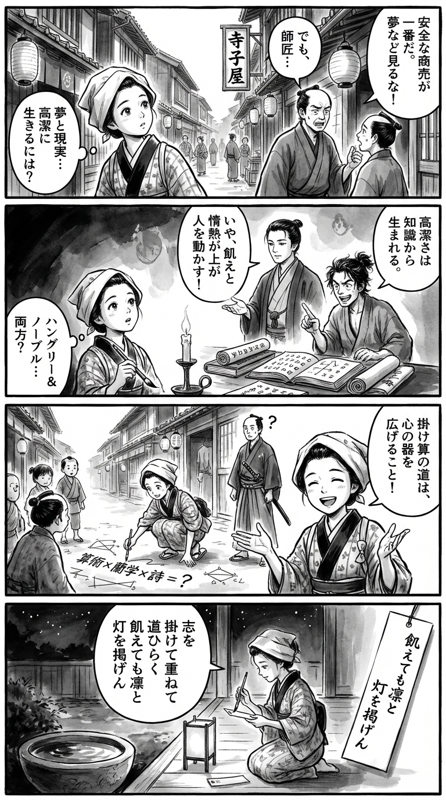

> **Language**: [日本語](../ja/ポスト平成のキャリア戦略_review.html) | [English](../en/ポスト平成のキャリア戦略_review.html) | [繁體中文](../zh-tw/ポスト平成のキャリア戦略_review.html)
>
> [← Top / トップページ](../../)

# 書籍評論（繁體中文）

## 📖 書籍資訊
- **標題**: ポスト平成のキャリア戦略  
- **作者**: 塩野誠 and 佐々木紀彦  
- **ASIN**: B078GCRDLB  
- **URL**: [https://www.amazon.co.jp/dp/B078GCRDLB](https://www.amazon.co.jp/dp/B078GCRDLB)  

---

<picture>
  <source srcset="../../images/reviews/ポスト平成のキャリア戦略_4panel.webp" type="image/webp">
  
</picture>

## 對白

### Panel 1
**Scene**: 在繁忙的江戶街道上，町娘停下腳步，觀察一位商人與他的學徒爭論「安全的工作與冒險的夢想」。她歪著頭，感受到一個更深層的問題——是否可以同時過著高尚而雄心勃勃的生活？背景顯示著一條狹窄的街道，懸掛著紙燈籠和寫著「寺子屋」的招牌。

### Panel 2
**Scene**: 在寺子屋內，燭光下，町娘正在研究標有荷蘭字母和算術圖表的厚卷軸。她的書本中出現了兩個想像中的人物——一位像是冷靜、目光銳利的學者塩野真，頭髮束起，姿態端莊；另一位則像是年輕活潑的思考者佐佐木紀彦，稍微凌亂的頭髮和敏銳的表情。他們熱烈地辯論，手勢呼應著「飢餓與高尚」的理念。女孩驚訝地傾聽，手中的毛筆準備就緒。

### Panel 3
**Scene**: 在黎明時分，她用新獲得的見解進行實驗——在街道上畫出粉筆圖表，教導孩子們如何將不同的技能（算術×蘭學×詩）結合起來，創造出獨特的東西。一位路過的武士困惑地看著，她愉快地解釋：「掛け算の道は、心の器を広げること！」構圖動態，隨著她的手勢，衣袖飄動。

### Panel 4
**Scene**: 黃昏的寧靜。町娘跪在紙燈旁，手握毛筆，凝視著水盆中倒映的星星。在懸掛的短冊上，她寫下了一首捕捉「飢餓與高尚」本質及挑戰勇氣的和歌：

**Tanka (translation)**: 以志向交織開拓道路，雖然飢餓卻依然高昂地舉起燈火。
**Tanka (original)**: 志を　掛けて重ねて　道ひらく  
飢えても凛と　灯を掲げん

## 🎯 本書的核心
本書是一本對談書，背景是平成以後的日本社會所漂浮的閉塞感，提出了一種新的職業倫理「哈根里＆高貴」。作者塩野誠和佐々木紀彦主張，野心與高潔的兼顧，正是生存於後平成時代的根本指針。

依賴單一技能或穩定志向的時代已經結束，強調將多種專業結合的「職業乘法」能夠創造稀有價值。此外，隨著AI和全球化的進展，領導者需要的不再是技術能力，而是教養和倫理觀，促進打破日本社會僵化結構的智慧勇氣。

---

## 💡 關鍵洞見
- **「哈根里＆高貴」的倫理軸心**  
  追求成功的貪婪與遵守倫理的高潔並存，是持續職業發展的關鍵。偏向其中一方可能會導致短期成功或自我滿足的危險。

- **職業乘法創造稀有價值**  
  通過結合多種專業，能建立不易被AI取代的獨特性。多軸技能設計是應對變化劇烈時代的生存策略。

- **專業意識超越動機**  
  以「不丟臉的工作」為基準的工匠倫理，支撐著長期的信任。成果主義的本質在於內在的驕傲，而非外在的獎勵。

- **擺脫「挑戰處女座」**  
  恐懼挑戰的文化使日本社會停滯不前。勇於冒險的經驗能培養創造力和領導力。

- **教養與使命造就領導者**  
  決定領導者素質的不是技術，而是世界觀和倫理觀。以教養為基礎的使命，才是引導組織和社會的動力。

---

## 🔍 與現代背景的關聯
進入令和時期，企業和政府開始提倡「人力資本經營」，將個人的技能和職業發展戰略性地定位。政府對人力資本的披露義務化以及企業對技能再教育的投資擴大，與本書所提倡的「職業乘法」思想相吻合。

此外，無論是公務員還是民間企業，都要求建立靈活的職業路徑，年功序列的結構正在被重新檢視。本書對「挑戰處女座」的批評，亦可視為這些制度改革的倫理基礎。

再者，在AI和數位轉型進展的現代，重建不僅僅是技能，而是擁有教養和使命的領導者形象已成當務之急。作者的建議可以被解讀為人力資本時代的「智慧領導力論」。

---

## 🚀 實踐建議
1. **以「乘法」設計職業**  
   有意識地結合不同領域的技能和經驗，建立屬於自己的專業領域。擁有至少三個擅長的領域，能帶來稀有性和安全感。

2. **將「哈根里＆高貴」作為日常判斷軸心**  
   同時意識到追求成果的貪婪與遵守倫理的高潔。優先考慮長期信任而非短期利益的態度至關重要。

3. **將專業意識內化為倫理**  
   不受動機影響，超過報酬的責任必須履行。像工匠一樣，以「不丟臉的工作」為行動基準，積累信任。

4. **積累小挑戰**  
   不懼失敗，在日常工作或項目中進行新的嘗試。挑戰的經驗能鍛煉判斷力和創造力。

5. **深入學習教養，規劃使命的時間**  
   不僅學習技術和資格，還要學習哲學、歷史、文學等教養，以形成更大的使命感。這將成為作為領導者的核心。

---

## ⭐ 總體評價
《ポスト平成のキャリア戦略》不僅僅是一本工作指南，而是一本兼具倫理與智慧的職業哲學書。作者們在AI和全球化進展的時代，根本性地質疑個人應如何生活和工作。

特別是「哈根里＆高貴」的概念，為現代職業論提供了一個新的倫理坐標軸，對年輕商業人士到管理層都提供了廣泛的啟示。對於希望兼顧挑戰與教養的讀者而言，本書將成為思考的羅盤。

---

&copy; shioki | [CC BY-NC-SA 4.0](https://creativecommons.org/licenses/by-nc-sa/4.0/)
