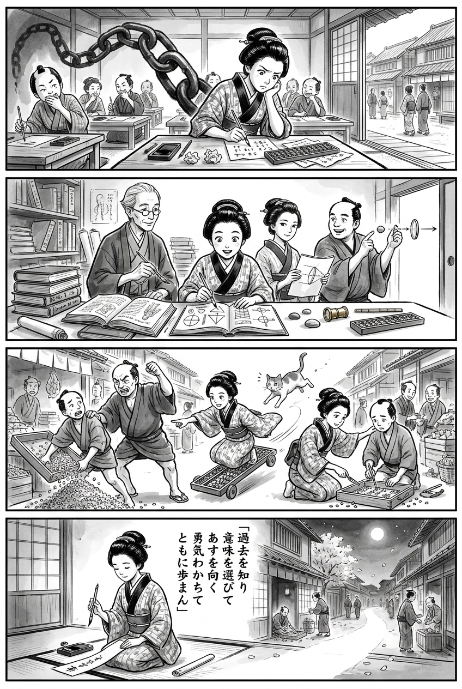

> **Language**: [日本語](../ja/マンガでやさしくわかるアドラー心理学_review.html) | [English](../en/マンガでやさしくわかるアドラー心理学_review.html) | [繁體中文](../zh-tw/マンガでやさしくわかるアドラー心理学_review.html)
>
> [← Top / トップページ](../../)

# 書籍評論（繁體中文）

## 📖 書籍資訊
- **標題**: マンガでやさしくわかるアドラー心理学
- **作者**: 岩井俊憲, 深森あき, and 星井博文
- **ASIN**: B00SSWYQKW
- **URL**: [https://www.amazon.co.jp/dp/B00SSWYQKW](https://www.amazon.co.jp/dp/B00SSWYQKW)

---

<picture>
  <source srcset="../../images/reviews/マンガでやさしくわかるアドラー心理学_4panel.webp" type="image/webp">
  
</picture>
## 🎯 本書的核心
本書的核心在於將人類視為不受過去或環境決定的存在，而是能夠為事件賦予意義並選擇未來行動的主體。與其追尋原因，更重要的是問自己想要創造什麼樣的未來，這是其基礎的目的論。

此外，情感和自卑感不應被視為應該排除的缺點，而是可以重新詮釋為與目的和成長相關的力量。最終目標是脫離對競爭和評價的依賴，通過基於尊重、信任和共鳴的「勇氣鼓勵」，實現自立與對社會的貢獻。

---

## 💡 關鍵洞見
- **過去的影響與現在的選擇可以共存**  
  本書展示了一種姿態，承認成長環境和經驗的影響，但不將人生的決定權讓渡給它們。這是一種不否定過去，而是從現在出發，回復能夠選擇未來的思考方式。

- **事實與詮釋的區分**  
  人們透過「私人的邏輯」看待世界，容易陷入下定論、誇張、忽略和過度一般化的陷阱。本書鼓勵讀者不要將自己的詮釋與客觀事實等同，而是尋找反證和不同的觀點，這是通往自由的入口。

- **情感和自卑感的使用方式可以改變**  
  憤怒、嫉妒和自卑感本身不是壞事，而是朝著某種目的發揮作用的力量。與其壓抑情感，不如問自己「是為了誰，實現什麼而使用這些情感」，這樣可以轉化為建設性的行動。

- **勇氣鼓勵促進自立而非評價**  
  讚美容易受到評價者標準的影響，而勇氣鼓勵則以尊重、信任和共鳴為基礎。它不會使對方依賴，而是引導他們最終能夠自我鼓勵，這是其實踐價值所在。

---

## 🔍 與現代文脈的關聯
在社交媒體和職場中，人們容易受到與他人比較和短期評價的影響，自卑感和孤立感也因此加劇。本書所提出的「將比較的情感作為成長的刺激使用」和「不僅重視能力和地位，更重視貢獻感」的觀點，為減少對外部評價的依賴提供了線索。

此外，將職場和教育現場的質詢型溝通轉變為未來導向的對話和勇氣鼓勵，對現代社會也具有重要意義。然而，必須避免將自我決定性簡化為輕率的自我責任論。在尊重個人選擇的同時，也應考慮組織結構、生活環境和專業支持的必要性，這樣的閱讀方式至關重要。

---

## 🚀 實踐建議
1. **在原因之後詢問目的**  
   當問題發生時，不要僅停留在「為什麼失敗了」的思考上，而是重新詢問「接下來想實現什麼狀態」。具體化未來目標，可以將意識從後悔和責任追究轉移到可行的課題上。

2. **將私人的邏輯寫下來**  
   當感受到強烈的憤怒或焦慮時，記錄下當時浮現的想法。將支持的證據和反證的證據並列，可以將下定論和誇張與事實分開，選擇更建設性的詮釋。

3. **將情感的目的語言化**  
   自問「這種憤怒是想讓對方行動嗎？」「這種自卑感是否在用來逃避課題？」不將情感視為敵人，而是檢視其用途，這樣可以轉化為主張、諮詢或練習等其他行動。

4. **鼓勵過程而非結果**  
   對他人不僅要關注成果，還要具體傳達他們的創意、努力、合作和改進之處。這樣的方式不是通過評價來操控，而是促使對方能夠選擇下一步，從而培養自立和信任。

5. **每天實行一個小貢獻**  
   例如傳達感謝、分享資訊、幫助有需要的人等，養成不論地位或能力的貢獻習慣。如果能感受到與社區的聯繫，則歸屬感和自我鼓勵都會增強。

---

## ⭐ 總體評價
本書是一本入門書，旨在將阿德勒心理學的目的論、認知論、共同體感和勇氣鼓勵與日常人際關係和行為變化相結合。它不僅讓讀者了解理論知識，還提供了檢視自己詮釋、情感使用和對他人接觸的實踐性閱讀體驗。

適合那些希望擺脫對過去的執著、困擾於自卑感和人際衝突的人，以及希望引導下屬或孩子走向自立而非評價的人。同時，讀者需注意不要將自我決定視為萬能，因為變化過程中會有不適和笨拙的時期，並且環境支持也是必要的，這樣才能更健康地運用本書的積極主張。

---

&copy; shioki | [CC BY-NC-SA 4.0](https://creativecommons.org/licenses/by-nc-sa/4.0/)
