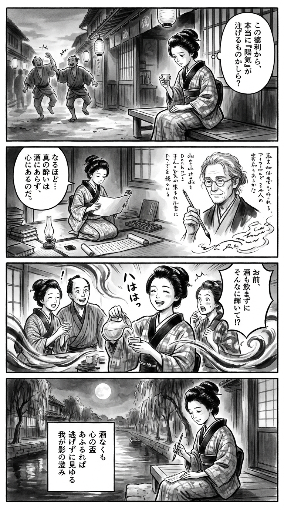

> **Language**: [日本語](../ja/上を向いてアルコール_review.html) | [English](../en/上を向いてアルコール_review.html) | [繁體中文](../zh-tw/上を向いてアルコール_review.html)
>
> [← Top / トップページ](../../)

# 書籍評論（Markdown・繁體中文）

## 📖 書籍資訊
- **標題**: 上を向いてアルコール  
- **作者**: 小田嶋隆  
- **ASIN**: B08QRQH81J  
- **URL**: [https://www.amazon.co.jp/dp/B08QRQH81J](https://www.amazon.co.jp/dp/B08QRQH81J)  

---

<picture>
  <source srcset="../../images/reviews/上を向いてアルコール_4panel.webp" type="image/webp">
  
</picture>

## 對白

### Panel 1
**Scene**: 在靜謐的江戶小巷中，黃昏時分，町娘坐在一間酒屋外，目睹醉酒的城鎮男子搖搖晃晃地走過，笑聲在夜空中迴盪。她看著自己未動的酒杯，微微皺眉，心中思索著「快樂」是否真的能從瓶中倒出來。

**Dialogue**: [無]

### Panel 2
**Scene**: 在她的小書房裡，油燈微弱的光線下，町娘正在閱讀一卷進口的論文捲軸，捲軸上畫著一位沉思的中年男子的肖像——想像中的作者小田島高志，面容溫和，短髮隨意束起，圓形眼鏡，目光平靜而深邃。肖像中的他手持毛筆，似在思考，周圍是關於幻覺、控制和人心的文字。她低聲自語：「所以……真正的陶醉不在於酒，而在於心靈。」

**Dialogue**: [無]

### Panel 3
**Scene**: 第二天早上，她進行實驗——將清水倒入酒杯中。她在茶館裡參加朋友們熱鬧的對話，但她不喝酒，而是專心傾聽，開心地笑著。朋友們驚訝於她在沒有酒精的情況下更加光彩奪目。構圖動感十足，她的笑聲如風般在熱鬧的房間中流淌。

**Dialogue**: [無]

### Panel 4
**Scene**: 那天晚上，在運河旁的月光下，町娘在一小片短冊上寫下和歌，筆尖懸停在反思和自我發現之上。最後一幅畫面散發著靜謐的決心和溫柔的幽默感。  
**Tanka (translation)**: 即使沒有酒，心中的杯子若滿溢，便能看見不逃避的清晰影子。  
**Tanka (original)**: 酒なくも  
心の盃  
あふるれば  
逃げずに見ゆる  
我が影の澄み

## 🎯 這本書的核心
《上を向いてアルコール》是一部將酒精依賴描繪為「人類心理結構」而非「疾病」的作品。作者小田嶋隆基於自身的依賴經驗，冷靜地觀察酒精如何滲透到人類的思維、創作和人際關係中，並最終侵蝕這些領域。

他否定了「酒能助於創作」的幻想，斷言酒精帶來的僅僅是一時的逃避和自我欺瞞。另一方面，他也不忽視酒精作為一種社會裝置，將人際關係「戲劇化」，掩蓋孤獨的功能。

本書的核心在於提出「重建人生而非單純戒酒」。作者指出，斷絕依賴並不僅僅是禁酒，而是重新設計自己的生活方式。

---

## 💡 關鍵見解
- **依賴的本質是「控制不住」而非「數量」**  
  酒精依賴並不是飲酒量的問題，而是指無法自行停止的狀態。作者打破了「因為量少所以不是酒精依賴」的誤解，將依賴的本質描繪為「自我控制的喪失」。

- **酒是「現實逃避的開關」**  
  酒並不是解決問題的工具，而是作為「思維停止的漏洞」來運作。作者敏銳地揭示了這一逃避結構，明確指出酒是將人生課題延遲的裝置。

- **創作與酒的關係是幻想**  
  作者完全否定了「酒能產生創意」的神話。相反，酒會奪走創作的時間，並使思維遲鈍，創作所需的不是「醉意」，而是「清醒」。

- **從依賴中恢復需要「替代的建構」**  
  禁酒的過程不能僅靠忍耐。作者指出「如何重新設計無酒的生活」是關鍵，並提出構建新的行為和關係以填補依賴的空白。

- **現代的依賴以不同形式持續存在**  
  將社交媒體和智能手機的依賴視為與酒精相同的逃避結構，指出現代社會中「資訊中毒」和「認可依賴」的危險。依賴是超越時代，潛藏於人類根源的問題。

---

## 🔍 與現代背景的關聯
近年來，日本年輕人中飲酒減少的趨勢明顯，無酒精市場迅速擴大。這背後是健康意識的提高以及疫情後生活方式的變化。然而，家庭內飲酒和由壓力引起的「工作酒精症」也成為新的社會問題。

本書所描繪的「依賴酒精的文化」的脫離，正與現代社會的潮流相呼應。此外，作者所指出的「資訊依賴」和「社交媒體成癮」可被理解為酒精依賴結構在數位空間的延伸。小田嶋的洞察超越了依賴的形態，擴展到「如何與自己相處」這一普遍主題。

---

## 🚀 實踐建議
1. **設計「無酒的時間」**  
   重要的是找到可以全心投入的行為，而不是單純忍耐。閱讀、運動、創作等，重建曾被酒精奪走的時間是恢復的第一步。

2. **觀察「自己的醉酒方式」**  
   記錄醉酒的質量和頻率變化，將身體和心靈的反應可視化。這是為了早期察覺依賴的徵兆進行的自我監測。

3. **不將酒作為藉口**  
   不要將失敗或情緒歸咎於酒，而是將其視為自己的責任。這樣可以擺脫將酒視為「免罪符」的心理結構。

4. **有意識地控制「資訊依賴」**  
   限制社交媒體和智能手機的使用時間，恢復「思維的寧靜」。意識到資訊也可能成為逃避的手段是非常重要的。

5. **接受「不完美的自己」**  
   不要追求完美，勇於「不完美地寫作和行動」。緩解依賴根源中的「自我否定」，將有助於真正的恢復。

---

## ⭐ 總體評價
《上を向いてアルコール》是一部將依賴描繪為與人類存在本身相關的問題的珍貴著作。小田嶋隆的筆觸冷靜而溫暖，流露出對自我欺瞞的幽默。

本書不僅針對困擾於酒精的人，也是一面鏡子，反映出所有感到「想要逃避」的現代人。閱讀後，依賴的問題將轉化為「如何設計自己的生活」的靜默思考。

---

&copy; shioki | [CC BY-NC-SA 4.0](https://creativecommons.org/licenses/by-nc-sa/4.0/)
