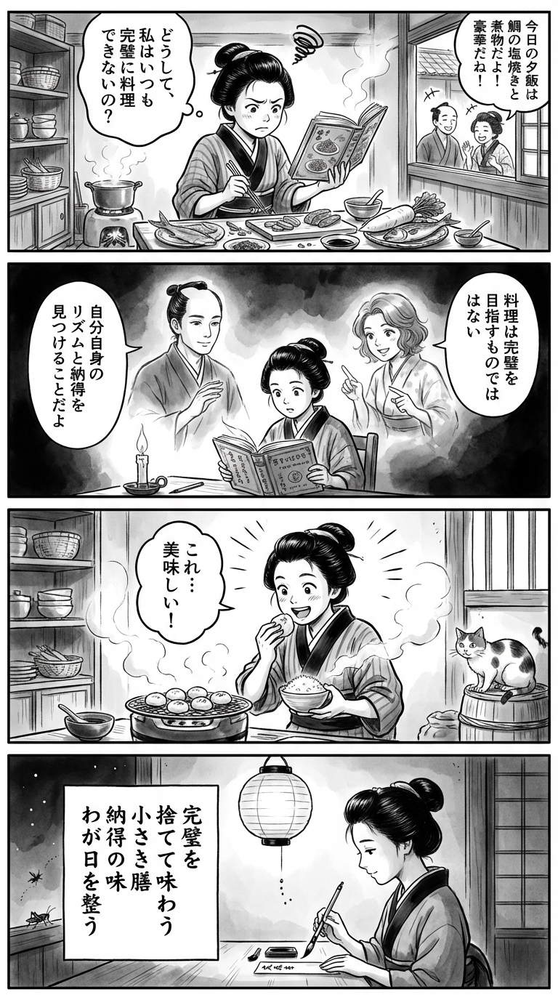

---
---
> **Language**: [日本語](../ja/典士-祐加-自炊の壁_review.html) | [English](../en/典士-祐加-自炊の壁_review.html) | [繁體中文](../zh-tw/典士-祐加-自炊の壁_review.html)
>
> [← Top / トップページ](../../)

## 📖 書籍資訊
- **書名**: 自炊の壁  
- **作者**: 佐々木 典士 and 山口 祐加  
- **ASIN**: B0DSGZ35RB  
- **URL**: [https://www.amazon.co.jp/dp/B0DSGZ35RB](https://www.amazon.co.jp/dp/B0DSGZ35RB)  

---

<picture>
  <source srcset="../../images/reviews/典士-祐加-自炊の壁_4panel.webp" type="image/webp">
  
</picture>
## 對白

### Panel 1
**Scene**: 江戶時代的町娘站在自己狹小的廚房裡，凝視著擺滿食材的桌子。她手裡拿著一本寫滿複雜菜式的食譜，神情沮喪，心想自己永遠煮不出完美的料理。背景是簡樸的長屋廚房，有木架與小炭爐；窗外傳來鄰居們談論華麗菜餚的聲音。  
**Dialogue**: 「為什麼大家都能煮得那麼好……？」

### Panel 2
**Scene**: 在燭光搖曳的書桌前，町娘閱讀一本神秘的外國風書籍。書頁上浮現兩位虛幻的思想者：一位是神情沉靜、髮束整齊的佐佐木範義般學者，另一位是表情柔和、動作生動的山口由香般女子。他們宛如墨跡幻影般從頁面中現身，教導她：「料理不是追求完美，而是理解自己的節奏與滿足。」  
**Dialogue**: 「原來……料理的味道，也有自己的呼吸啊。」

### Panel 3
**Scene**: 町娘在廚房裡嘗試新的做法——她只簡單地烤了幾串丸子，並熱了一碗白飯。她品嚐著這份「不完美」卻令人滿足的餐點，露出驚喜與喜悅的笑容。墨筆筆觸強調蒸氣、笑聲與輕盈的氣氛。背景裡，她的貓好奇地注視著，增添了幽默與溫暖。  
**Dialogue**: 「這樣……也很好吃呢！」

### Panel 4
**Scene**: 夜裡，町娘在燈籠下靜靜地寫下一首和歌。畫面寧靜而詩意，她的神情安詳。這首短詩傳達了書中核心的訊息——在日常中尋得自由與自我接納。  
**Dialogue**: （無）  
**Tanka (translation)**: 捨棄完美，細細品味這小小的膳食；那份滿意的滋味，使我今日的心境得以平衡。  
**Tanka (original)**:  
「完璧を　捨てて味わう　小さき膳  
　納得の味　わが日を整う」

## 🎯 本書的核心
《自炊の壁》從「無法持續做飯的原因不是意志薄弱，而是被既有觀念束縛」這個角度出發，剖析了圍繞自炊的心理與文化障礙。作者佐々木典士與山口祐加，分別從極簡主義與實踐料理的觀點，提出了「不必完美的自炊哲學」。  

本書主張的重點，不在於追求食譜或營養均衡的「正確答案」，而是找到「能讓自己心服口服、持續下去的自炊方式」。它肯定失敗與偷懶的價值，並將料理從「義務」轉化為「理解自我與獲得安心的行為」。  

最終，本書認為自炊是一個透過「吃」來重新奪回「用自己雙手整理生活的自由」的過程。  

---

## 💡 關鍵洞見
- **從「漢堡排問題」學習重新定義開始的方法**  
  作者指出，初學者一開始就挑戰困難料理的低效率，並強調從「煎冷凍餃子」等小小的成功經驗開始的重要性。這與習慣養成的心理學相通，是持續的關鍵。  

- **從「依賴食譜」到「理解料理法則」**  
  透過掌握像是鹽分1%或「蔬菜＋蛋白質」等原理，就能擺脫只會照著食譜做的狀態。相信自己的味覺與感受，是邁向創造性自炊的第一步。  

- **「不便益」的哲學──享受失敗**  
  本書貫徹重視試錯過程中樂趣的態度，而非一味追求效率。當不再害怕失敗，反而將其視為「成功的調味料」，料理就會成為更豐富的體驗。  

- **「心服口服」能化解罪惡感**  
  即使使用冷凍食品或熟食，只要自己能接受，那也是正確的自炊。這種觀點促使人們從社會強加的「正義自炊觀」中解放出來。  

- **「無名料理」中蘊藏的自由**  
  創造那些不在食譜裡、只屬於自己的「無名料理」，是重新找回自炊自由與創造力的行為。它讓人以「生活的表達」來享受料理。  

---

## 🔍 與現代脈絡的關聯
隨著雙薪家庭的增加與居家時間的變化，「做飯好麻煩」成為許多人共同的煩惱。SNS 上流行著「只要加工熟食也算自炊」等彈性觀念，從完美主義中解放的風潮正逐漸形成。  

本書正位於這股潮流的中心，重新檢視「一汁三菜」等理想型態，並肯定「一汁一菜」或「主菜＋副菜」等更貼近現實的形式。這不只是家事效率化，而是一種「透過飲食善待自己」的新型自我照顧方式。  

此外，在 AI 與食譜影片氾濫的時代，本書提倡的「思考的料理」與「感受的味覺」，也象徵著在資訊過剩社會中「感官的再生」，極具啟發性。  

---

## 🚀 實踐建議
1. **從「微波飯＋冷凍餃子」開始**  
   不追求完美的餐桌，先從「做得到的範圍」開始動手。降低心理門檻，讓自炊從「義務」變成「遊戲」。  

2. **記住「料理的法則」**  
   掌握像鹽分1%或「食材＋香氣」等基本原理，就能不依賴食譜自由發揮。這是誕生「無名料理」的基礎。  

3. **寫下「無名料理筆記」**  
   不必發在社群媒體上，將料理記錄在自己的筆記本中，有助於提升技巧與理解自我。這本「飲食手帳」會成為認識自己的紀錄。  

4. **準備「不想做飯日」的退路**  
   常備沙丁魚罐頭或即食包，讓自己能說出「今天這樣就好」。持續的秘訣不在完美，而在「能長久維持的機制」。  

5. **把洗碗變成「音樂時間」**  
   將麻煩的家事重新定義為愉快時光，讓整個家務成為自我照顧的一部分。關鍵在於在生活中灑下「小小的樂趣」。  

---

## ⭐ 綜合評價
《自炊の壁》既是一部將料理從「正確」引導至「心服口服」的思想書，也是一部實用的生活指南。它不像食譜書那樣教步驟，而是幫助人調整面對料理的心態。  

對那些想持續做飯卻屢屢放棄、或對料理懷有罪惡感的人而言，本書將成為降低「心理門檻」的一本書。閱讀之後，你會體驗到自炊從「義務」轉變為「讓自己安心的行為」的那一刻。

---

&copy; shioki | [CC BY-NC-SA 4.0](https://creativecommons.org/licenses/by-nc-sa/4.0/)
