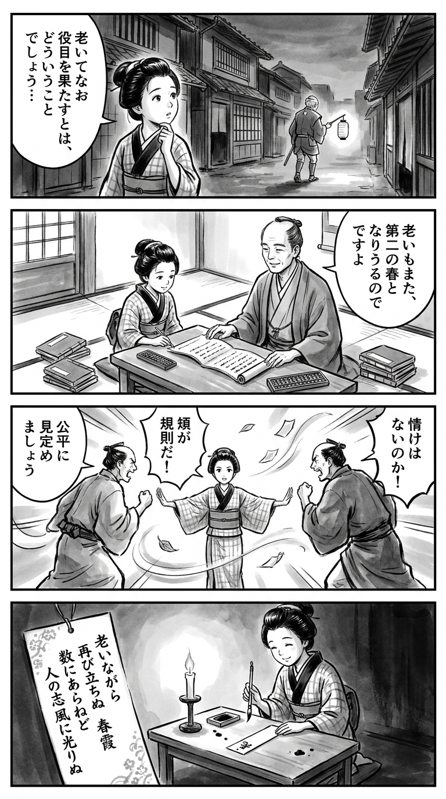

> **Language**: [日本語](../ja/再雇用警察官_review.html) | [English](../en/再雇用警察官_review.html) | [繁體中文](../zh-tw/再雇用警察官_review.html)
>
> [← Top / トップページ](../../)

# 書籍評論（繁體中文）

## 📖 書籍資訊
- **標題**: 再雇用警察官  
- **作者**: 姉小路祐  
- **ASIN**: B07X8WWSK7  
- **URL**: [https://www.amazon.co.jp/dp/B07X8WWSK7](https://www.amazon.co.jp/dp/B07X8WWSK7)  

---

<picture>
  <source srcset="../../images/reviews/再雇用警察官_4panel.webp" type="image/webp">
  
</picture>
## 🎯 這本書的核心
《再雇用警察官》講述了定年退休的前刑警安治川，以「再雇用警察官」的身份重返現場，探討老化與再生，以及組織與個人倫理的社會派懸疑小說。  
故事的中心是安治川在官僚體制下掙扎，卻仍堅持自己信念的人性。  

本作不僅僅是解決事件的故事，而是提出了一種「老春」的新生活形態。它探索了在接受老化的基礎上，重新參與社會的意義，帶來了靜謐的感動。  

---

## 💡 關鍵見解
- **老化是重新出發的契機**  
　安治川說「已經沒有失去的東西」，他將老化視為自由的恢復，而非限制。將退休後的生活重新定義為「老春」，這一視角向讀者展示了成熟生活的可能性。  

- **描繪官僚組織的責任迴避的社會批評**  
　如消息應對室的設立背景所象徵，制度奪走現場實效的結構被描繪出來。形式化的程序與人性誠信的對比，成為現代社會的縮影。  

- **人不是數字或符號**  
　在以個人識別號碼和身份證為象徵的管理社會中，身份的脆弱與尊嚴受到質疑。拒絕將人還原為制度符號的倫理，構成了整個故事的根基。  

- **經驗可以作為「老益」回饋社會**  
　透過再雇用，年長者的經驗可以成為年輕人和社會的「老益」。將老化描繪為「貢獻的重建」，而非「結束」，是作品所傳遞的希望。  

---

## 🔍 與現代背景的關聯
本作的背景是日本社會面臨的高齡化與勞動力不足的現實。在警察這一公共組織中，再雇用與再任用的推進，使得經驗知識的傳承與年輕人的合作成為挑戰。安治川的形象正是這一社會實驗的象徵。  

此外，作品中描繪的「人類的更替」和「被數字化的個體」，也可以被解讀為對數位管理社會的批評。儘管制度和技術在進步，人性的本質卻不會改變，這一信息引起了現代讀者的強烈共鳴。  

更重要的是，在高齡化社會中顯現的孤獨、繼承、家庭斷裂等問題背景下，如何活出老化的普遍性問題，使本作成為時代的鏡子。  

---

## 🚀 實踐建議
1. **將老化視為「第二次現役」**  
　將退休視為新社會參與的開始，而非終點，能大幅改變人生的充實度。  

2. **優先考慮人性的誠信而非制度**  
　不被官僚體制所左右，像安治川一樣通過「流汗的姿態」來建立信任，這是任何職場都應遵循的倫理。  

3. **將經驗作為社會資源發揮**  
　將過去的經驗作為「老益」回饋給下一代，能促進組織和社區的成熟。  

4. **在數位社會中不忘「人性面孔」**  
　意識到制度和數字背後的活生生的人，並以同理心和尊重與他人互動，將成為現代社會的倫理基礎。  

5. **不懼「無謂的努力」，持續累積**  
　重視過程而非結果的態度，將為職業人和人類的成長帶來成果。  

---

## ⭐ 總體評價
《再雇用警察官》是一部正面描繪老化與再生的成熟故事。在保持懸疑感的同時，展開對社會制度與人性尊嚴的深刻思考。  

讀者將會獲得重新思考退休後生活和工作的意義的契機。這本書靜謐而有力，是對現役世代和退休世代的重新出發的啟示。

---

&copy; shioki | [CC BY-NC-SA 4.0](https://creativecommons.org/licenses/by-nc-sa/4.0/)
