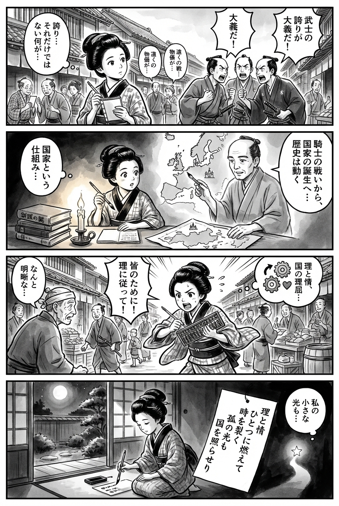

---
---
> **Language**: [日本語](../ja/双頭の鷲（上下）合本版（新潮文庫）_review.html) | [English](../en/双頭の鷲（上下）合本版（新潮文庫）_review.html) | [繁體中文](../zh-tw/双頭の鷲（上下）合本版（新潮文庫）_review.html)
>
> [← Top / トップページ](../../)

## 📖 書籍資訊
- **書名**: 双頭の鷲（上下）合本版（新潮文庫）  
- **作者**: 佐藤賢一  
- **ASIN**: B09CKVDBMD  
- **URL**: [https://www.amazon.co.jp/dp/B09CKVDBMD](https://www.amazon.co.jp/dp/B09CKVDBMD)  

---

## 對白

### Panel 1
**Scene**: 江戶街道上人聲鼎沸，身著和服的町娘站在人群中，注視著幾位武士正激烈爭論「榮譽」與「責任」。她微微歪著頭，手中握著一本小筆記本。背景裡，商人與百姓竊竊私語著遠方的戰事。她的神情帶著好奇，彷彿在思索——衝突是否能超越個人驕傲，成為更大的意義。  
**Dialogue**: （無台詞）

### Panel 2
**Scene**: 在狹小的書齋裡，町娘伏案閱讀成堆的書籍，既有外國文獻，也有本地典籍。燭光搖曳間，一位溫和睿智的學者幻影浮現——她心中想像的導師。男子身著素樸和服，目光沉靜，指向一幅以墨繪成的歐洲地圖，講述從騎士戰爭到民族國家的轉變。町娘屏息傾聽，筆尖懸於半空。  
**Dialogue**: （無台詞）

### Panel 3
**Scene**: 白日的市集裡，町娘手持算盤與圓規，協助鄉人分配物資，為「眾人之益」而行。她的舉止映照出從書中學得的理性與策略，卻仍溫柔體貼。一位老翁對她的清晰思路露出驚訝神情。畫面充滿動感，袖擺飛揚，理與情在她之間流轉。  
**Dialogue**: （無台詞）

### Panel 4
**Scene**: 夜色靜謐。町娘跪坐窗邊，手執毛筆，月光灑在紙上。她寫下一首短歌，總結自己的領悟——理性、情感與目的交織，構成人類歷史的脈動。  
**Dialogue**: （無台詞）  
**Tanka (translation)**:  
理與情燃成一體，  
撕裂時間的流光；  
孤獨之光，  
亦能照亮整個國度。  
**Tanka (original)**:  
理と情　  
ひとつに燃えて　  
時を裂く  
孤の光も　  
国を照らせり

## 🎯 本書的核心
《双頭の鷲》以百年戰爭時期的法國為舞台，描繪了戰爭的形態如何從「騎士的榮譽」轉變為「國家的戰略」的壯闊歷史史詩。  
兩位天才——杜·蓋克蘭（Du Guesclin）與查理五世（Charles V）——融合理性與直覺，開創新時代的過程，象徵了「國家」這一概念的誕生。  

同時，作品層層描寫了兄弟、師徒、父子等血緣關係的矛盾，愛與信仰的衝突，以及孤高天才們的苦悶。  
在戰亂之中，人類如何追求理想、被現實擊碎，卻仍不放棄前行——透過這樣的描寫，作品深刻地拋出「人是什麼」這一永恆的問題。  

---

## 💡 關鍵洞見
- **戰爭是國家的工具**  
　杜·蓋克蘭的戰鬥並非為了個人榮譽，而是為了國家。在此誕生了近代國家的萌芽，以及「為公共而戰」的新倫理觀。以戰爭作為國策的視角，在歷史小說中極具開創性。  

- **天才是理性與直覺的融合體**  
　查理五世評價杜·蓋克蘭「思慮深於熟慮，行動快於機智」的場景，揭示了智慧不僅是知識的積累，更是瞬間判斷與洞察的結合。這一洞見同樣適用於現代的領導學。  

- **愛既是救贖，也是毀滅**  
　蒂法娜與艾曼紐的悲劇象徵了愛的雙面性——它能提升人性，也能導向毀滅。作者認為人類的情感推動了歷史的進程，這一觀點在此濃縮展現。  

- **孤獨是天才的宿命**  
　越是非凡的才能，越難被理解，注定孤獨。然而，當能夠共享孤獨的朋友出現時，人終於得以被拯救。杜·蓋克蘭與格萊伊的友情，正體現了戰亂中人性的救贖。  

- **理想既能改變人，也能摧毀人**  
　查理五世為國家改革而燃盡自身的形象，揭示了追求理想的代價——理想與現實的緊張關係，正是推動歷史前進的原動力。  

---

## 🔍 與現代的關聯
即使在現代，「國家」「組織」「個人」三者的關係仍在不斷被重新定義。《双頭の鷲》所描繪的「戰爭的合理化」與「國家的形成」，與全球化與民族主義角力的當代社會遙相呼應。  

同時，查理五世高舉理想卻被現實折磨的形象，也讓人聯想到現代的領導者與改革者。變革所帶來的孤獨與疲憊，是跨越時代的普遍課題。  

此外，書中女性為了愛與尊嚴而奮鬥的姿態，也與現代女性跨越性別藩籬、主動選擇自己人生的精神相通。雖以中世為舞台，卻如一面鏡子，映照出現代倫理與價值觀。  

---

## 🚀 實踐建議
- **訓練理性與直覺的並行運用**  
　有意識地切換邏輯思考與直覺判斷，能讓決策更靈活、更具創造性。杜·蓋克蘭的行動原則，可應用於現代商業與政治領域。  

- **不畏孤獨，貫徹信念**  
　如同那些以孤獨為養分推動時代的天才，堅守信念才能帶來長遠成果。被誤解的時期，正是內在成長的契機。  

- **觀察情緒，轉化為行動力**  
　不否定愛、嫉妒、憤怒等情緒，而是觀察它們如何影響自己的判斷，能使行動更成熟。情緒的掌控，本身就是智慧的一部分。  

- **從歷史中學習結構**  
　如同查理五世的改革，成功並非偶然，而是結構性思考的結果。現代的組織經營與社會變革，也能從中學習「洞察結構」的眼光。  

---

## ⭐ 總體評價
《双頭の鷲》是佐藤賢一的代表作之一，在壯闊的歷史洪流中，深刻探問「國家是什麼」「人類的理想是什麼」。  
透過戰爭、政治、愛與信仰等主題，以壓倒性的筆力描繪出人類情感與理性的角力。  

這部作品不僅具備宏大的歷史格局，也蘊含能與現代對話的思想深度，對關心領導力與人性理解的讀者而言，極具啟發性。  
它向讀者拋出一個永恆的問題——「在理想與現實的夾縫中，該如何生存？」這是一部厚重而普世的經典之作。

---

&copy; shioki | [CC BY-NC-SA 4.0](https://creativecommons.org/licenses/by-nc-sa/4.0/)
