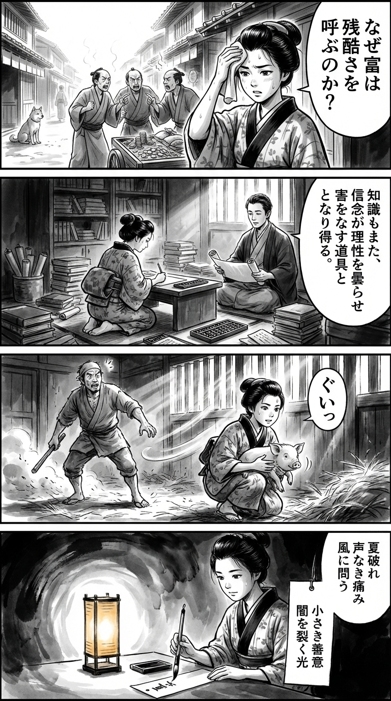

> **Language**: [日本語](../ja/夏が破れる_review.html) | [English](../en/夏が破れる_review.html) | [繁體中文](../zh-tw/夏が破れる_review.html)
>
> [← Top / トップページ](../../)

# 書籍評論（繁體中文）

## 📖 書籍資訊
- **標題**: 夏が破れる  
- **作者**: 新庄耕  
- **ASIN**: B09YDFRB51  
- **URL**: [https://www.amazon.co.jp/dp/B09YDFRB51](https://www.amazon.co.jp/dp/B09YDFRB51)  

---

<picture>
  <source srcset="../../images/reviews/夏が破れる_4panel.webp" type="image/webp">
  
</picture>
## 🎯 這本書的核心
《夏が破れる》是一部透過個人創傷描繪經濟發展陰影下的剝削與暴力結構的作品。從讓人想起泰國人口販賣事件的開頭開始，讀者便被拖入人類尊嚴被踐踏的現實中。

透過主角進的視角，描繪了加害與受害、正義與腐敗、現實與惡夢之間的界限崩潰過程。暴力的記憶超越時間重現，以制度和信仰之名侵蝕人性，象徵著當代社會的倫理危機。

然而，故事的底部卻透出微弱的光芒，如與動物的交流和他人的小小善意。新庄耕在凝視人類黑暗的同時，從未放棄救贖的可能性。

---

## 💡 關鍵洞見
- **暴力以不同形式重複出現**  
　曾是霸凌受害者的進，後來捲入暴力現場的情節，顯示社會無法斷絕暴力的連鎖現實。受害者被迫沉默，使加害結構得以延續。

- **制度不保證正義**  
　警察站在加害者一方的場景，象徵著制度的腐敗與倫理的崩潰。原本應該負責正義的機構卻成為暴力的共犯，這種恐懼在讀者心中留下深刻的不信任。

- **人類的殘酷潛藏於日常**  
　豬隻飼養這一日常行為成為暴力的掩護，顯示殘酷並非異常，而是日常延伸的結果。暴力並非遙遠世界的事件，而是潛藏在我們的生活中。

- **救贖存在於小小的善意中**  
　「困難時互相幫助」這句話象徵著，無私的關懷是斷絕暴力連鎖的關鍵。這道穿透絕望的光芒，正是人類重生的可能性。

- **信仰與科學的混合產生瘋狂**  
　將松果體視為「第三隻眼」的信介思想，描繪理性與狂信的危險融合。當知識與信仰結合時，最可怕的方式摧毀人性。

---

## 🔍 與現代背景的關聯
本書所描繪的「暴力與孤立的連鎖」，與2020年代日本社會面臨的現實深刻共鳴。酷熱與氣候變遷侵蝕著人們的身心，地方衰退與年輕人孤立的情況日益嚴重，社會暴力以不同形式再生。

近年的研究顯示，氣候壓力對心理健康造成嚴重影響。新庄耕所描繪的「夏天的崩潰」，不僅僅是季節的隱喻，更象徵著當代日本的精神疲憊。

在社交媒體依賴與制度不信蔓延的當下，透過作品再次質疑重拾對他人的小小善意與倫理判斷力的重要性。

---

## 🚀 實踐建議
1. **建立講述暴力記憶的空間**  
　沉默是暴力的溫床。在安全的環境中分享過去的痛苦，是恢復與連結的第一步。

2. **不依賴制度，自行以倫理做判斷**  
　直視制度不一定保證正義的現實，並磨練個人的倫理敏感性是必要的。

3. **在日常中積累小小的善意**  
　「困難時互相幫助」的姿態能緩和社會暴力。無私的關懷若能連鎖，將成為對抗結構性暴力的力量。

4. **將身體的異變視為心靈的警告**  
　身體感受的變化是精神危機的信號。對心身的聲音保持敏感，是防止崩潰的關鍵。

5. **停止旁觀，對異常發聲**  
　「視而不見」是暴力的共犯。當發現小的不正義時，勇敢行動而非沉默，將改變社會。

---

## ⭐ 總體評價
《夏が破れる》是一部透過暴力與倫理崩潰，照射現代社會扭曲的極為厚重的文學作品。新庄耕以冷靜的筆觸描繪在創傷與救贖之間搖擺的人性。

讀者將透過這個故事，不僅直視社會的暴力結構，也將面對自身內心潛藏的「沉默共犯性」。當在絕望中找到微弱的希望時，讀者必定能感受到「破裂的夏天」之後重生的可能性。

---

&copy; shioki | [CC BY-NC-SA 4.0](https://creativecommons.org/licenses/by-nc-sa/4.0/)
