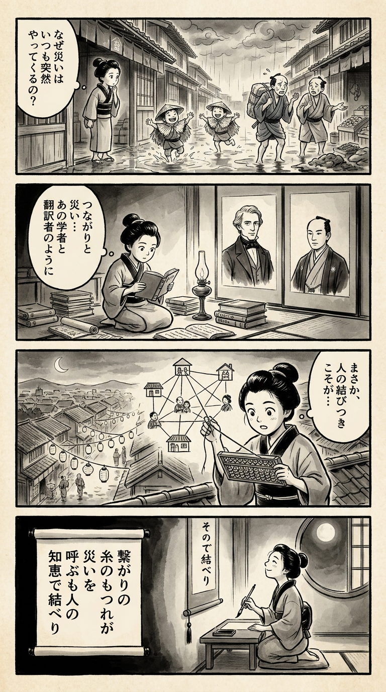

> **Language**: [日本語](../ja/大惨事（カタストロフィ）の人類史_review.html) | [English](../en/大惨事（カタストロフィ）の人類史_review.html) | [繁體中文](../zh-tw/大惨事（カタストロフィ）の人類史_review.html)
>
> [← Top / トップページ](../../)

# 書籍評論（繁體中文）

## 📖 書籍資訊
- **標題**: 大慘事（カタストロフィ）の人類史  
- **作者**: ニーアル・ファーガソン and 柴田 裕之  
- **ASIN**: B09WHTL1HP  
- **URL**: [https://www.amazon.co.jp/dp/B09WHTL1HP](https://www.amazon.co.jp/dp/B09WHTL1HP)  

---

<picture>
  <source srcset="../../images/reviews/大惨事（カタストロフィ）の人類史_4panel.webp" type="image/webp">
  
</picture>

## 對白

### Panel 1
**Scene**: 在繁忙的江戶街道上，突然下起大雨，町娘凝視著淹水的小巷，喃喃自語：「災難為何總是來得如此突然？」孩子們在水坑裡嬉戲，商人們則為損壞的貨物感到沮喪。空氣中充滿了好奇與不安的氛圍。

### Panel 2
**Scene**: 在一間燈光昏暗的寺子屋裡，堆滿了卷軸和荷蘭書籍，她正在研究一篇關於網絡與災難的外文文本。牆上的畫卷描繪了一位西方學者，形似奈爾·弗格森——一位高瘦的男子，穿著深色外套，銀白色的頭髮向後梳理，神情冷靜而知性。旁邊是一位冷靜的日本翻譯，想像成柴田宏之。兩人的面容似乎在注視著她，讓她思考災難如何由人與人之間的聯繫編織而成。

### Panel 3
**Scene**: 她攀上屋頂，手中拿著自製的算盤和繩結圖，像網一樣繪製著鄰里的聯繫。當她拉動一個結時，街對面的燈籠閃爍著，形成一個幽默而又象徵性的瞬間，顯示出一個環節如何影響整體。她的眼睛因領悟而睜大，明白災難並非源於偶然，而是人們如何緊密相連所致。

### Panel 4
**Scene**: 在寧靜的月光下，她跪在書桌旁，手握毛筆，正在一幅懸掛的卷軸上寫下反思的和歌。墨水柔和地滲入紙張，她面帶微笑，感到平靜與敬畏。詩句如下：

**Tanka (translation)**: 連結的  
紐帶交織著  
災難來臨  
卻也因人之  
智慧而結合  
**Tanka (original)**:  
「繋がりの  
糸のもつれが  
災いを  
呼ぶも人の  
知恵で結べり」

## 🎯 本書的核心
本書是一項宏大的嘗試，透過「大慘事（カタストロフィ）」的視角來解讀歷史。作者ニーアル・ファーガソン將災害、戰爭、疫情等破壞性事件描繪為社會結構、政治制度與人類心理相互作用所產生的「必然現象」，而非僅僅是偶然的不幸。  

他主張，自然災害與人為災害之間的界線應該模糊，兩者都應被理解為人類社會網絡與決策的結果。此外，慘事是社會「反脆弱性」的試金石，制度與文化的真正價值在危機時刻才會顯露出來。  

其核心在於對「人類能預測危機卻無法行動」的認知限制的洞察。ファーガソン將歷史視為複雜系統，鼓勵讀者採取以不可預測性為前提的靈活思考。

---

## 💡 關鍵見解
- **網絡決定慘事的規模**  
  疫情或信息災害的擴大，主要取決於社會網絡的結構與國家的應對能力，而非病原體或信息本身。危機不是孤立的現象，而是由聯結的密度和方向性所主導。  

- **「預測到卻感到驚訝」的危機**  
  許多慘事在發生前已經發出警告，但卻在發生時被視為「意外」。這是由於人類的認知偏見所致，問題在於「想像力的缺乏」而非危機的「概率」。  

- **組織的中層導致失敗**  
  許多大慘事中，中層管理層的信息傳遞或風險評估的扭曲，往往比高層的錯誤判斷更致命。組織的結構性缺陷會引發危機的連鎖反應。  

- **歷史是複雜系，無法用周期解釋**  
  歷史上的大慘事不是簡單的周期或因果關係，而是非線性相互作用的結果。遵循冪次法則的「稀有但巨大的事件」會徹底顛覆人類歷史。  

- **人類是會遺忘慘事的存在**  
  人類無法從過去的失敗中學習，常常重蹈覆轍。記憶的短暫性正是下一次慘事的溫床。  

---

## 🔍 與現代文脈的關聯
本書的視角是解讀疫情後的世界、戰爭、氣候變遷及數位混亂等現代危機的關鍵。新冠病毒的擴散正是網絡結構與制度應對差異決定了損害的案例，印證了ファーガソン的主張。  

此外，社交媒體及生成AI所引發的信息暴走、國際間的地緣政治對立、以及氣候災害如超級風暴，顯示出作為複雜系的社會是多麼脆弱。這些現象模糊了「自然」與「人為災害」的界限，實現了ファーガソン所描繪的「社會結構塑造災害」的觀點。  

現代社會處於一個僅靠理性無法控制的複雜風險網中。本書提供了理解這種混沌的智識裝備。

---

## 🚀 實踐建議
1. **以最壞情況為前提進行思考**  
   災害或危機不是以平均概率發生，而是以極端事件的形式出現。需要進行以冪次法則為前提的思考訓練，預想意外情況。  

2. **可視化網絡結構**  
   在傳染病防治或信息管理中，了解誰是樞紐，在哪裡會發生擴散，有助於有效的風險控制。  

3. **審核組織的中層**  
   相較於高層的戰略，現場與中層的信息傳遞扭曲更容易擴大危機。需要建立歡迎異議的文化和信息透明度。  

4. **以認知偏見為前提設計制度**  
   人類有低估風險的傾向。應在決策機制中加入「偏見修正」，平衡數據與直覺。  

5. **建立不忘記危機的機制**  
   社會對慘事記憶的傳承是防止下一次危機的最可靠方法。需要通過教育、記錄和模擬來培養抵抗遺忘的文化。  

---

## ⭐ 總體評價
《大慘事（カタストロフィ）の人類史》是一部將歷史重構為「解構危機結構的科學」的雄心之作。ファーガソン作為歷史學家，同時展現了社會科學家和系統理論家的洞察，冷靜地描繪出人類社會的脆弱性。  

本書是生活在疫情後世界的每一個人的必讀書，提供了自我防衛與社會理解的知識武器，讓讀者不僅能「預測危機」，更能「接受並準備」面對未來的挑戰。

---

&copy; shioki | [CC BY-NC-SA 4.0](https://creativecommons.org/licenses/by-nc-sa/4.0/)
