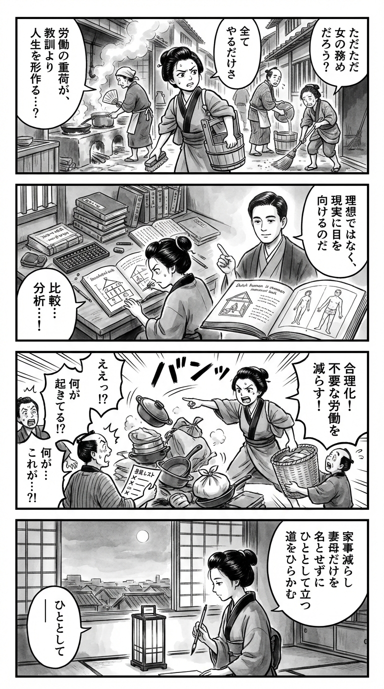

---
---
> **Language**: [日本語](../ja/女と文明_review.html) | [English](../en/女と文明_review.html) | [繁體中文](../zh-tw/女と文明_review.html)
>
> [← Top / トップページ](../../)

## 對白

### Panel 1
**Scene**: 在江戶時代的長屋廚房與巷弄中，町娘忙碌於無盡的家務：提水、生火、洗布、掃地。鄰居們隨口說著「女人的本分就是全都要做」。她在動作中停下，露出疑惑而銳利的神情，意識到勞動的重擔比抽象的道德教條更深刻地塑造了女性的一生。畫面中可見木桶、炊煙與庶民生活的喧囂。情感：好奇、困惑與思想的覺醒交織。

**Dialogue**: （心想）「為什麼這些事全都該由女人來做呢？」

### Panel 2
**Scene**: 在類似寺子屋的書齋一角，她專注研讀和算書、蘭學書籍與抄本，將家務、家庭制度與女性地位在不同社會中的差異整理成如蘭學圖表般的筆記。畫中出現一位象徵作者的男性學者形象——高額頭、短髮整齊、神情沉靜而銳利，身著樸素學者服，彷彿昭和時代的知識人。他以掛畫或幻影導師的姿態出現，指向的不是理想，而是具體的生活條件與家務的重量。情感：發現與專注學習。

**Dialogue**: 幻影導師：「觀察現實，從勞動中讀出社會的形狀。」

### Panel 3
**Scene**: 町娘勇敢地將所學付諸實踐。從戲劇性的俯瞰角度，她像數學家兼工程師般重新整理狹小的江戶家屋，移除多餘物品、簡化家務，依功能分配工作而非依性別，令家人與鄰人驚訝不已。成堆的雜物傾倒、家務清單被劃掉，男人們被遞上實際的任務。畫面以幽默呈現「合理化家務」的真意——減少不必要的勞動，而非讓女性更完美地承擔。情感：自信、驚喜與俏皮的反叛。

**Dialogue**: 「這樣分工，大家都輕鬆多了吧！」

### Panel 4
**Scene**: 夜晚靜謐的畫面中，町娘坐在燈光下，手執毛筆，凝視著被簡化的家與窗外開闊的景色，象徵女性的社會位置不應侷限於妻或母。她在短冊上寫下一首短歌，神情平靜而堅定，留下一抹抒情的餘韻。

**Dialogue**: （輕聲）「願我能開出屬於自己的路。」

**Tanka (translation)**: 減少家務，不再只以妻與母為名，作為一個人，開拓自己的道路。

**Tanka (original)**: 家事減らし　妻母だけを　名とせずに　ひととして立つ　道をひらかむ

## 📖 書籍資訊
- **書名**: 女と文明  
- **作者**: 梅棹忠夫  
- **ASIN**: B08BFB84WB  
- **URL**: [https://www.amazon.co.jp/dp/B08BFB84WB](https://www.amazon.co.jp/dp/B08BFB84WB)  

## 🎯 本書的核心
《女と文明》的核心在於，並非以「女人就是這樣的存在」這類本質論來談論女性的地位與角色，而是重新從具體條件──家務勞動、家庭制度、文明發展階段──中去理解。作者特別主張，討論女性處境的出發點，不應是抽象的道德或理念，而應該觀察日常家務勞動的沉重與生活設備的差異。

同時，本書將日本妻子與主婦的地位放在世界脈絡中比較，揭示不同地區與制度下「妻子」的樣貌如何迥異。透過這種比較，可以看出日本的主婦權是一種在壓抑之中形成的實質權力，但在上班族家庭中，其基礎反而變得脆弱。

更銳利的是，作者洞察到家務合理化不只是效率提升，而是可能使「主婦」這個角色本身被掏空。最終，他展望一種未來：女性不再僅透過「妻子」或「母親」的身分取得社會地位，而是男女作為更同質的個體共同參與社會，重新組構共同生活的方式。

## 💡 關鍵洞見
- **女性問題應首先作為勞動條件的比較來看待**  
  本書並非以抽象的精神論來思考女性的困境，而是從烹飪、洗衣、打掃等家務負擔出發。即使同樣被稱為「主婦」，其實際狀況因文明與技術而大不相同。忽視這些差異的討論，往往錯失現實的核心，這一點極為重要。

- **妻子的地位並非普世，而是隨文化與制度而變**  
  作者不以日本妻子的立場為唯一基準，而是並列展示世界各地的婚姻、家庭與女性慣行。如此一來，女性的從屬或自主不再被視為天生宿命，而能被理解為歷史制度的產物。

- **日本的主婦權是在壓抑中形成的有限權力**  
  本書並未將家父長制描繪為單向的支配，而是肯定女性透過廚房與家庭運作擁有一定決定權。然而，這並非自由的完成形，而是一種被困於家庭內部的權力。閱讀這種雙重性，正是本書的魅力所在。

- **上班族家庭看似現代，卻使妻子的地位更不穩定**  
  夫外妻內的分工模式看似穩定，但作者指出其中深層的依附結構。只要妻子的活動難以被視為直接的生產或社會參與，她的存在意義就容易受丈夫認可所左右。這樣的洞察，即使在今日仍然銳利。

- **家務合理化不是把家務做得更好，而是減少家務本身**  
  作者不將家務神聖化，反而懷疑許多作業根本是不必要的發明。這種觀點從根本質疑以細心與奉獻為美德的家庭文化，並引導出「不做的工夫」才是改變生活的實踐智慧。

## 🔍 與現代脈絡的關聯
本書的問題意識在 2020 年代的性別平等與少子化討論中依然鮮活。即使女性就業率提高，只要家務與育兒負擔的分配、家庭內隱性的依附關係未被解消，僅有表面的社會進出仍然不足。這正是本書觀點的現代意義。

此外，有關家務合理化與生活外部化的論點，在家電、外送、家事代行與 AI 普及的今日更為切身。若便利僅意味著要求女性達成「更高水準的家庭經營」，那負擔並未減少，結果不是「主婦被解放」，而是「主婦的高度化」。

再者，對於將女性價值集中於母職的批判，也對少子化對策與家庭政策提供啟示。本書不僅讚揚生育與育兒，而是追問女性作為一個人，如何直接與社會連結。這樣的視角對當代政策與工作模式都具有深刻的再思考意義。

## 🚀 實踐建議
- **不要把所有家務都視為「必要」，先進行盤點**  
  與其機械地延續每日家務，不如逐一檢視：「真的需要嗎？」「能否降低頻率？」「不做會怎樣？」本書提醒我們，減輕家務負擔的第一步，不在於努力或效率，而在於減少作業本身。

- **以功能而非性別重新分配家庭角色**  
  暫時擱置「丈夫的工作」「妻子的工作」這種前提，將家計管理、育兒、清潔、對外手續等具體化並重新分工。這不只是家務分擔，更是對家庭內決策權結構的重新檢討，是將本書的主婦權論現代化的實踐。

- **建立不讓物品增加的機制**  
  家務多半隨著物品增加而膨脹。購物前先考慮收納、管理、處理的成本，並養成定期清理的習慣，可降低整體生活維持成本。

- **有意識地培養「母親」「妻子」以外的社會參與途徑**  
  透過職業、社區活動、再學習、志工等方式，在家庭之外建立自己的角色與關係，也能穩定家庭內的地位。本書指出，女性應直接與社會連結，而非作為他人的附屬。這一點對任何性別的現代人都具啟發性。

## ⭐ 綜合評價
《女と文明》雖屬於女性論書籍，卻不止於情緒性的控訴或抽象理念，而是從家務、家庭與文明的結構中細緻地解構女性的位置，極具價值。雖然語氣有時挑釁、用語在今日看來略顯粗糙，但其觀察的銳度依然令人折服。

特別推薦給關心如何減少家務、如何將妻與母的角色視為歷史建構、以及洞察上班族家庭封建性的讀者。這不僅是性別研究者的讀物，也會讓想從根本重新思考家庭與生活設計的人留下深刻印象。

---

&copy; shioki | [CC BY-NC-SA 4.0](https://creativecommons.org/licenses/by-nc-sa/4.0/)
