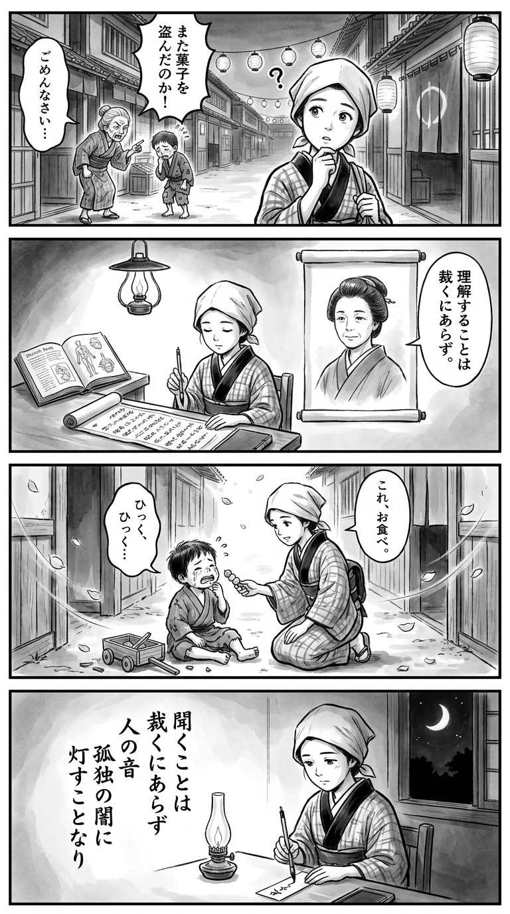

> **Language**: [日本語](../ja/家裁調査官・庵原かのん_review.html) | [English](../en/家裁調査官・庵原かのん_review.html) | [繁體中文](../zh-tw/家裁調査官・庵原かのん_review.html)
>
> [← Top / トップページ](../../)

# 書籍評論（繁體中文）

## 📖 書籍資訊
- **標題**: 家裁調查官・庵原かのん  
- **作者**: 乃南アサ  
- **ASIN**: B0DRB1VGJN  
- **URL**: [https://www.amazon.co.jp/dp/B0DRB1VGJN](https://www.amazon.co.jp/dp/B0DRB1VGJN)  

---

<picture>
  <source srcset="../../images/reviews/家裁調査官・庵原かのん_4panel.webp" type="image/webp">
  
</picture>

## 對白

### Panel 1
**Scene**: 町娘在黃昏的江戶街道上走著，聽到鄰居們爭吵的聲音——一位老婦人在責罵偷糖果的小男孩。她停下腳步，困惑於怒氣與悲傷交織的情感，凝視著男孩低垂的臉龐。背景中有狹窄的小巷、懸掛的燈籠和木製房屋。

### Panel 2
**Scene**: 在一間昏暗的寺子屋內，町娘打開一本荷蘭書籍，旁邊擺著一卷法律條文。條文上的肖像是一位冷靜的中年女性，眼神溫柔而端莊——她的頭髮整齊地束起，穿著簡單的和服，反映出想像中的作者**朝野野美**作為江戶時代學者的存在。肖像似乎在低語：“理解不是評判。”町娘專心地聆聽，筆刷懸停在筆記上。

### Panel 3
**Scene**: 第二天，她跪在一個哭泣的孩子身邊，這個孩子剛剛弄壞了別人的玩具。她沒有責罵，而是靜靜地遞出一個甜糯的團子。孩子猶豫了一下，然後微微一笑。風輕輕吹過小巷，櫻花瓣飄落，象徵著一個小小的理解行為連結了彼此的心靈。

### Panel 4
**Scene**: 那天晚上，在燈光下，町娘在一張小的短冊上寫下一首和歌，她的表情平靜而深思。詩句以細膩的筆觸垂直書寫：

> 聞くことは  
> 裁くにあらず  
> 人の音  
> 孤独の闇に  
> 灯すことなり  

**Tanka (translation)**: 聆聽並非評判他人之音，於孤獨的黑暗中點亮心燈。  
**Tanka (original)**: 聞くことは  
裁くにあらず  
人の音  
孤独の闇に  
灯すことなり

## 🎯 這本書的核心
《家裁調查官・庵原かのん》是一部透過家庭法院調查官的職務，描繪人類心靈複雜性與重生可能性的社會派小說。主人公庵原かのん面對法律條文無法裁決的「心靈問題」，重新思考司法現場中「人性力量」的意義。

故事透過與非行少年、家庭崩壞、發展障礙、文化背景差異等多元問題的人們的互動展開。每個案例所揭示的根本問題是「未被理解的孤獨」與「愛的缺乏」，而かのん靜靜地陪伴著他們，尋找重生的契機。

乃南アサ在處理沉重主題的同時，細膩地編織角色的溫暖與日常描寫，讓讀者思考「支持的意義」。雖然故事以司法現場為舞台，但其根本是人類希望與共鳴的故事。

---

## 💡 關鍵見解
- **傾聽與觀察的力量能拯救人**  
  不僅僅是言語，還有表情、動作及沉默背後的情感，這些都是家裁調查官本質的所在。理解他人並非從判斷開始，而是從感受開始。

- **非行背後的愛的缺乏**  
  少年們的行為常常不是出於「惡意」，而是「尋求愛的呼喊」。重建信任是更生的第一步，社會如何支持這種關係成為一個重要課題。

- **發展障礙與無理解的連鎖**  
  故事描繪了發展特性孩子在家庭和學校中未被理解而孤立的現實。知識的缺乏造成誤解，最終導致悲劇，這一結構在故事中靜靜地被揭露。

- **文化斷裂與身份的搖擺**  
  異文化家庭的少年米格爾的故事，展示了語言和文化的障礙對親子關係的深遠影響。在多元文化社會中，「我屬於哪裡」的問題被尖銳地提出。

- **人性支撐專業**  
  喜愛甜食的かのん形象以及與同事之間的溫暖交流，描繪了在沉重現場中的心靈支撐。專業的力量不僅在於知識和技術，更在於與他人共同生活的感性。

---

## 🔍 與現代文脈的關聯
本作的背景是當代日本面臨的嚴重社會問題，如兒童虐待、家庭暴力及離婚後的親子關係調整。家庭法院調查官的工作是在司法立場上關注這些問題的最前線，承擔著將社會「難以看見的痛苦」可視化的角色。

近年來，隨著兒童家庭廳的成立及重視「兒童最佳利益」的政策轉變，本作以故事體現了這一理念。將非行與虐待視為「需要支持的信號」而非「事件」，這一視角暗示了當代社會對新型福祉與司法的需求。

此外，故事還包含了數位時代中孤立與多文化共生的課題，「如何防止未被理解的孤獨」的問題，正是當今每個人都應思考的議題。

---

## 🚀 實踐建議
1. **保持傾聽的姿態**  
   意識到不打斷對方的話，感受表情和沉默的意義。人際關係中最重要的就是理解的態度。

2. **深化對發展特性的理解**  
   努力了解在家庭或職場中遇到的多樣人群的背景。擁有知識能防止誤解和排斥，邁出支持的第一步。

3. **培養社區支持的文化**  
   參與志願者或社區活動，支持孤立的家庭和孩子。社會的連結是重生的基礎。

4. **尊重文化多樣性**  
   在接觸不同語言和價值觀的人時，保持理解對方背景的姿態。共生社會源於共鳴的積累。

5. **珍視自我療癒**  
   正如かのん透過甜食來調整心情，日常生活中也要擁有小小的「恢復時間」。支持他人的力量來自於自身的健康。

---

## ⭐ 總體評價
《家裁調查官・庵原かのん》是一部透過司法現場描繪「理解與支持」本質的人性劇。乃南アサ以超越制度框架的筆觸，讓讀者深刻共鳴與反思。

對家庭與社會問題有興趣的讀者，無論如何，這本書都會讓所有與人互動的工作者重新思考「理解他人是什麼」。沉重而溫暖的讀後感，留下了靜謐的希望。

---

&copy; shioki | [CC BY-NC-SA 4.0](https://creativecommons.org/licenses/by-nc-sa/4.0/)
