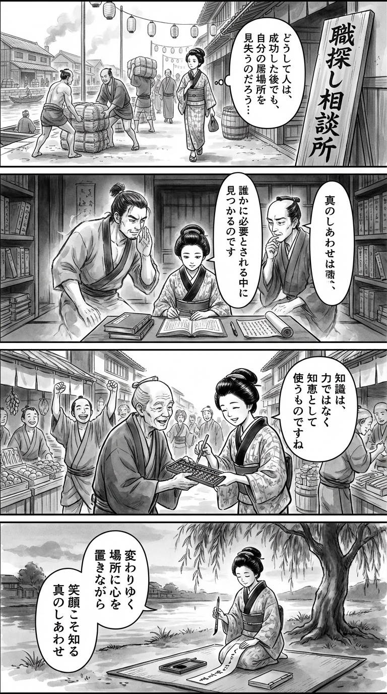

---
---
> **Language**: [日本語](../ja/巨人をクビになりハローワークに通った男が、工場勤務で見つけた“本当の幸せ”_review.html) | [English](../en/巨人をクビになりハローワークに通った男が、工場勤務で見つけた“本当の幸せ”_review.html) | [繁體中文](../zh-tw/巨人をクビになりハローワークに通った男が、工場勤務で見つけた“本当の幸せ”_review.html)
>
> [← Top / トップページ](../../)

## 📖 書籍資訊
- **書名**: 巨人をクビになりハローワークに通った男が、工場勤務で見つけた“本当の幸せ”  
- **作者**: 田原 誠次 and 菊地 高弘  
- **ASIN**: B0GMFVR2X3  
- **URL**: [https://www.amazon.co.jp/dp/B0GMFVR2X3](https://www.amazon.co.jp/dp/B0GMFVR2X3)  

---

<picture>
  <source srcset="../../images/reviews/巨人をクビになりハローワークに通った男が、工場勤務で見つけた“本当の幸せ”_4panel.webp" type="image/webp">
  
</picture>
## 對白

### Panel 1
**Scene**: 江戶街道上人聲鼎沸，身著和服的町娘漫步在河邊的倉庫旁，注視著壯漢們卸貨。她神情若有所思，輕聲自問：為何有些人在成功之後，仍會失去自己的位置？背景掛著寫有「職探し相談所」的舊式招牌與燈籠，墨線勾勒出繁華又滄桑的氣息。  
**Dialogue**: 「為什麼有人明明成功了，卻還是失去了立足之地呢……？」

### Panel 2
**Scene**: 昏暗的寺院藏書閣中，町娘靜坐研讀荷蘭書籍與一卷關於職業倫理的卷軸。書頁間浮現出兩位幻影導師——一位是肩寬眼柔、髮束在後的匠人模樣（田原誠次），另一位是目光深邃、神情沉思的學者（菊地高弘）。他們如靈影般從紙上現身，溫和地傳授：「唯有被他人需要，方能找到真正的幸福。」  
**Dialogue**: 「被需要的那一刻，才是幸福的開始。」

### Panel 3
**Scene**: 在熱鬧的市集裡，町娘幫鄰居修理壞掉的算盤。她運用所學，以靈巧的思考而非蠻力解決問題。周圍的町人報以掌聲與笑容，象徵著在人與人之間的日常互助中，重新找回了自豪與連結。  
**Dialogue**: 「原來，只要動點腦筋，就能讓大家都開心呢！」

### Panel 4
**Scene**: 黃昏的柳樹下，町娘跪坐在地，手持毛筆，神情安然。她在短冊上寫下和歌，墨跡滲入紙纖，隨風微動。  
**Dialogue**: （無台詞，只有靜謐的筆聲與晚風）  
**Tanka (translation)**:  
在變遷的地方，  
心仍停留於此；  
微笑之中，  
我終於明白——  
那才是真正的幸福。  
**Tanka (original)**:  
変わりゆく  
場所に心を  
置きながら  
笑顔こそ知る  
真のしあわせ

## 🎯 本書的核心
本書以前巨人隊投手田原誠次的真實經歷為基礎，描寫他結束職業棒球生涯、經歷職業介紹所後轉職至工廠工作的故事，重新定義了「工作」與「幸福」的意義。離開華麗舞台之後所看見的人生本質，透過坦率而溫暖的筆觸娓娓道來。  

在挫折中他所找到的，不是「努力」或「成功」，而是「與家人共度的喜悅」與「被他人需要的自豪」。書中細膩描寫了他如何將在職業棒球這個極限世界中培養出的觀察力、責任感與謙虛，重新在工廠這個新舞台上發光發熱的過程。  

本書為所有害怕失去職涯的人帶來希望——「即使環境改變，自身的價值也不會消失」。  

---

## 💡 關鍵洞見
- **「努力有時會背叛你，但巧思不會」**  
  沒有目的的努力未必能帶來成果，唯有伴隨思考與創意的努力才有意義。作者重新審視「如何努力」，強調有效率且具創造性的努力方式，這種理念與現代的工作改革精神不謀而合。  

- **以「萬能幫手」為榮**  
  與其追求特殊才能，不如在任何環境中成為「被需要的人」。無論在職業球場或工廠，盡責完成角色的態度，正是專業精神的體現。  

- **「家人的笑容」是最好的報酬**  
  比起物質的富足，作者更以家人的笑容作為成功的標準。他以親身經驗證明，幸福存在於「能與他人共享笑容的時光」這一普遍真理之中。  

- **「不依賴他人」才能建立信任**  
  以自己的責任完成行動，才能孕育信任與成長。這不僅適用於職場，更是整個人生的實踐法則。  

- **勇於挑戰能改變人生**  
  就像他改變投球姿勢成為側投一樣，勇於面對未知的挑戰會開啟新的道路。作者認為，行動本身比結果更有價值。  

---

## 🔍 與現代的關聯
近年來，越來越多媒體關注職業運動員的第二人生與退休後的生活。本書在這股潮流中脫穎而出，不僅是一篇再就業記錄，更是一段「作為一個人重新出發的故事」。  

在少子化與社會孤立加劇的當下，「與他人連結」與「發現微小幸福的能力」愈發重要。田原的身影提醒我們，比起追逐華麗的成功，更應誠實面對自我、踏實生活。  

在資訊過剩的時代，本書提供了一個重要的思考方向——「該放下什麼，又該珍惜什麼」，因此深深觸動現代讀者的心。  

---

## 🚀 實踐建議
- **① 重新檢視努力的「品質」**  
  與其追求努力的量，不如明確設定目的與方法。這不僅能更快達成成果，也能提升自我效能感。  

- **② 主動行動、負起責任**  
  不依賴他人，以自己的判斷完成任務。這樣的小小自律能建立信任，並成為在任何環境中都能發揮的力量。  

- **③ 不以環境為藉口**  
  在既有條件下盡最大努力，能將逆境轉化為成長的契機。懂得善用環境的思維，是職涯持續發展的關鍵。  

- **④ 以家人與夥伴的笑容為行動準則**  
  把他人的幸福放在中心，能讓動力更穩定，也能帶來長期的滿足感。  

- **⑤ 勇於挑戰，不懼失敗**  
  抱持「與其後悔沒做，不如做了再說」的精神，勇敢邁出一步。挑戰本身，就是讓人生更豐富的經驗。  

---

## ⭐ 總體評價
本書以平實的筆調描繪出一個人在挫折後仍堅定向前的力量。從職業棒球這個非日常的舞台，轉向工廠這個日常的現場，作者始終不斷追問「誠實生活」的意義。  

比起耀眼的成功，能與家人共享笑容的每一天才是「真正的幸福」。這本書讀後餘韻深長，特別適合正處於職涯轉折點、或對努力的意義感到迷惘的人閱讀，幫助他們重新整理心緒，找回前進的力量。

---

&copy; shioki | [CC BY-NC-SA 4.0](https://creativecommons.org/licenses/by-nc-sa/4.0/)
